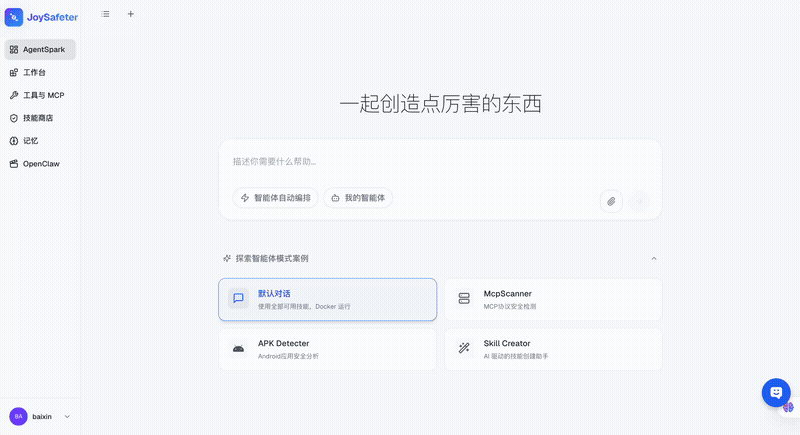
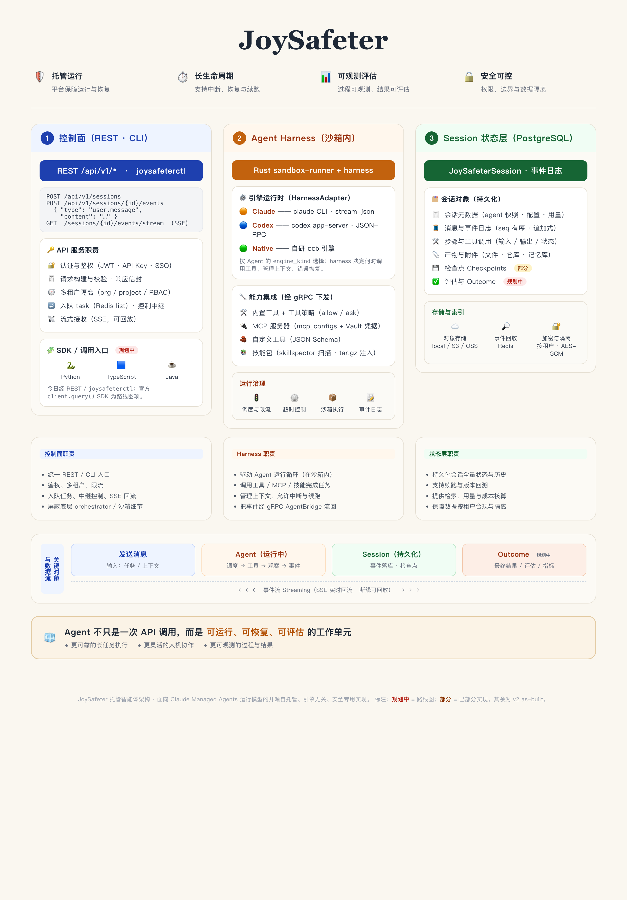

<h1 align="center">
  <br/>
  JoySafeter
</h1>

<p align="center">
  <strong>The open, self-hostable managed-agent platform for security.</strong><br/>
  <sub>Define an agent's tools, skills, and guardrails — JoySafeter runs it on your own hardened, observable infrastructure. From idea to production-grade security automation in minutes, not months.</sub>
</p>

<p align="center">
  <a href="https://www.apache.org/licenses/LICENSE-2.0"></a>
  <a href="https://www.python.org/downloads/"></a>
  <a href="https://nodejs.org/"></a>
  <a href="https://fastapi.tiangolo.com/"></a>
  <a href="https://nextjs.org/"></a>
  <a href="#"></a>
</p>

<p align="center">
  English | <a href="./README_CN.md">简体中文</a>
</p>

---

## Why JoySafeter

The managed-agent operating model is the right one for autonomous work. But for **security** —
where you operate on client systems under NDA and run aggressive tooling — *where and how* the
agent runs is the whole decision. JoySafeter gives you that model **on your own infrastructure**:

- **Your data and targets never leave your infra.** Fully self-hosted: prompts, findings, captured
  traffic, and target details stay inside your network. No third party ever sees the engagement.
- **Network-contained execution.** Every session runs in a `NetworkMode=none` sandbox behind an
  Envoy proxy with a **deny-all-by-default egress allowlist** — offensive tools can't phone home or
  pivot into your network unless you explicitly permit it.
- **Runtime-closed skill supply-chain control.** Skills are code that runs in your environment;
  skills are scanned by skillspector, and runtime packing blocks anything not approved, not
  successfully scanned, blocked, failed, still scanning, or drifted from its last scan.
- **Engine-agnostic.** Claude Code, Codex, or the self-developed `ccb` engine behind one gRPC
  contract — not locked to a single vendor or model.

| | Cloud managed agents | Build it yourself | **JoySafeter** |
|---|---|---|---|
| Data / target residency | Vendor cloud | Yours | **Yours — fully self-hosted** |
| Engine / model | Single vendor | Whatever you wire | **Claude Code / Codex / native, per agent** |
| Network isolation | Vendor-managed | You build it | **Per-sandbox Envoy deny-all egress** |
| Skill & tool safety | Vendor-managed | You build it | **SkillSpector scan + runtime-closed gate** |
| Time to production | Days | Months | **Days, on your own hardware** |

> JoySafeter frames this as **AI-driven Security Operations (AISecOps)**: the managed-agent model
> — multi-step autonomy, sandboxed tools, sessions, full-chain observability — specialized for
> security and run entirely under your control.

---

## Real-World Cases

### Case 1 — APK Vulnerability Detection Agent

> Upload an APK. Get an OWASP Mobile Top 10 report. No engineer required.

<p align="center">
  
</p>

> **This is a demo workflow, not a built-in integration.** The agent is configured with the
> `pentest-mobile-app` skill and a sandbox image carrying mobile-analysis tooling — you choose the tools.

**How it works:**

1. User uploads the APK file
2. The agent runs static analysis with the mobile tooling in its sandbox (e.g. MobSF)
3. Extracts critical risk signals — permission abuse, hardcoded secrets, insecure network config
4. Deep-validates high-severity findings via dynamic instrumentation (e.g. Frida)
5. Auto-generates a structured report aligned to OWASP Mobile Top 10

The entire flow — from upload to report — requires zero manual intervention, covering work that traditionally takes 2–3 security engineers.

---

### Case 2 — Penetration Testing Agent

> Describe the target and scope. The agent plans, executes, and adapts — then delivers a report.

<p align="center">
  
</p>

**How it works:**

1. Open the Workbench and create a new agent
2. Choose an engine (Claude Code / Codex / native) and select penetration testing skills
3. Provide an authorized target URL and test requirements
4. Agent runs autonomously inside an isolated sandbox — if it discovers a login page, it automatically triggers auth bypass testing
5. Download the final report when the session completes

> **Note:** Requires sandbox image `swr.cn-north-4.myhuaweicloud.com/ddn-k8s/ghcr.io/jd-opensource/joysafeter-sandbox:latest` configured in Sandbox Settings.

This dynamic decision-making — where the agent adapts its next step based on what it finds — is what fixed scripts cannot replicate.

---

## Core Capabilities — the managed-agent building blocks

You declare an agent — engine, model, system prompt, tools, skills, MCP servers, guardrails — and
JoySafeter runs it end-to-end on the same managed-agent building blocks Anthropic ships behind
Claude Managed Agents, only **self-hosted and security-specialized**:

<table>
<tr>
<td width="50%">

### 🧠 Managed harness & orchestration

- The **orchestrator** + gRPC `AgentBridge` + in-sandbox Rust `sandbox-runner` decide when to call tools, manage context, and recover from errors
- **DB-backed scheduling** — tasks claimed from Postgres with `FOR UPDATE SKIP LOCKED`, with retries and timeouts
- **Engine-agnostic** — Claude Code CLI, Codex app-server, or the self-developed `native` (`ccb`) harness, selected per agent

</td>
<td width="50%">

### 📦 Sandboxed execution

- Every session runs in its **own hardened container** — dropped capabilities, non-root, no-new-privileges
- **Pluggable providers** — Docker (default), E2B (Firecracker), Daytona, behind one SPI
- **Egress control** — per-sandbox Envoy proxy with a deny-all-by-default domain allowlist

</td>
</tr>
<tr>
<td width="50%">

### 🔧 Tools, custom tools & MCP

- Attach **builtin tools**, **custom tools** (name + JSON Schema), and **MCP servers** per agent
- MCP configs + Vault credentials are resolved at run time and delivered to the sandbox over gRPC
- **Security skill packs** drive tools like **Nmap / Nuclei / Trivy** inside the sandbox image; connect any external tool via the **MCP protocol**

</td>
<td width="50%">

### 📚 Skills

- **30 versioned capability packs** — penetration testing, document analysis, planning/meta
- **SkillSpector security scanning** + a runtime `is_skill_usable` gate (approved + `passed` / `warning` scan + no content drift)
- **AI skill authoring** — draft, edit, version, and diff skills with an LLM-assisted editor

</td>
</tr>
<tr>
<td width="50%">

### 💾 Sessions, memory & resume

- **Sessions** are persistent conversations with an **append-only, seq-ordered event log**
- **Memory stores** — versioned, agent-writable KV stores synced bi-directionally with the sandbox
- **Resumable** — reattach a session's harness + work dir on reconnect

</td>
<td width="50%">

### 🛡️ Scoped permissions & guardrails

- **Per-tool authorization** — `always_ask` / `always_allow`, with human-in-the-loop confirmation for high-risk tools
- **Encrypted credentials** — provider keys in Secrets, MCP creds in Vaults, AES-256-GCM, injected as sandbox env
- **SSRF guard** — blocks cloud-metadata endpoints; opt-in private-range hardening

</td>
</tr>
<tr>
<td width="50%">

### 🔎 Full-chain observability

- **Live SSE event stream** of every message, thinking step, tool call, tool result, and model request
- **OpenTelemetry** traces + `observations` with token/cost aggregation, `trace_id` propagated end-to-end
- Append-only session event log doubles as a full **audit trail**

</td>
<td width="50%">

### 🏢 Multi-tenancy & access

- **Orgs / projects / RBAC** — isolated workspaces with role-based access control
- **SSO** — GitHub, Google, Microsoft, OIDC (Keycloak, Authentik, GitLab), JD SSO
- **Quickstart** — describe your goal in natural language and get a running agent in minutes

</td>
</tr>
</table>

> How these blocks compare to the Claude Managed Agents feature set — and what's on the
> roadmap — is tracked in [Managed-Agent Parity & Roadmap](#managed-agent-parity--roadmap).

---

## Quick Start

### Docker Compose (recommended)

```bash
cd deploy
cp .env.example .env
cd ../backend && cp env.example .env
cd ../frontend && cp env.example .env
cd ../deploy

# Fully local: PostgreSQL + Redis + Rust orchestrator
docker compose --profile local-redis --profile rust-orchestrator up -d --build
```

Access points:

| Service | URL |
|---------|-----|
| Frontend | http://localhost:3000 |
| Backend API | http://localhost:8000 |
| API Docs | http://localhost:8000/docs |

The backend is a single codebase split into three services by the `JOYSAFETER_SERVICE_ROLE`
environment variable, deployed as separate containers:

- `api` — REST `/api/v1/*`, SSE event stream, notification WebSocket, auth.
- `orchestrator-rs` — task scheduler, gRPC `AgentBridge`, and sandbox lifecycle.
- `worker` — consumes the Redis event stream and persists events to Postgres.

Supporting infrastructure: PostgreSQL, Redis, Envoy (per-sandbox egress proxy), and
skillspector (skill security scanner). The bundled Redis service is behind the `local-redis`
profile; for cloud Redis, leave that profile off and set `REDIS_URL` in `deploy/.env`.
The Python orchestrator package has been removed. Use the Rust orchestrator
profile for local and containerized orchestration.

### Local test one-command startup

```bash
cd deploy
./local-test.sh
```

### Common deployment commands

```bash
./deploy/local-test.sh                     # local test one-command startup
./deploy/deploy.sh build                   # build frontend + backend images
./deploy/deploy.sh build --all             # build all images
```

> **Prerequisites:** Docker + Docker Compose. See [deploy/README.md](deploy/README.md) for deployment details.

---

## Architecture

```mermaid
flowchart LR
    FE["Browser"] -->|"REST · SSE"| API["API service"]
    API -->|"rpush task"| RLIST[("Redis list<br/>global_queue")]
    RLIST -.->|"wakeup"| SCHED["Orchestrator<br/>scheduler (DB-authoritative)"]
    SCHED -->|"claim / provision"| SBX["Sandbox (NetworkMode=none)<br/>Rust runner + harness"]
    SBX <-->|"gRPC AgentBridge"| ENVOY["Envoy<br/>sole network conduit"]
    ENVOY <--> GRPC["Orchestrator gRPC :9090"]
    ENVOY -->|"egress allowlist"| EXT["Model API · MCP · targets"]
    GRPC -->|"harness events"| BUS["Two-phase event bus"]
    BUS -->|"① persist XADD"| RSTREAM[("Redis stream")]
    BUS -->|"② broadcast PUBLISH"| RPUB[("Redis pub/sub")]
    RSTREAM -->|"XREADGROUP"| WK["Worker → persist"]
    WK --> PG[("PostgreSQL")]
    WK -.->|"republish"| RPUB
    RPUB -->|"SessionBroadcaster"| API
    API -->|"SSE stream"| FE
```



<sub>Overview infographic — ① control plane (REST · CLI) → ② Agent Harness (in-sandbox) → ③ Session state-layer. Interactive version: [`docs/architecture-diagram.html`](docs/architecture-diagram.html).</sub>



> Full architecture (deployment topology, gRPC contract, engines, sandbox, event model,
> domain FSMs): **[docs/ARCHITECTURE.md](docs/ARCHITECTURE.md)** · layered view:
> [docs/architecture-unified-event-model.mmd](docs/architecture-unified-event-model.mmd)

**Key design principles:**

- **Three services, one codebase** — `api`, `orchestrator`, and `worker` share a single codebase and select their behavior at boot from `JOYSAFETER_SERVICE_ROLE` (`all` runs everything in one process for local dev)
- **DB is the source of truth for scheduling** — the API enqueues a task onto a Redis list as a wakeup signal; the orchestrator claims pending rows from Postgres with `FOR UPDATE SKIP LOCKED`
- **Decoupled persistence and live delivery** — a two-phase event bus fans out to Redis Streams (durable, consumed by the Worker → `joysafeter_session_events`) and Redis Pub/Sub (ephemeral, driving the SSE fan-out to the browser)
- **Live events over SSE** — the browser subscribes to `GET /api/v1/sessions/{id}/events/stream` (DB replay via `?after_seq`, then live); WebSocket is reserved for `/ws/notifications`
- **Sandboxed execution over gRPC** — agents never run in the orchestrator process; a Rust `sandbox-runner` inside a per-session container speaks the gRPC `AgentBridge` protocol back to the orchestrator
- **Pluggable engines** — `claude` (Claude Code CLI), `codex` (Codex app-server), and `native` (self-developed `ccb` binary), selected per agent by `engine_kind`
- **Pluggable sandboxes** — Docker (default, hardened), E2B, and Daytona providers behind one `SandboxProvider` SPI
- **Centralized state machines** — guarded FSMs for Task, Session, Sandbox, and Skill lifecycle
- **Normalized error system** — `AppError` produces a canonical `ErrorDescriptor` (`{code, message, data, source, retryable, user_action}`) consumed identically across HTTP and streaming paths
- **OTel-backed observation** — full-chain `trace_id` propagation with spans persisted to the database
- **Encrypted credentials** — provider API keys live in Secrets and MCP credentials in Vaults, both AES-256-GCM encrypted and injected into the sandbox at run time
- **Layered skill system** — skills are versioned capability packs; runtime only packs approved skills with an allowed scan verdict and no content drift

### User Journey — Quick Start

> **Login** → **Add provider keys (Secrets)** → **Configure MCP credentials (Vaults)** → **Skill Management** → **Build Agent** → **Open a Session** → **Chat & watch live events** → **Download report**

---

## Tech Stack

| Layer | Technology | Purpose |
|-------|------------|---------|
| **Frontend** | Next.js 16 (App Router), React 19, TypeScript | Server-side rendering, product surface under `/managed/**` |
| **UI** | Radix UI, Tailwind CSS | Accessible component primitives |
| **State** | Zustand, TanStack Query | Client & server state |
| **Backend** | FastAPI 0.122+, Python 3.12+ | Async API with OpenAPI docs, three services split by `JOYSAFETER_SERVICE_ROLE` |
| **Agent runtime** | Rust `sandbox-runner` + Claude Code / Codex / `ccb` harness | Per-session sandboxed execution over gRPC `AgentBridge` |
| **MCP** | mcp 1.20+, fastmcp 2.14+ | Tool protocol support |
| **Database** | PostgreSQL, SQLAlchemy 2.0 | Async ORM with Alembic migrations |
| **Event bus / cache** | Redis (Streams · Pub/Sub · list) | Durable event stream, live SSE fan-out, task queue |
| **Egress control** | Envoy | Per-sandbox deny-all-by-default domain allowlist |
| **Observability** | OpenTelemetry, Loguru | Full-chain tracing & structured logging |

---

## What's New

> Full history: [CHANGELOG.md](CHANGELOG.md)

| Tag | Feature | What it means |
|-----|---------|---------------|
| **NEW** | **Three-Service Architecture** | The single-process monolith was split into `api` / `orchestrator` / `worker`, one codebase selected by `JOYSAFETER_SERVICE_ROLE`, deployed as separate containers |
| **NEW** | **Redis-Backed Event Bus** | A two-phase bus fans out to Redis Streams (durable, Worker-consumed) and Redis Pub/Sub (live SSE), replacing the old in-process WebSocket bus |
| **NEW** | **SSE Live Event Stream** | The browser subscribes to `GET /api/v1/sessions/{id}/events/stream` with `?after_seq` replay; WebSocket is reserved for notifications |
| **NEW** | **Sandboxed gRPC Execution** | A Rust `sandbox-runner` runs the harness inside a per-session container and speaks the gRPC `AgentBridge` protocol back to the orchestrator |
| **NEW** | **Pluggable Engines** | `claude` (Claude Code CLI), `codex` (Codex app-server), and `native` (self-developed `ccb`), selected per agent |
| **NEW** | **Pluggable Sandboxes** | Docker (default, hardened), E2B, and Daytona providers behind one SPI |
| **NEW** | **AI Skill Authoring** | LLM-assisted skill drafting, a code editor, and version diffs in the workspace UI |
| **NEW** | **Secrets & Vaults** | AES-256-GCM encrypted provider API keys (Secrets) and MCP credentials (Vaults), injected into the sandbox at run time |
| **NEW** | **Skill Security Scanning** | SkillSpector scans skill content; runtime blocks unapproved, unscanned, failed, blocked, scanning, or drifted skills before use |
| **NEW** | **Per-Sandbox Egress Control** | Envoy proxy enforces a deny-all-by-default domain allowlist per sandbox |
| **NEW** | **Full-Chain trace_id Propagation** | End-to-end request tracing via OpenTelemetry for complete observability |

---

## Managed-Agent Parity & Roadmap

JoySafeter implements the same **managed-agent operating model** that Anthropic describes for
[Claude Managed Agents](https://claude.com/blog/claude-managed-agents) — you declare an agent's
tools, skills, and guardrails, and the platform runs it on a managed harness with sandboxed
execution, sessions, scoped permissions, and full observability. The difference: JoySafeter is
**open-source, self-hostable, engine-agnostic** (Claude Code / Codex / native `ccb`), and
**specialized for security work**. This table maps the model concept-for-concept against what
JoySafeter ships today.

**Legend:** ✅ shipped · 🟡 partial · ⬜ planned (see roadmap)

| Managed-agent capability | JoySafeter | How we do it |
|---|:---:|---|
| Managed agent harness / orchestration | ✅ | Orchestrator + gRPC `AgentBridge` + in-sandbox Rust `sandbox-runner` harness |
| Sandboxed execution | ✅ | Per-session hardened containers; Docker (default) / E2B / Daytona behind one SPI |
| Tools, custom tools & MCP | ✅ | Per-agent builtin tools, custom tools, and `mcp_configs`, delivered to the sandbox over gRPC |
| Scoped permissions / guardrails | ✅ | Per-tool policy (`always_ask` / `always_allow`) with human-in-the-loop confirmation |
| Credential management | ✅ | Secrets (provider keys) + Vaults (MCP creds), AES-256-GCM encrypted, injected as sandbox env |
| Sessions & resumable work | ✅ | `JoySafeterSession` + append-only event log; harness session/work-dir resume on reconnect |
| Memory stores | ✅ | Versioned, agent-writable memory stores with bi-directional sandbox sync |
| Observability / session tracing | ✅ | OTel traces + `observations`, plus a live SSE event stream of every tool call & decision |
| Deployment CLI + console | ✅ | `joysafeterctl` (declarative REST CLI) + the web workspace |
| Multi-agent orchestration (lead → specialists) | 🟡 | Harness-driven sub-agents today, surfaced via `TaskNotification` events; first-class lead/specialist orchestration is on the roadmap |
| Durable checkpointing | 🟡 | Session-level resume today; step-level durable checkpoints are planned |
| Outcomes (rubric + grader self-correct loop) | ⬜ | Planned |
| Dreaming (scheduled memory consolidation / self-improvement) | ⬜ | Planned |
| Webhooks (notify on task/outcome completion) | ⬜ | Planned |

### Roadmap / TODO

Combining our current capabilities with the managed-agent frontier, the next work items are:

- [ ] **Outcomes** — let a user define a rubric; an independent grader evaluates each result in its own context and the agent self-corrects until the criteria are met (no per-attempt human review).
- [ ] **First-class multi-agent orchestration** — a lead agent that delegates to specialist sub-agents, each with its own model / prompt / tools, running in parallel on a shared session workspace, with full per-sub-agent tracing (today sub-agents are spawned by the harness and only observed via `agent.bg_task_*` events).
- [ ] **Dreaming** — a scheduled job that reviews past sessions + memory stores, extracts recurring patterns and mistakes, and curates memory (opt-in auto-update or review-first).
- [ ] **Webhooks** — notify external systems (or trigger follow-on agents) when a task or outcome completes.
- [ ] **Durable step-level checkpointing** — resume a long-running task mid-flight beyond the current session/work-dir reattach.
- [ ] **Session-hour metering & cost analytics** — per-session runtime + token/cost accounting surfaced in the console.

> Have a use case that needs one of these sooner? Open an issue — the roadmap is community-driven.

---

## Documentation

### Getting Started
- [INSTALL.md](INSTALL.md) — Installation guide (Docker / manual / pre-built images)
- [DEVELOPMENT.md](DEVELOPMENT.md) — Local development setup
- [deploy/README.md](deploy/README.md) — Docker deployment

### Deep Dive
- [docs/README.md](docs/README.md) — Documentation map
- [docs/ARCHITECTURE.md](docs/ARCHITECTURE.md) — Architecture overview
- [docs/DOCUMENTATION_STATUS.md](docs/DOCUMENTATION_STATUS.md) — Current documentation review status
- [backend/README.md](backend/README.md) — Backend guide
- [frontend/README.md](frontend/README.md) — Frontend guide

### Tutorials
See [docs/tutorials/](docs/tutorials/) for step-by-step guides on model setup, MCP integration, skill development, and more.

### Governance
- [CONTRIBUTING.md](CONTRIBUTING.md) — Contributing guide
- [SECURITY.md](SECURITY.md) — Security policy
- [CODE_OF_CONDUCT.md](CODE_OF_CONDUCT.md) — Code of conduct

---

## Community

Join the WeChat user group for questions and discussion:

<p align="center">
  
  &nbsp;&nbsp;&nbsp;&nbsp;
  
</p>

---

## Contributing

```bash
git clone https://github.com/jd-opensource/JoySafeter.git
git checkout -b feature/amazing-feature
git commit -m 'feat: add amazing feature'
git push origin feature/amazing-feature
```

See [CONTRIBUTING.md](CONTRIBUTING.md) for full guidelines.

---

## License

Apache License 2.0 — see [LICENSE](LICENSE) for details.

Third-party component licenses: [THIRD_PARTY_LICENSES.md](THIRD_PARTY_LICENSES.md)

---

## Acknowledgments

<table>
<tr>
<td align="center"><a href="https://fastapi.tiangolo.com/"><br/><sub>FastAPI</sub></a></td>
<td align="center"><a href="https://nextjs.org/"><br/><sub>Next.js</sub></a></td>
<td align="center"><a href="https://www.radix-ui.com/"><br/><sub>Radix UI</sub></a></td>
<td align="center"><a href="https://www.envoyproxy.io/"><br/><sub>Envoy</sub></a></td>
<td align="center"><a href="https://opentelemetry.io/"><br/><sub>OpenTelemetry</sub></a></td>
</tr>
</table>

---

<p align="center">
  <sub>Made with ❤️ by the JoySafeter Team</sub><br/>
  <sub>For commercial solutions, contact JD Technology Solutions Team at <a href="mailto:org.ospo1@jd.com">org.ospo1@jd.com</a></sub>
</p>
