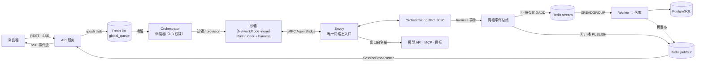

<h1 align="center">
  <br/>
  JoySafeter
</h1>

<p align="center">
  <strong>开源、可自托管的安全托管智能体（Managed Agent）平台。</strong><br/>
  <sub>你只需声明 Agent 的工具、技能与护栏，JoySafeter 便在你自己的加固、可观测的基础设施上托管运行它。从想法到生产级安全自动化，只需几分钟，而非数月。</sub>
</p>

<p align="center">
  <a href="https://www.apache.org/licenses/LICENSE-2.0"></a>
  <a href="https://www.python.org/downloads/"></a>
  <a href="https://nodejs.org/"></a>
  <a href="https://fastapi.tiangolo.com/"></a>
  <a href="https://nextjs.org/"></a>
  <a href="#"></a>
</p>

<p align="center">
  <a href="./README.md">English</a> | 简体中文
</p>

---

## 为什么选择 JoySafeter

托管智能体运行模型对自主工作是正确选择。但对**安全**而言 —— 你在客户系统上、
在 NDA 之下运行具攻击性的工具 —— Agent *在哪里、以何种方式*运行才是决定性的。
JoySafeter 把这套模型交到你**自己的基础设施**上：

- **数据与目标绝不出你的基础设施。** 完全自托管：提示词、发现、抓取的流量、目标细节都留在你的
  网络内。任何第三方都不会看到本次工作。
- **网络受限执行。** 每个会话跑在 `NetworkMode=none` 沙箱里，前置一个 Envoy 代理，
  **默认全拒的出口白名单** —— 攻击性工具无法回连外部或横向进入你的网络，除非你显式放行。
- **发布边界的技能供应链管控。** 技能是会在你环境里执行的代码；skillspector 默认提示风险，
  可通过全局开关要求发布前对同一份不可变快照执行新的成功扫描。
- **引擎无关。** Claude Code、Codex、或自研 `ccb` 引擎，统一在一个 gRPC 契约之后 —— 不锁定单一
  厂商或模型。

| | 云托管智能体 | 自建 | **JoySafeter** |
|---|---|---|---|
| 数据 / 目标驻留 | 厂商云 | 你的 | **你的 —— 完全自托管** |
| 引擎 / 模型 | 单一厂商 | 自行拼装 | **Claude Code / Codex / native，按 Agent 选** |
| 网络隔离 | 厂商托管 | 自行搭建 | **每沙箱 Envoy 全拒出口** |
| 技能与工具安全 | 厂商托管 | 自行搭建 | **SkillSpector 扫描 + 可选发布闸门** |
| 上生产时间 | 数天 | 数月 | **数天，在你自己的硬件上** |

> JoySafeter 将其定义为 **AI 驱动安全运营（AISecOps）**：把托管智能体模型 —— 多步自主、
> 沙箱化工具、会话、全链路可观测 —— 面向安全场景专门化，并完全运行在你的掌控之下。

---

## 实战案例

### 案例一 —— APK 漏洞检测智能体

> 上传 APK，获得 OWASP Mobile Top 10 检测报告，全程无需人工干预。

<p align="center">
  
</p>

> **这是一个演示流程，而非内置集成。** 该 Agent 配置了 `pentest-mobile-app` 技能，
> 并使用装有移动端分析工具的沙箱镜像 —— 工具由你自行选配。

**运行流程：**

1. 用户上传 APK 文件
2. Agent 用沙箱内的移动端工具做静态分析（例如 MobSF）
3. 提取关键风险点 —— 权限滥用、硬编码密钥、不安全的网络配置等
4. 对高危项通过动态插桩做深度验证（例如 Frida）
5. 自动生成符合 OWASP Mobile Top 10 格式的结构化检测报告

整个流程从上传到出报告，零人工干预，覆盖了传统需要 2–3 名安全工程师协作完成的工作量。

---

### 案例二 —— 渗透测试智能体

> 给出目标和测试范围，Agent 自主规划、执行、动态调整，最终交付报告。

<p align="center">
  
</p>

**操作流程：**

1. 进入工作台，创建新 Agent
2. 选择执行引擎（Claude Code / Codex / native）→ 选择渗透测试相关 Skills
3. 输入经过授权的目标地址和测试要求
4. Agent 在隔离沙箱中自主运行 —— 若发现登录页面，自动触发认证绕过测试
5. 会话结束后下载完整报告

> **备注：** 需要为所选引擎配置匹配的 agent runtime 镜像。本地部署读取 `deploy/.env`
> 中的 `JOYSAFETER_IMAGE_CLAUDE`、`JOYSAFETER_IMAGE_CODEX`、`JOYSAFETER_IMAGE_NATIVE`；
> 使用镜像仓库部署时可通过 `./deploy.sh pull --all` 同步这些变量。

这种根据侦察结果动态决定下一步的能力，是传统固定脚本无法实现的。

---

## 核心能力 —— 托管智能体的构建块

你只需声明一个 Agent —— 引擎、模型、系统提示词、工具、Skills、MCP 服务、护栏 —— JoySafeter
就用与 Claude Managed Agents 背后同一套**托管智能体构建块**端到端地运行它，只不过是
**自托管、面向安全场景**的：

<table>
<tr>
<td width="50%">

### 🧠 托管 harness 与编排

- **Orchestrator** + gRPC `AgentBridge` + 沙箱内 Rust `sandbox-runner` 负责决定何时调用工具、管理上下文、从错误中恢复
- **以 DB 为准的调度** —— 用 `FOR UPDATE SKIP LOCKED` 从 Postgres 认领任务，带重试与超时
- **触发器（Triggers）** —— 按 **cron** 周期、一次性时间、或**入站签名 webhook**（HMAC / bearer / token）自动运行 Agent；支持每次触发的会话模式（fresh / reuse / pinned / keyed）、重试/退避与死信自动禁用 —— [使用文档](backend/README.md#triggers-触发器)
- **引擎无关** —— Claude Code CLI、Codex app-server、自研 `native`（`ccb`）harness，按 Agent 选择

</td>
<td width="50%">

### 📦 沙箱执行

- 每个会话运行在**独立加固容器**中 —— 丢弃能力、非 root、no-new-privileges
- **可插拔 Provider** —— Docker（默认）、E2B（Firecracker）、Daytona，统一 SPI
- **出站管控** —— 每沙箱 Envoy 代理，默认拒绝的域名白名单

</td>
</tr>
<tr>
<td width="50%">

### 🔧 工具、自定义工具与 MCP

- 每个 Agent 可挂载**内置工具**、**自定义工具**（名称 + JSON Schema）与 **MCP 服务**
- MCP 配置 + Vault 凭据在运行时解析，经 gRPC 下发到沙箱
- **安全技能包**在沙箱镜像内驱动 **Nmap / Nuclei / Trivy** 等工具；任意外部工具经 **MCP 协议**接入

</td>
<td width="50%">

### 📚 Skills

- **30 个版本化能力包** —— 渗透测试、文档分析、规划/元技能
- **SkillSpector 安全扫描**默认只提示风险，可选仅在发布时执行 fail-closed 强制扫描
- **AI Skill 创作** —— LLM 辅助的起草、编辑、版本化与 diff

</td>
</tr>
<tr>
<td width="50%">

### 💾 会话、记忆与恢复

- **Session** 是持久对话，带**追加式、按 seq 排序的事件日志**
- **记忆库** —— 版本化、Agent 可写的 KV 存储，与沙箱双向同步
- **可恢复** —— 重连时重新挂接会话的 harness 与工作目录

</td>
<td width="50%">

### 🛡️ 作用域权限与护栏

- **每工具授权** —— `always_ask` / `always_allow`，高危工具触发人工确认（HITL）
- **凭据加密** —— Provider Key 存 Secrets、MCP 凭据存 Vaults，AES-256-GCM，作为沙箱 env 注入
- **SSRF 守卫** —— 拦截云元数据端点；可选私网段加固

</td>
</tr>
<tr>
<td width="50%">

### 🔎 全链路可观测

- **实时 SSE 事件流** —— 每条消息、思考步、工具调用、工具结果、模型请求
- **OpenTelemetry** traces + `observations`，带 token/成本聚合，`trace_id` 端到端传播
- 追加式会话事件日志天然充当完整**审计轨迹**

</td>
<td width="50%">

### 🏢 多租户与访问控制

- **组织 / 项目 / RBAC** —— 工作区隔离 + 基于角色的访问控制
- **SSO** —— GitHub、Google、Microsoft、OIDC（Keycloak、Authentik、GitLab）、JD SSO
- **Quickstart** —— 用自然语言描述目标，分钟级生成可运行的 Agent

</td>
</tr>
</table>

---

## 快速开始

```bash
cd deploy
./deploy.sh doctor
./deploy.sh local
```

这是当前唯一支持的完整安装路径。`local` 会自动选择 Docker daemon 的 `amd64` 或 `arm64`
架构，构建核心服务与默认 Claude Code runtime，执行数据库迁移并启动完整栈。

访问地址：

| 服务 | 地址 |
|------|------|
| 前端 | http://localhost:3000 |
| API | http://localhost:8000 |
| API 文档 | http://localhost:8000/docs |

安装说明见 [INSTALL_CN.md](INSTALL_CN.md)，构建与部署命令见
[deploy/README.md](deploy/README.md)，宿主机开发见 [DEVELOPMENT.md](DEVELOPMENT.md)。

---

## 架构概览


<sub>总览信息图 —— ① 控制面（REST · CLI）→ ② Agent Harness（沙箱内）→ ③ Session 状态层。交互版：[`docs/architecture-diagram.html`](docs/architecture-diagram.html)。</sub>



> **托管智能体总览信息图：** [docs/architecture-diagram.html](docs/architecture-diagram.html) —— 在浏览器打开（① 控制面 REST·CLI → ② Agent Harness → ③ Session 状态层）。
>
> 完整架构（部署拓扑、gRPC 契约、引擎、沙箱、事件模型、领域 FSM）：
> **[docs/ARCHITECTURE_CN.md](docs/ARCHITECTURE_CN.md)** · 分层视图：
> [docs/architecture-unified-event-model.mmd](docs/architecture-unified-event-model.mmd)

**核心设计原则：**

- **显式服务边界** —— Python 只承载 `api` / `worker` 两个服务；调度、gRPC `AgentBridge` 与沙箱生命周期由 Rust `orchestrator-rs` 服务负责
- **调度以 DB 为准** —— API 将任务推入 Redis list 作为唤醒信号；orchestrator 用 `FOR UPDATE SKIP LOCKED` 从 Postgres 认领待处理行
- **持久化与实时投递解耦** —— 两阶段事件总线分别扇出到 Redis Streams（持久，Worker 消费 → `joysafeter_session_events`）和 Redis Pub/Sub（临时，驱动 SSE 扇出到浏览器）
- **实时事件走 SSE** —— 浏览器订阅 `GET /api/v1/sessions/{id}/events/stream`（先按 `?after_seq` 从 DB 回放，再接实时）；WebSocket 仅用于 `/ws/notifications`
- **沙箱内 gRPC 执行** —— Agent 从不在 orchestrator 进程中运行；每会话容器内的 Rust `sandbox-runner` 通过 gRPC `AgentBridge` 协议回连 orchestrator
- **可插拔引擎** —— `claude`（Claude Code CLI）、`codex`（Codex app-server）、`native`（自研 `ccb` 二进制），按 Agent 的 `engine_kind` 选择
- **可插拔沙箱** —— Docker（默认，加固）、E2B、Daytona，统一的 `SandboxProvider` SPI
- **集中化状态机** —— Task、Session、Sandbox、Skill 生命周期均由受保护的 FSM 管理
- **规范化错误系统** —— `AppError` 输出规范的 `ErrorDescriptor`（`{code, message, data, source, retryable, user_action}`），HTTP 与流式路径一致消费
- **OTel 观测追踪** —— 全链路 `trace_id` 传播，span 落库
- **凭据加密** —— Provider API Key 存于 Secrets、MCP 凭据存于 Vaults，均 AES-256-GCM 加密，运行时注入沙箱
- **分层技能体系** —— 发布要求 Skill 已审批；Agent 与运行时只消费不可变的已发布版本，不回查父 Skill 的后续扫描状态

### 用户操作路径 —— 快速入门

> **登录** → **添加 Provider Key（Secrets）** → **配置 MCP 凭据（Vaults）** → **Skill 管理** → **构建 Agent** → **开启 Session** → **对话并实时观看事件** → **下载报告**

---

## 技术栈

| 层级 | 技术 | 用途 |
|------|------|------|
| **前端** | Next.js 16（App Router）, React 19, TypeScript | 服务端渲染，产品界面位于 `/managed/**` |
| **UI** | Radix UI, Tailwind CSS | 无障碍组件基元 |
| **状态管理** | Zustand, TanStack Query | 客户端与服务端状态 |
| **后端** | FastAPI 0.122+, Python 3.12+ | 异步 API 与 worker 服务；调度由 Rust `orchestrator-rs` 服务负责 |
| **Agent 运行时** | Rust `sandbox-runner` + Claude Code / Codex / `ccb` harness | 每会话沙箱执行，经 gRPC `AgentBridge` |
| **MCP** | mcp 1.20+, fastmcp 2.14+ | 工具协议支持 |
| **数据库** | PostgreSQL, SQLAlchemy 2.0 | 异步 ORM，Alembic 迁移 |
| **事件总线/缓存** | Redis（Streams · Pub/Sub · list） | 持久事件流、实时 SSE 扇出、任务队列 |
| **出站管控** | Envoy | 每沙箱默认拒绝的域名白名单 |
| **可观测性** | OpenTelemetry, Loguru | 全链路追踪与结构化日志 |

---

## 文档

### 快速上手
- [INSTALL_CN.md](INSTALL_CN.md) — 统一安装入口
- [DEVELOPMENT.md](DEVELOPMENT.md) — 本地开发
- [deploy/README.md](deploy/README.md) — 构建、镜像发布与部署

### 深入了解
- [docs/README.md](docs/README.md) — 文档地图
- [docs/ARCHITECTURE_CN.md](docs/ARCHITECTURE_CN.md) — 架构总览
- [docs/PRODUCTION_READINESS.md](docs/PRODUCTION_READINESS.md) — 上线前生产门禁
- [backend/README.md](backend/README.md) — 后端指南
- [frontend/README.md](frontend/README.md) — 前端指南

### 教程
参见 [docs/tutorials/](docs/tutorials/)，包含模型配置、MCP 集成、技能开发等逐步指南。

### 项目治理
- [CONTRIBUTING.md](CONTRIBUTING.md) — 贡献指南
- [SECURITY.md](SECURITY.md) — 安全策略
- [CODE_OF_CONDUCT.md](CODE_OF_CONDUCT.md) — 行为准则

---

## 社区

如有问题或想与其他用户交流，欢迎扫码加入微信交流群：

<p align="center">
  
  &nbsp;&nbsp;&nbsp;&nbsp;
  
</p>

---

## 贡献指南

```bash
git clone https://github.com/jd-opensource/JoySafeter.git
git checkout -b feature/amazing-feature
git commit -m 'feat: add amazing feature'
git push origin feature/amazing-feature
```

详情请查看 [CONTRIBUTING.md](CONTRIBUTING.md)。

---

## 许可证

Apache License 2.0 —— 详见 [LICENSE](LICENSE) 文件。

第三方组件许可证：[THIRD_PARTY_LICENSES.md](THIRD_PARTY_LICENSES.md)

---

## 致谢

<table>
<tr>
<td align="center"><a href="https://fastapi.tiangolo.com/"><br/><sub>FastAPI</sub></a></td>
<td align="center"><a href="https://nextjs.org/"><br/><sub>Next.js</sub></a></td>
<td align="center"><a href="https://www.radix-ui.com/"><br/><sub>Radix UI</sub></a></td>
<td align="center"><a href="https://www.envoyproxy.io/"><br/><sub>Envoy</sub></a></td>
<td align="center"><a href="https://opentelemetry.io/"><br/><sub>OpenTelemetry</sub></a></td>
</tr>
</table>

---

<p align="center">
  <sub>由 JoySafeter 团队用 ❤️ 打造</sub><br/>
  <sub>如需咨询商业方案，请联系京东科技解决方案团队：<a href="mailto:org.ospo1@jd.com">org.ospo1@jd.com</a></sub>
</p>
