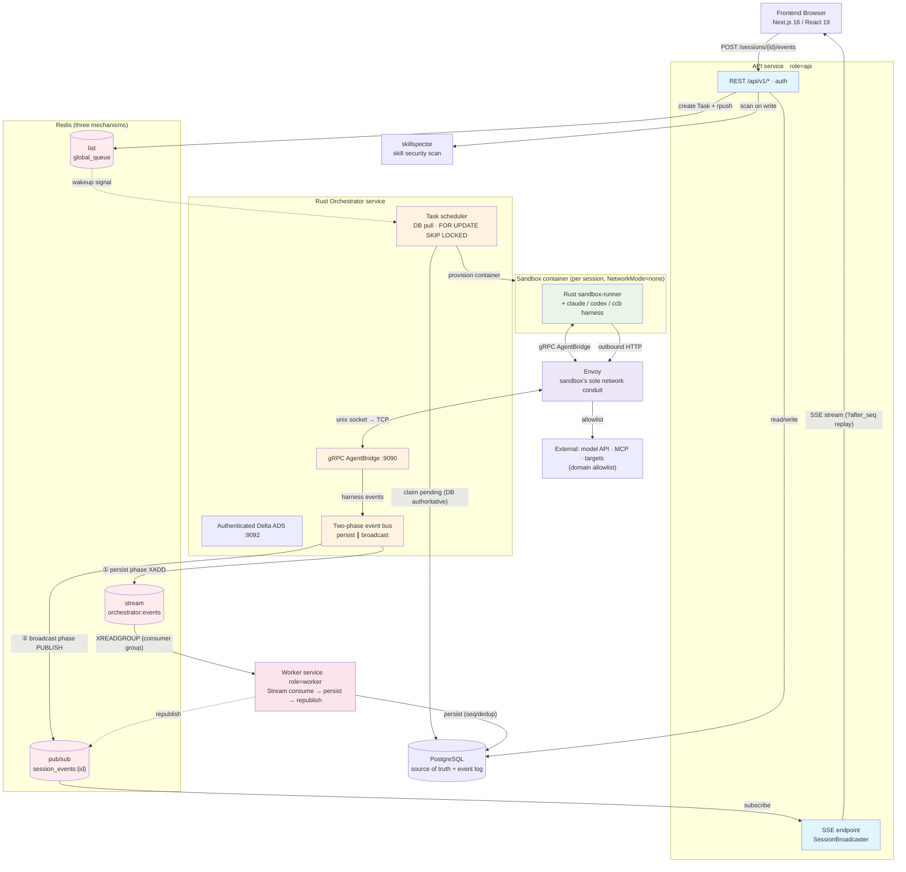
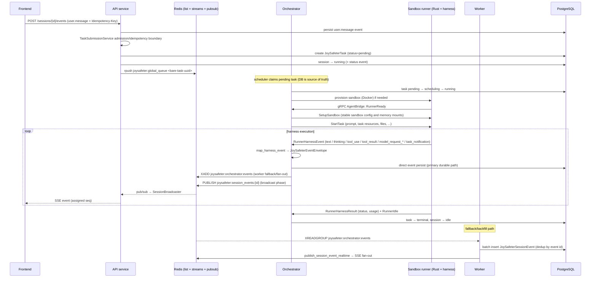

# Architecture

This document describes the current runtime architecture. Source code and automated tests are the final authority.

JoySafeter is an AI-agent orchestration platform for security work. A user defines
an **Agent** (engine + model + system prompt + tools + skills + MCP servers), opens a
**Session** (a conversation), and sends messages. Each message becomes a **Task** that
the platform schedules onto an isolated **sandbox** container, where a coding-agent
harness (Claude Code / Codex / a self-developed `ccb` runner) executes with the agent's
configured capabilities. Everything the harness does — text, thinking, tool calls,
tool results, model requests, sub-agent lifecycle — is streamed back as **events**,
persisted, and pushed to the browser live over **SSE**.

---

## 1. Deployment topology

JoySafeter runs as **two Python FastAPI services, one Rust orchestrator, and supporting
infrastructure**. The Python API and Worker share one codebase and select behavior at boot
from `JOYSAFETER_SERVICE_ROLE` (`api` / `worker`). The orchestrator is the Rust binary in
`app/joysafeter_orchestrator_rs`.



### Services & containers

| Component | Compose service | Role | Key responsibility |
|---|---|---|---|
| **API** | `api` | `JOYSAFETER_SERVICE_ROLE=api` | REST `/api/v1/*`, SSE execution stream, notification WebSocket, auth |
| **Orchestrator (Rust)** | `orchestrator-rs` (profile `rust-orchestrator`) | — | gRPC `AgentBridge` server, task scheduler, sandbox lifecycle, event bus |
| **Worker** | `worker` | `worker` | Consumes the Redis event Stream, batch-persists events to `joysafeter_session_events`, republishes for SSE |
| **Frontend** | `frontend` | — | Next.js App Router UI |
| **PostgreSQL** | `db` | — | System of record for all state |
| **Redis** | `redis` (profile `local-redis`) or external | — | Event Streams, Pub/Sub fan-out, task queue, coordination |
| **Envoy** | `joysafeter-envoy` | — | Fronts each sandbox's unix socket; enforces per-sandbox egress allowlist |
| **skillspector** | `skillspector` | — | Standalone skill security-scanning service; advisory by default, optionally enforced only when publishing a version |
| **db-init** | `db-init` (profile `init`) | — | One-shot Alembic migrations |

Use the deployment helper for the supported local stack:
`cd deploy && ./deploy.sh doctor && ./deploy.sh build --group runtime && ./deploy.sh local && ./deploy.sh verify`.
The verification command is an operational contract check, not a second lifecycle owner: it observes
Compose state, orchestrator health/xDS/metrics, and the Registry-derived runtime image inventory without
creating domain objects or mutating PostgreSQL.

### Collaboration contracts

Each service has one clear ownership boundary. Cross-service calls should preserve these
contracts instead of recreating older in-process shortcuts.

| Actor | Owns | Consumes | Publishes / mutates | Must not do |
|---|---|---|---|---|
| Frontend | Product UI state, auth redirects, SSE subscriptions | REST responses, SSE events, notification WS | User commands through REST | Talk to Redis, Postgres, orchestrator gRPC, or sandbox containers directly |
| API | Auth/RBAC, REST validation, CRUD, task creation, SSE replay/live bridge, skill write-time scan calls | Browser requests, DB state, Redis Pub/Sub for live events | DB rows, Redis task wakeup, Redis command relay | Run agent harnesses, create sandboxes, consume durable event streams |
| Rust orchestrator | Scheduling, task leases, sandbox lifecycle, runner gRPC, the elected xDS authority, control ACKs, event emission | Pending DB tasks, Redis wakeups/commands, runner gRPC streams, Envoy ACK/NACK | Task/sandbox/session state, Redis Stream events, Redis Pub/Sub broadcasts, leader-owned xDS resources | Serve product REST APIs, own browser auth, batch-persist event logs as the primary path, or let non-authority replicas mutate provider-local xDS state |
| Sandbox runner | In-container harness execution, tool/MCP invocation, memory/file sync from inside the sandbox | `SetupSandbox` and `StartTask` over gRPC, sandbox env, task-scoped files | Runner events/results over gRPC, memory sync messages | Receive generic secret maps or remote MCP authentication material, reach the host network directly, mutate platform DB/Redis, bypass Envoy egress policy |
| Worker | Durable event persistence, `seq` assignment, Redis Stream recovery/redelivery | Redis Stream consumer group | `joysafeter_session_events`, replay Pub/Sub after DB write | Schedule tasks, create sandboxes, expose user-facing APIs |
| SkillSpector | Static skill security scanning service | Skill content sent by API/domain service | Advisory verdicts and optional publish-time enforcement | Decide runtime packaging or invalidate already-published versions |
| PostgreSQL | Source of truth for domain state, task/session/sandbox FSMs, event log | Writes from API/orchestrator/worker/db-init | Durable rows | Act as a queue or live fan-out bus |
| Redis | Wakeups, Streams, Pub/Sub, command relay, ownership/heartbeat coordination | API/orchestrator/worker pub/sub/list/stream traffic | Ephemeral and durable-stream messages | Be treated as scheduling or network-policy truth; PostgreSQL rows are authoritative |

### Failure ownership

| Symptom | Primary owner | First checks |
|---|---|---|
| User cannot log in or CRUD resources | API | `api` logs, auth config, database connectivity |
| Session created but task never starts | Orchestrator | pending task row, `global_queue` wakeup, orchestrator logs, DB lease/fencing settings |
| Sandbox never becomes ready | Orchestrator + Docker host | Docker socket mount, sandbox image, workspace volume, runner `RunnerReady` timeout |
| Agent runs but browser misses live events | API SSE bridge + Redis Pub/Sub | API `SessionBroadcaster`, Redis Pub/Sub, browser `?after_seq` replay |
| Events appear live but disappear after refresh | Orchestrator event persister + Worker fallback | Orchestrator DB persist logs, Redis Stream pending entries, worker logs, Postgres insert errors, advisory-lock contention |
| Skill cannot be used at runtime | Skill domain | referenced version exists and has immutable version files |
| Sandbox cannot reach model/MCP/target | Envoy + orchestrator sandbox config | allowlist, Envoy config files, `JOYSAFETER_GRPC_PUBLIC_URL`, target DNS/network policy |

---

## 2. The core loop — from message to live events

This is the single most important flow. Follow it once and the rest of the architecture
falls into place.



Core ownership rules:

1. **The DB is the source of truth for scheduling.** The Redis list
   (`joysafeter:global_queue`) is only a *wakeup signal*; the orchestrator claims work by
   querying `joysafeter_tasks` with `FOR UPDATE SKIP LOCKED`. If Redis loses a signal, the
   scheduler still finds the pending row.

2. **Task submission has one owner.** API routes, follow-up chat messages, manual
   trigger runs, and worker-fired cron triggers submit through
   `TaskSubmissionService`. That service owns idempotency replay, admission control,
   task creation, session running/idle transitions, enqueue, and enqueue-failure
   compensation. Routes may validate request-specific inputs, but they should not
   hand-roll task dispatch.

3. **Session resources have one owner.** File and git-repository resources mounted
   into sessions are validated, normalized, encrypted, listed, added, deleted, and
   rotated through `SessionResourceService`. Routes may discriminate the request
   body shape, but they should not write `SessionFile` / `SessionRepo` rows or
   encrypt clone tokens inline.

4. **Task cancellation has one owner.** API cancel requests and scheduler
   replacement policy cancel through `TaskCancellationService`. That service owns
   runtime cancel relay, task state transition, linked session idle transition,
   and the `session.status_idle` event. Routes and schedulers should not mark a
   task cancelled or write session-idle compensation inline.

5. **Project lifecycle has one owner.** Project create/list/default/restore/archive
   state transitions go through `ProjectService`. Project archive owns the full
   closed loop: default-project guard, active-task gate, session sandbox destroy
   relay, sandbox state sync, session archival, trigger pause, and the final
   project archive timestamp. Routes should not recreate that chain inline.

6. **Sandbox status writes are compare-and-swap.** Rust runtime state changes use
   `transition_sandbox_cas(expected_status, new_status)`, which validates the documented
   sandbox FSM before issuing the fenced update. There is no read-then-write compatibility
   transition API, so stale observers cannot select their own expected state.

6. **Organization membership has one owner.** Organization creation/deletion and
   member role lifecycle go through `OrganizationService` and
   `OrganizationMemberService`. Those services own owner membership bootstrap,
   default project bootstrap, owner/admin gates, role normalization, owner
   transfer, duplicate member checks, member removal, and route-specific error
   contracts. Routes may shape responses and audit events, but should not write
   `Member` rows or duplicate role policy inline.

7. **Persistence and live delivery are decoupled.** The orchestrator writes events
   directly to Postgres as the primary durable path and also publishes to Redis Stream
   for worker fallback/backfill and to Redis Pub/Sub for live SSE fan-out. The browser
   gets events fast; durable rows let a reconnecting client replay from `?after_seq`.

---

## 3. Transport map — what talks to what, and how

Runtime communication uses several purpose-built channels. This table is the definitive reference.

| Channel | Mechanism | Purpose | Anchor |
|---|---|---|---|
| Browser → API | HTTPS REST `/api/v1/*` | All CRUD + commands | `joysafeter_api/api/v1/router.py` |
| **Live events → browser** | **SSE** `GET /sessions/{id}/events/stream` | Primary execution stream (DB replay via `?after_seq`, then live) | `joysafeter_api/api/v1/sessions.py` |
| Notifications → browser | WebSocket `/ws/notifications` | User-level notifications (in-memory `NotificationManager`) | `joysafeter_api/app.py`, `joysafeter_api/websocket/notification_manager.py` |
| Per-task stream | WebSocket `/tasks/{id}/stream` | Per-task output (bridge queue → Redis fallback) | `joysafeter_api/api/v1/tasks.py` |
| Task enqueue | Redis **list** `joysafeter:global_queue` | API `rpush` → Rust orchestrator scheduler pops | `joysafeter_api/services.py`, `joysafeter_orchestrator_rs/src/kernel/queue.rs` |
| **Durable event bus** | Redis **Streams** `joysafeter:orchestrator:events` + consumer group | Orchestrator `XADD` → Worker `XREADGROUP` → DB persist | `joysafeter_orchestrator_rs/src/events/stream_publisher.rs`, `joysafeter_worker/events/stream_consumer.py` |
| **Live event fan-out** | Redis **Pub/Sub** `joysafeter:session_events:{id}` | Cross-instance SSE delivery via `SessionBroadcaster` | `joysafeter_orchestrator_rs/src/kernel/session_broadcaster.rs`, `joysafeter_shared/orchestrator_bridge/session_broadcaster.py` |
| Control/cancel relay | Redis **Pub/Sub** `joysafeter:cmd:{instance}` | Route cancel/input/shutdown to the instance owning the sandbox | `joysafeter_shared/orchestrator_bridge/runtime_commands.py`, `joysafeter_orchestrator_rs/src/kernel/command_listener.rs` |
| Network-policy wakeup | Redis **Stream** `joysafeter:network-policy:requests` | Wake the elected xDS authority for an exact PostgreSQL policy generation or teardown | `joysafeter_orchestrator_rs/src/kernel/ha/redis_impl.rs`, `joysafeter_orchestrator_rs/src/xds/authority.rs` |
| Orchestrator ↔ runner | **gRPC** `AgentBridge` (bidi stream, :9090) | The agent execution protocol | `proto/joysafeter.proto`, `joysafeter_orchestrator_rs/src/grpc/server.rs` |
| Runner egress | Envoy proxy (unix socket) | Per-sandbox domain allowlist, deny-all default | `joysafeter_orchestrator_rs/src/sandbox/envoy.rs` |
| Skill scan | HTTP → skillspector `:8010` | Informational scans on writes; optional fresh fail-closed scan only when publishing | `joysafeter_skill_security.py` |

**API ↔ orchestrator is Redis, not direct gRPC.** Python API/worker processes use
`joysafeter_shared.orchestrator_bridge` only for lightweight API-side helpers and optional test seams; runtime control flows through
Redis command relay and ACKs. gRPC is used *only* for the Rust orchestrator ↔ in-sandbox-runner hop.

---

## 4. Services in detail

### 4.1 API service (`app/joysafeter_api/`)

The API surface. Assembles a FastAPI app (`app.py`), wraps every `/api/v1` JSON response in
a `{success, code, message, data}` envelope via `ApiV1ResponseWrapperMiddleware`
(`api/v1/middleware.py`) — the middleware **skips** any `/stream` path and any
`StreamingResponse`, which is why SSE emits raw `text/event-stream`.

**Auth** (`app/joysafeter_shared/common/joysafeter_auth/dependencies.py`) resolves a
request in priority order: `X-Api-Key` header → JWT (from `Authorization` or cookie, with
real-time DB re-verification of org/project membership) → cookie/session fallback
(auto-provisions a default org+project on first login). Every project-scoped route filters
by `auth_ctx.project_id` for multi-tenant isolation. WebSocket connections authenticate via
a short-lived token from `GET /auth/ws-token`.

**Startup** is deliberately small: `run_api_startup()` only wires the `SessionBroadcaster` for SSE.

The full REST inventory is in [§8 API surface](#8-api-surface).

### 4.2 Orchestrator service (`app/joysafeter_orchestrator_rs/`)

The engine room. Hosts the gRPC `AgentBridge` server and a set of DB-driven control loops.
Agent code does **not** run in this process — it runs inside the sandbox runner, reached
over gRPC.

| Subsystem | Module | Responsibility |
|---|---|---|
| Runner server | `src/grpc/server.rs` | Binds the Runner TCP/UDS listeners, configures tonic limits/keepalive, and owns only server-task lifecycle |
| Runner transport | `src/grpc/transport.rs` | Adapts the closed protobuf `AgentBridge.Session` stream into the application-owned `RunnerInbound` port, enforces connection limits, and contains all tonic stream/error types |
| Runner inbound port | `src/kernel/runner/inbound.rs` | Defines the transport-neutral message source consumed by setup, execution, recovery, and session orchestration; it owns no connection or task state |
| Runner session | `src/kernel/runner/session.rs` | Authenticates runners, performs the handshake, registers/displaces bridges, and delegates work through `RunnerFlowSet` |
| Runner child flows | `src/kernel/runner/{admission,setup,task_lifecycle,execution,recovery,memory_sync,failure,cleanup,metrics}.rs` | Own identity/protocol admission, setup, durable task transitions, execution/event handling, reconnect recovery, memory synchronization, terminal failure ejection, disconnect cleanup, and bounded observations independently |
| xDS control plane | `src/xds/control_plane.rs`, `src/xds/resource_store.rs`, `src/xds/node_ownership.rs`, `src/xds/delta.rs` | One process-level composition root, atomic explicitly-owned resource world, complete sandbox-to-node lifecycle, and Delta reconciliation |
| xDS transport | `src/xds/auth.rs`, `src/xds/transport.rs` | Dedicated `:9092` ADS listener, keyring authentication, and transport isolation from runner gRPC |
| xDS authority | `src/xds/authority.rs`, `src/xds/leader.rs` | Single `Standby → Staging → RecoveryServing → Ready → Revoked` lifecycle, epoch-fenced recovery/mutation guards, ADS admission, and leader endpoint publication |
| Task scheduler | `src/kernel/scheduler.rs` | Claims pending tasks (`FOR UPDATE SKIP LOCKED`), resolves a sandbox, pushes to the sandbox queue |
| Task controller | `src/kernel/task_controller.rs` | Lifecycle, startup recovery, failover/retry |
| Sandbox controller | `src/kernel/sandbox_controller.rs` | Timer/notification orchestration over isolated idle, provisioning, pool, orphan, and task-recovery capabilities |
| Sandbox resolution | `src/kernel/sandbox_resolver.rs`, `src/kernel/sandbox_resolver/*` | Reuse/restart → pool claim → create orchestration over explicit context, lifecycle, networking, provisioning, pool, and identity-policy capabilities |
| Sandbox bridge | `src/kernel/sandbox_bridge.rs` | Per-connection in-memory state: runner stream, connection ID, setup generation, runtime activity, subscribers, and control queue |
| HA bridge store | `src/kernel/ha/{traits,local,redis_impl}.rs` | Sole Runner-connection ownership authority: local lookup or Redis owner + connection-generation fencing, heartbeat, compare-and-delete, and cross-instance dispatch |
| Redis coordinator | `src/kernel/redis_coordinator.rs` | Cross-instance coordination other than Runner ownership: instance heartbeat, task mapping, distributed locks, queues, and event publication |
| Command listener | `src/kernel/command_listener.rs` | Redis command relay for cancel/input/shutdown/memory updates with ACKs |
| Event bus | `src/events/bus.rs` | In-process event bus feeding stream persistence and realtime fan-out |
| Session broadcaster | `src/kernel/session_broadcaster.rs` | Live SSE fan-out via Redis Pub/Sub |

Startup order (`src/bootstrap/application.rs`; `src/main.rs` only delegates): config + database + Redis coordinator → one process-wide xDS authority and
`XdsControlPlane` → provider adapters receive the control plane → dedicated authenticated ADS on `:9092` → provider initialization →
`Staging` / `RecoveryServing` PostgreSQL recovery → `Ready` → runner `AgentBridge` on `:9090` → task and
lifecycle background loops. In multi mode, the Lease owner publishes its endpoint at `RecoveryServing` so
Envoy can ACK recovery; mutation guards remain unavailable until `Ready`. Lease loss and shutdown enter
`Revoked` before endpoint removal and transport shutdown. Multi mode fails closed when managed egress is
enabled without the Kubernetes leader-only xDS authority.

After a bridge is registered, every session exit follows one finalization path. Protocol/setup/execution
failures first delegate durable quarantine, credential revocation, and task repair to `RunnerFailureService`;
ordinary transport loss retains the reconnect grace period. Both paths then compare-and-remove only the
same bridge connection, release its Redis ownership generation, and unregister request-scoped memory state.
An old connection cannot delete or refresh a replacement connection, including when another orchestrator
replica owns that replacement.

Runner authentication is a two-step proof. Credential verification may observe the short-lived
`creating/admission` state while the provider is still returning from `create`; connection commit then
revalidates the same token digest against the current PostgreSQL row and returns the current sandbox/session
binding. The legal monotonic `admission → active` activation is accepted, while credential rotation,
expiration, revocation, stopping/destroyed status, or row deletion fail closed.

Sandbox file requests remain owned by the active Runner execution flow. A child operation may await a typed
file response, but the execution flow must continue consuming `RunnerInbound` and route matching responses
to `SandboxBridge`; waiting on the bridge without driving inbound is forbidden because it self-deadlocks the
single bidirectional stream. Artifact persistence starts only after the matching response is received and is
best-effort relative to the already-authoritative task result.

#### Orchestrator ownership and extension boundaries

The orchestrator has one composition root and several independently replaceable child flows. The main
flow may select implementations, connect ports, start them in dependency order, and supervise shutdown;
it must not reproduce provider, network-policy, xDS, or transport decisions. Concrete provider selection
is therefore registry-driven rather than hard-coded through branches in `main.rs` or business services.

| Area | Module | Owns | Inputs → outputs | May depend on | Failure owner |
|---|---|---|---|---|---|
| Process entry | `src/main.rs` | Logging/config entry and delegation only | environment → `JoySafeterConfig` → `OrchestratorApplication` | `bootstrap` | Invalid process configuration |
| Composition root | `src/bootstrap/application.rs` | Process-wide object graph, startup order, background-loop startup, coordinated shutdown | validated config → initialized ports, services, and handles | config, DB/Redis constructors, registries, application services, transports | Missing required infrastructure or an invalid cross-component topology |
| Provider registry | `src/bootstrap/registry.rs` | Normalized provider-name lookup and factory dispatch | provider name + factory context → `RuntimeComponents` | factory interfaces only | Unknown/disabled provider and factory construction errors |
| Runtime factories | `src/bootstrap/runtime_factories.rs` | Concrete adapter construction, `RunnerFlowSet`, the single production `SandboxRuntimeServices` capability graph, and composition-only event handlers | config + shared infrastructure → provider/runtime adapters and application ports | concrete adapters and fixed core-flow constructors, never business callers | Construction errors and invalid capability combinations |
| Supervision | `src/bootstrap/supervisor.rs` | OS shutdown signal and health/metrics HTTP exposure | readiness + xDS snapshots → process lifecycle/HTTP responses | stable health interfaces | Listener failure is reported here; domain failures remain with their owner |
| Material adapter | `src/bootstrap/network_policy_material.rs` | PostgreSQL/credential implementation of the domain material port | `SandboxId` → validated `DesiredNetworkPolicy` inputs | DB queries and credential projection | Missing sandbox, credential reconstruction, or material-loading failure |

`ProviderFactoryRegistry` is the extension point for a new sandbox backend. A new provider registers a
`ProviderFactory` that returns a `SandboxProvider` plus the optional policy-runtime, socket-provisioning,
Envoy-process, and placement-reconciliation capabilities supported by that backend. Callers consume those
ports and handles and do not downcast or branch on provider type.
The registry is confined to bootstrap so business code cannot become a service locator.

Registration and factories have deliberately different roles. Replaceable provider implementations use
`ProviderFactoryRegistry`; fixed application flows use explicit bootstrap factories. A core flow is not
looked up dynamically merely to avoid a constructor: `build_runner_flows` and
`build_sandbox_runtime_services` make the complete production graph reviewable and type-checked, while
consumers receive only their narrow ports. `application.rs` controls startup order and supervision but
does not instantiate child-flow implementations itself.

#### Sandbox application capabilities

`SandboxRuntimeServices` is the only production composition point for sandbox application capabilities.
It creates one shared set of immutable handles and hands each consumer only the capability it needs:

| Capability | Owner | Input → output | Direct dependencies | Failure owner |
|---|---|---|---|---|
| `ResolveContextBuilder` | `sandbox_resolver/context.rs` | task/session/agent/project IDs → immutable `ResolveContext` snapshot | PostgreSQL reads, identity material, MCP/runtime projections | Missing or inconsistent material; no provider side effect has started |
| `SandboxNetworkingService` | `sandbox_resolver/networking.rs` | validated desired policy/generation → ready or failed network state | `NetworkPolicyService`, PostgreSQL generation state, bounded ready cache | Network-policy validation/application/delivery failure |
| `SandboxLifecycleService` | `sandbox_resolver/lifecycle.rs` | observed sandbox state + external ID → CAS-fenced restart/destroy/compensation result | PostgreSQL, `SandboxProvider`, networking teardown | Lifecycle transition or compensation failure |
| `SandboxProvisioningService` | `sandbox_resolver/provisioning.rs` | task ID + immutable context → newly created `ResolvedSandbox` | provider port, lifecycle compensation, networking capability | Create/start/file-injection/generation/CAS failure; compensates partial runtime creation |
| `SandboxPoolService` / `PoolSandboxProvisioner` | `sandbox_resolver/pool.rs` | claim context or image → claimed/provisioned pool sandbox | PostgreSQL, provider port, networking capability | Claim race, stale pool runtime, or pool provisioning failure |
| `SandboxResolver` / `SandboxResolution` | `sandbox_resolver.rs`, `sandbox_resolver/ports.rs` | typed IDs → `ResolvedSandbox` | context, lifecycle, pool, provisioning capabilities only | Stage-selection failure; it owns no provider construction or identity-policy side channel |
| `SandboxIdentityPolicyService` / `SandboxIdentityPolicy` | `sandbox_resolver/identity_policy.rs` | sandbox/task identity lifecycle → refresh delay, refreshed policy, or cleared lease | context snapshot, networking, lifecycle | Identity lease/material/policy refresh failure |

`SandboxResolution` is consumed by the scheduler. `SandboxIdentityPolicy` is consumed by runner execution
and recovery. Runner code never depends on `SandboxResolver`, and the resolver does not re-export pool
provisioning, identity refresh, provider creation, or network-policy internals. Context objects are built
per resolve request and passed immutably; child services share cloneable handles, not mutable request
state.

`SandboxController` is a loop coordinator, not a bag of infrastructure dependencies. Its internal fixed
flows are composed once and have disjoint dependency sets:

| Child flow | Owns | Must not own | Failure behavior |
|---|---|---|---|
| `IdleSandboxMaintenance` | bridge health, idle/disconnect/hard-timeout reap, stuck-stop recovery, stopped/error TTL cleanup | pool provisioning or provisioning progress | Each phase reports independently; one sandbox or phase failure does not suppress later cycles |
| `ProvisioningSandboxMaintenance` | provisioning progress, timeout CAS, provider stop/destroy after claim | idle policy, pool sizing, orphan inventory | A failed CAS means another actor owns the new state; external cleanup follows only a successful claim |
| `SandboxPoolMaintenance` | HA-locked pool sizing, bounded parallel top-up, stale-pool cleanup | session resolution or task identity | Per-create failures are isolated; the HA lock is released on every result path |
| `SandboxOrphanMaintenance` | provider↔PostgreSQL inventory comparison and missing-runtime cleanup | pool sizing or xDS inventory | Recent uncommitted runtimes are protected; DB task recovery precedes durable sandbox destruction |
| `SandboxTaskRecovery` | queue drain/requeue, retry exhaustion, task/session durable transitions and events | provider/network/xDS operations | PostgreSQL is authoritative; queue publication is best effort after durable transition |

Bootstrap supervises `sandbox-idle-sweep` and `sandbox-provisioning-monitor` as critical tasks,
`sandbox-pool-orphan-maintenance` as degradable, and registers the network-policy reconciler separately
only for providers with egress management. The Controller neither holds `NetworkPolicyService` nor imports
xDS types.

#### Identity, credentials, tool policy, and harness projection

These concerns cooperate during sandbox resolution and task dispatch, but they do not share one mutable
"execution context" or a generic secret map. Each domain owns one authoritative decision and publishes a
narrow typed result to the next boundary.

| Capability | Owner | Authoritative input → output | Explicit dependencies | Failure owner / non-responsibilities |
|---|---|---|---|---|
| Human authentication and product authorization | Python API auth/RBAC | JWT/session + current org/project membership → authorized API command | PostgreSQL identity and membership state | Rejects the product request; never creates runtime credentials or xDS resources |
| Task-scoped agent identity | `kernel/task_identity/{service,store,material,error}.rs` | task/project/session/agent scope + approved egress targets → validated `AgentIdentityInjection` | `TaskIdentityStore`, `TaskIdentityMaterial`, `AgentIdentityProvider` ports | Owns claim, decode, trusted-host/header validation, provider invocation, consume/release; no SQL, sandbox provider, network-policy mutation, or xDS access |
| Task identity persistence | `db/task_identity_store.rs` | typed claim/complete/release commands → CAS-fenced PostgreSQL transitions | PostgreSQL only | Owns row locking, expiry and claim conflicts; does not decrypt or call identity providers |
| Identity provider selection | `bootstrap/registry.rs` | validated provider kind → `Arc<dyn AgentIdentityProvider>` | registered `none` / feature-gated provider factory | Unknown or unavailable provider fails bootstrap; the registry is not available to business code |
| Managed credential access | `kernel/credentials/access.rs` | project-scoped credential ID + purpose-bearing `CredentialAccessContext` → typed model/service/MCP material | credential store, material adapter, append-only audit writer | Owns scope/kind/purpose validation, minimal-field reveal, and access audit; does not decide sandbox lifecycle or publish policy |
| Runtime credential projection | `kernel/credentials/runtime_projection/{environment,external_egress,git_egress,llm_egress,recovery}.rs` | validated typed material → sandbox env, narrow repository token, or Envoy credential routes | credential access and repository-material ports | Capability-focused projection plus recovery reconstruction; no provider construction, ADS session, or generation state |
| Tool authorization policy | `kernel/tool_policy.rs` | immutable Agent `tools` snapshot → provider-neutral `Allow` / `Ask` / `Deny` rules | JSON value types only | Invalid or ambiguous policy fails closed; no protobuf or harness-specific command generation |
| Tool-policy transport | `grpc/tool_policy.rs`, `proto/joysafeter.proto`, `sandbox-runner/.../tool_policy.rs` | kernel policy ↔ closed protobuf contract ↔ runner policy | transport types at the adapter edges only | Unknown enum values, missing policy, or blank selectors reject setup/task input |
| Harness input projection | `kernel/harness_input_builder.rs` and focused child modules | task/session/agent snapshots → immutable `HarnessInput` | PostgreSQL reads, credential access, repository material, skill/session-resource handlers | Owns snapshot consistency and generation fencing; does not launch a harness, mutate sandbox lifecycle, or resolve task identity |
| Harness-specific enforcement | `sandbox-runner/crates/joysafeter-runtime/` | validated runner `ToolPolicy` + `HarnessInput` → CLI config/runtime decisions | the selected `HarnessAdapter` only | Unsupported policy representation fails before execution; adapters may not weaken a decision silently |

Task identity is deliberately separate from durable reusable credentials. Its lifecycle is:

```text
API capture → PostgreSQL captured
  → TaskIdentityStore.claim_material (captured/expired resolving → resolving + 60s claim)
  → TaskIdentityMaterial.reveal
  → AgentIdentityProvider.resolve against explicit approved egress targets
  → exact route/host/port/TLS validation
  → network-policy identity-route merge
  → complete_claim → issued + material erased
```

Provider failure, malformed material, or route mismatch releases the matching claim so a bounded retry may
occur; a concurrent live claim returns `ClaimConflict`; expiry changes the row to `expired` and erases
material; terminal task transitions change unresolved material to `discarded`. The captured identity token,
auth code, and browser-header map are not copied into `ResolveContext` or sandbox environment. Only the
provider-derived per-route injection headers enter the in-memory desired policy/xDS world; their debug and
metric surfaces remain redacted, and refresh/teardown replaces or removes them. `sandbox_resolver/context.rs`
consumes `TaskIdentityService`; it no longer owns or re-exports the identity implementation.

Managed credentials follow a different, reusable flow:

```text
PostgreSQL encrypted credential + typed reference
  → CredentialMaterialAccessService scope/kind/purpose validation
  → selected-field reveal + append-only audit
  → one of: sandbox environment | Envoy credential route | clone-only repository token
  → HarnessInput / DesiredNetworkPolicy
```

The destination determines the exposure boundary. Limited-network model/MCP credentials remain in Envoy;
unrestricted-network model/service values are projected only into the sandbox creation environment;
repository material is exposed only through `HarnessRepository`/`RepoConfig.authorization_token` for clone;
the gRPC schema permanently reserves removed generic secret fields. Runtime image entrypoints convert the
purpose-specific Runner and egress proxy environment values into mode-`0600` files and unset the inline
variables before launching the Runner.

Tool policy has one semantic source and two adapter layers. The orchestrator compiles the immutable Agent
snapshot into a provider-neutral policy, `grpc/tool_policy.rs` only serializes it, the Runner rejects a
missing/unknown wire policy, and each harness adapter maps the same decisions to its native mechanism.
Claude/native render permission mode plus explicit project rules; Codex evaluates runtime tool calls; Pi
accepts only an unconditionally-allow policy and otherwise fails explicitly. Legacy `permission_mode`,
`allowed_tools`, `disallowed_tools`, and `ask_tools` protobuf fields are reserved and cannot become a second
authorization model.

Runtime capability compatibility is owned by the orchestrator engine registry and checked while building the
immutable harness input, before model credential reveal and before `SetupSandbox`. Claude/native support MCP,
custom tools, Skills, and non-deny defaults; Codex supports MCP and Skills but not custom-tool registration;
Pi supports Skills but does not support MCP or custom-tool registration and requires an unconditionally-allow
tool policy. Runner adapters retain the same checks as a final process-local defense, not as a second policy
source.

The Agent schema's optional tool-policy fields use JSON `null` and field absence equivalently: both mean
inherit the enclosing toolset default. A disabled toolset produces a deny default, while an explicitly enabled
tool entry may override it using the toolset permission decision. Non-null values with the wrong JSON type,
unknown decisions, and malformed selectors remain fail-closed at `kernel/tool_policy.rs`.
Duplicate built-in toolsets, duplicate MCP toolsets for one server, duplicate per-tool selectors, and duplicate
custom-tool names are rejected rather than relying on ordering or adapter-specific conflict resolution.

| Stage | Owner | Input → output | Failure ownership |
|---|---|---|---|
| Agent command validation | Python `AgentConfigurationPolicy` | typed request + declared MCP servers → persistable, unambiguous tool configuration | Rejects duplicate toolsets/selectors/custom names and undeclared MCP references before PostgreSQL changes |
| Execution snapshot | PostgreSQL + `run_spec.rs` | versioned Agent/Environment state → immutable task view | Rejects malformed typed IDs and snapshot overrides; never consults live mutable state for an existing snapshot field |
| Authorization compilation | `kernel/tool_policy.rs` | snapshot `tools` JSON → provider-neutral `ToolPolicy` | Owns inheritance, enabled/disabled semantics, selector uniqueness, and fail-closed parsing |
| MCP planning | `kernel/mcp_runtime_plan.rs` | declarations + authorized credential metadata + network mode → runner-safe servers + Envoy routes | Owns transport/auth matching and secret placement; does not decide tool authorization |
| Engine compatibility | `kernel/engine_adapter.rs` | engine + compiled policy + projected capabilities → executable/not executable | Rejects combinations the selected runtime cannot enforce; Skills, MCP, and custom tools remain separate capabilities |
| Harness assembly | `kernel/harness_input_builder.rs` | immutable projections → request-local `HarnessInput` | Orders the child flows, validates capability compatibility before model-secret reveal, and enforces the final generation fence |
| Wire projection and execution | `grpc/harness_projection.rs` → Runner decoder → runtime adapter | `HarnessInput` → protobuf → native runtime config | gRPC only serializes; Runner rejects missing/unknown wire values; adapter keeps a final local capability guard |
| Event classification | `events/mapping.rs` | runtime tool name + immutable declared-name sets → session event type | Recognizes canonical `mcp__<server>__<tool>` names without widening unknown servers into MCP events |

`HarnessInputBuilder` provides the final consistency barrier. It reads immutable execution snapshots,
materializes skills, session files, memory mounts, repositories, MCP declarations, model/environment data,
and tool policy, then re-reads the session/sandbox generation fence before returning. A changed generation,
ownership mismatch, inactive session, or non-ready runtime fails the build; partially assembled input is
never sent. Child handlers may return values but do not share mutable state outside the request-local
`HarnessInput`.

#### Runner application capabilities

`RunnerSessionCoordinator` owns only handshake sequencing, bridge displacement/registration, and the
single post-registration exit/finalization path. Bootstrap injects a `RunnerFlowSet`; the coordinator does
not construct concrete flows. Admission, setup, task lifecycle, execution, recovery, memory synchronization,
failure ejection, cleanup, and metrics exchange typed inputs through the coordinator and do not share
request-scoped mutable context. `admission.rs` owns identity verification, protocol capability admission,
and connection recording; `failure.rs` owns atomic durable quarantine/revocation/task repair; `setup.rs`
owns SetupSandbox generation state; recovery owns reconnect proof and orphan recovery; execution owns
task/event/artifact behavior; cleanup owns disconnect release and grace expiry; metrics observes but never
drives lifecycle decisions. Transport framing failures remain in `grpc/transport.rs`.

`BridgeStore` is the only Runner ownership API. In multi mode its Redis adapter stores a compatibility owner
value plus a separate opaque connection-generation key. Registration, heartbeat, and removal are fenced by
that generation, and teardown uses compare-and-delete. `RedisCoordinator` must not publish a second sandbox
owner key; it owns only instance liveness, task mapping, locks, queues, and event delivery.

Runner authentication has its own durable lifecycle and is not task identity or product RBAC. Provisioning
generates a random purpose-specific token, persists only its SHA-256 digest, expiry, and `admission` state
before creating the runtime, and passes the raw token only at the provider boundary. Successful provider
activation CAS-transitions the row to `active` and removes the admission expiry. `RunnerAuthenticator`
loads the authoritative row through `RunnerAuthStore`, checks sandbox availability and state, compares the
presented token digest in constant time, then atomically clears `disconnected_at`/updates `last_used_at` only
if the row is unchanged. Stop, destroy, error, and failed-provisioning paths move the row to `revoked` and
erase the digest. The raw token is materialized as a mode-`0600` file by the runtime entrypoint and is never
stored in sandbox JSON configuration.

#### Network-policy domain and application flow

`src/kernel/network_policy/` owns desired egress intent, deterministic revisioning, exact generation
orchestration, and the rules for converting runtime outcomes into PostgreSQL state transitions. It does
not own containers, Pods, ADS sessions, or protobuf/JSON encoding.

| Module | Responsibility and public capability | Dependencies and boundary |
|---|---|---|
| `mod.rs` | `DesiredNetworkPolicy`, canonical redacted revision, and `NetworkPolicyGeneration` value types | Pure domain inputs; no provider or transport access |
| `envoy_model.rs` | Validated, transport-neutral listener/cluster/credential policy model | Pure model/validation; renderers consume it but it does not consume renderers |
| `material.rs` | `NetworkPolicyMaterialResolver` input port | Implemented in bootstrap; domain callers see only `SandboxId → DesiredNetworkPolicy` |
| `ports.rs` | `NetworkPolicyRuntime` execution port and `NetworkPolicyRequestQueue` wakeup port | Infrastructure implements the ports; PostgreSQL remains authoritative |
| `request.rs` | Neutral reconcile/remove command carrying an exact generation where required | Safe to transport through Redis without embedding runtime state |
| `application.rs` | Prepare generation, validate material, apply/remove, wait for delivery, and persist exact CAS outcomes | Uses DB queries, domain ports, and authority guards; never constructs providers or xDS servers |
| `service.rs` | Crate-private application facade that owns policy capability composition and exposes ensure/reconcile/recover/teardown operations | Delegates domain decisions to `application.rs`/`recovery.rs`, adapters through ports, and durable transitions through DB queries; defines no second generation model |
| `authority.rs` | `NetworkPolicyAuthorityHandler`, adapting domain work to the generic elected-authority worker | Delegates only to `NetworkPolicyService`; owns no inventory, rendering, or persistence logic |
| `recovery.rs` | Rebuild and validate live limited-network inventory; classify ready, deferred, and quarantined entries | Reads PostgreSQL, invokes the runtime recovery port, persists exact recovery outcomes |

Normal reconcile follows one data path:

```text
business trigger
  → NetworkPolicyMaterialResolver.resolve(sandbox_id)
  → DesiredNetworkPolicy.revision/render_for
  → PostgreSQL prepare_generation(hash, version)
  → local authority apply OR Redis exact-generation wakeup
  → NetworkPolicyRuntime.apply
  → Envoy exact CDS/LDS ACK quorum
  → PostgreSQL mark_generation_applied CAS
```

Validation/material errors belong to the network-policy application boundary; stale or missing rows are
PostgreSQL concurrency outcomes; provider/render/delivery errors belong to `NetworkPolicyRuntime`; NACK and
timeout belong to xDS delivery. None may be hidden by changing a generation to ready, retrying with a
different generation, or treating Redis as truth. Recovery uses the same policy material and generation
rules, but installs one atomic resource world before persisting ready entries.

#### xDS domain, authority, and transport

`src/xds/` owns the in-memory xDS authority and protocol state. It accepts already validated resources and
explicit ownership; it does not load business credentials, decide desired policy, manage containers/Pods,
or persist sandbox lifecycle state.

| Module | Owns | Input → output / failure behavior |
|---|---|---|
| `authority.rs` | Authority FSM, epochs, recovery/mutation guards, application serialization, revocation | Lease/lifecycle events → fenced capability guards; stale epochs fail closed |
| `leader.rs` | Kubernetes Lease observation and leader-only Pod label publication | Lease + authority phase → xDS Service endpoint eligibility; API failures retry without granting authority |
| `authority_worker.rs` | Generic recover/reconcile/apply loop independent of Redis and network-policy details | request source + `AuthorityWork` handler → serialized guarded work |
| `control_plane.rs` | Stable process-local facade combining resource, ownership, delivery, and ADS services | explicit sandbox resources/placement → delivery attempts and snapshots |
| `model.rs` | Resource type, explicit owner, managed resource, sandbox bundle | Typed values only; no naming-based ownership inference |
| `resource_store.rs` | Atomic resource world and bounded revision log | owned resource batches → monotonic world revisions |
| `node_ownership.rs` | Sandbox-to-node truth and ownership transitions | neutral placement facts → scoped visibility revisions |
| `inventory.rs` | Atomic recovery inventory validation/install result | complete recovered world → installed/deferred inventory |
| `delivery.rs` | Exact generation delivery attempts and CDS/LDS quorum completion | world revision + node session ACK/NACK → terminal attempt result |
| `delta.rs` | Delta ADS subscriptions, reconnect reconciliation, per-node sessions, stream closure | authenticated protocol messages ↔ resource deltas/ACK/NACK updates |
| `auth.rs` | Shared-token keyring parsing and client principal authentication | request metadata → principal or `Unauthenticated` |
| `transport.rs` | Dedicated tonic ADS listener only | `XdsControlPlane` + authenticator → `:9092` server handle |
| `metrics.rs` | Bounded-cardinality health and Prometheus projection | internal counters/state → health/metrics snapshots |

The authority lifecycle is the sole permission model for xDS mutation. `RecoveryAuthorityGuard` permits
atomic startup reconstruction; `MutationAuthorityGuard` exists only in `Ready`. Lease loss revokes the
epoch, closes established ADS streams, and invalidates in-flight work. Resource storage, node ownership,
delivery quorum, and ADS sessions remain separate so a change to one state machine cannot silently mutate
another through shared ad-hoc context.

#### Sandbox and transport adapters

| Module | Owns | Explicit non-responsibilities |
|---|---|---|
| `src/sandbox/provider.rs` | Replaceable lifecycle/capability port for create/start/stop/destroy/status/exec/files | No PostgreSQL generation transitions and no xDS authority access |
| `src/sandbox/docker.rs` | Docker container, mount, socket, and runtime facts | Does not publish/remove xDS resources directly |
| `src/sandbox/k8s.rs` | Pod/PVC/spec lifecycle, node-local socket-directory cleanup, and watcher setup | Does not decide ownership or mutate xDS state |
| `src/sandbox/pod_watcher.rs` | Kubernetes Pod observation and neutral `PlacementEvent` emission | No dependency on `XdsControlPlane` or policy application |
| `src/sandbox/runtime.rs` | Small infrastructure ports for socket preparation and placement events | Contains no provider or xDS implementation |
| `src/sandbox/envoy.rs` | Composition facade that wires disjoint Envoy capabilities | Owns no process, socket, policy-delivery, desired-policy, or ADS mutable state |
| `src/sandbox/envoy/process.rs` | Bootstrap file lifecycle, managed Envoy process health, restart, and authority revocation on process failure | Does not render sandbox resources or own per-sandbox policy state |
| `src/sandbox/envoy/socket.rs` | Per-sandbox socket-directory preparation and readiness checks | Does not publish resources, mutate generations, or manage the Envoy process |
| `src/sandbox/envoy/policy_runtime.rs` | `NetworkPolicyRuntime` adapter, per-sandbox serialization, delivery wait/recovery/prune/removal | Does not own desired policy, durable generation, process lifecycle, or ADS protocol state |
| `src/sandbox/envoy_render/{json,proto}.rs` | Pure conversion from validated listener/cluster specs to Envoy JSON/protobuf | No I/O, DB, authority, delivery, or provider lifecycle |
| `src/sandbox/envoy_delivery.rs` | Provider-facing `EnvoyDelivery` port and `XdsControlPlane` adapter | No desired-policy decisions or implicit owner inference |
| `src/sandbox/envoy_filesystem.rs` | Limited local filesystem delivery adapter | Cannot claim atomic non-empty recovery or full CDS/LDS semantics |
| `src/grpc/server.rs` | Runner TCP/UDS binding and tonic server lifecycle | No authentication, SQL, Redis, task FSM, artifact, or recovery behavior |
| `src/grpc/transport.rs` | Protobuf stream adaptation and connection admission | No SQL/Redis access or task/session state transitions |
| `src/kernel/runner/session.rs` | Runner authentication, bridge registration, displacement, and disconnect lifecycle | Delegates task execution and reconnect policy; never binds sockets |
| `src/kernel/runner/execution.rs` | Task dispatch/event/result/artifact flow and execution concurrency | Does not authenticate transports or own reconnect policy |
| `src/kernel/runner/recovery.rs` | Reconnect classification, active-task resume, and orphan recovery | Does not bind transport or select sandbox providers |

The xDS domain owns `DeliveryGeneration`; the network-policy domain owns
`NetworkPolicyGeneration`. `sandbox/envoy_delivery.rs` is the only mapping boundary between them,
so xDS does not import business-domain generation types. Registry and factory implementations are
crate-private bootstrap details; normal consumers receive only `OrchestratorApplication`.

The Kubernetes placement path is deliberately inverted: the watcher emits `PlacementEvent`; the bootstrap
factory installs a handler that translates it into `XdsControlPlane` ownership calls. This keeps Kubernetes
facts replaceable and prevents the provider from acquiring xDS context. Runner gRPC and ADS use different
servers and ports (`:9090`/`:9091` versus `:9092`), so protocol changes, authentication, limits, and failure
handling cannot leak between execution and control-plane transports.

Kubernetes socket storage follows the same ownership rule. The sandbox initContainer creates its
UUID-scoped directory in the node-local hostPath before the runner starts. When a non-resumable Pod is
stopped or destroyed, the Kubernetes provider removes that UUID directory through every Envoy DaemonSet
Pod. The operation accepts only a parsed sandbox UUID and fixed command arguments, remains idempotent when
the sandbox Pod is already absent, and never publishes or removes xDS resources itself.

For node-scoped delivery, xDS publication waits inside `NodeOwnershipRegistry` for the authoritative
placement revision before exposing resources. The Kubernetes watcher still only emits facts; schedulers and
providers do not add Kubernetes-specific sleeps or retries. The enclosing delivery timeout owns the terminal
failure, so a missing placement fact fails at the xDS boundary instead of contaminating business orchestration.

Removal deliberately has different quorum semantics from publication. A live node assignment requires an
exact ACK from that node. If placement has already been revoked, the resource is invisible to every node, so
the xDS authority retires it from the authoritative inventory without inventing a fallback node or waiting for
an impossible ACK. Periodic inventory reconciliation therefore remains able to converge after out-of-band Pod
loss while publication continues to fail closed.

### 4.3 Worker service (`app/joysafeter_worker/`)

The durable persistence tier. Runs exactly one loop: `EventStreamWorker`
(`events/stream_consumer.py`) consumes the Redis Stream via a consumer group.

- `XREADGROUP` for new events; `XAUTOCLAIM` for messages idle > 60s (crash recovery / redelivery).
- Each event → `EventBatchSender` (`events/batch_writer.py`): groups by `session_id`, takes a
  Postgres advisory lock per session, computes the next `seq` from `MAX(seq)`, dedups, inserts
  `JoySafeterSessionEvent` rows.
- After insert, calls `publish_session_event_realtime()` → SSE fan-out.
- **ACK only after a successful DB write** — if persistence fails, the message is redelivered.

> **Note:** `event_stream_enabled` defaults to **false** in raw settings, but the supported
> Compose stack enables it. In the current split runtime, Rust `orchestrator-rs` emits events
> to Redis Stream and the Worker persists them; `JOYSAFETER_EVENT_STREAM_FALLBACK_TO_DB=true`
> allows the orchestrator to fall back to direct DB persistence if Redis Stream publishing fails.

---

## 5. The agent execution protocol — gRPC `AgentBridge`

Defined in `proto/joysafeter.proto`. One bidirectional streaming RPC:
`rpc Session(stream RunnerMessage) returns (stream OrchestratorMessage)`. The orchestrator
is the server; the in-sandbox Rust runner is the client. The DB is the source of truth — the
gRPC stream carries execution, not scheduling.

### Runner → Orchestrator (`RunnerMessage`)

| Message | Meaning |
|---|---|
| `RunnerReady` | First message; carries the physical sandbox UUID, purpose-specific `runner_token` (constant-time SHA-256 digest verification), available providers, reconnect state |
| `RunnerHarnessEvent` | The live event stream (see below) |
| `RunnerHarnessResult` | Terminal result: `status`, `output`, `error`, `TokenUsage` (with per-model breakdown), `duration_ms` |
| `RunnerHeartbeat` | Liveness (also, any message resets the heartbeat deadline; 120s timeout) |
| `RunnerIdle` | Harness went idle; persists `harness_session_id` / `work_dir` back to the session |
| `MemoryFileSync` | Agent wrote a memory file inside the sandbox → sync back |
| `SandboxSetupResult` | Correlated result for one `setup_id` and runtime-config generation; on success it atomically carries the immutable Skill materialization receipts for that generation |

**`RunnerHarnessEvent`** carries `seq` + `timestamp_ms` + a `oneof`:
`TextEvent` · `ThinkingEvent` · `ToolUseEvent` (`tool`, `call_id`, `input_json`,
`is_control_request`) · `ToolResultEvent` · `ErrorEvent` · `StatusEvent` · `LogEvent` ·
`ModelRequestStartEvent` (`model`) · `ModelRequestEndEvent` (`model` + 4 token counters) ·
`TaskNotificationEvent` (background sub-agent lifecycle: phase, description, status, summary,
result, token/tool metrics).

### Orchestrator → Runner (`OrchestratorMessage`)

| Message | Payload |
|---|---|
| `SetupSandbox` | Generation-scoped preparation: stable sandbox `skills[]`, `mcp_servers[]`, `custom_tools[]`, `setup_commands[]`, `memory_mounts[]`, `repos[]`, tool policy, `provider`, `model`, env, `setup_id`, and `runtime_config_generation` |
| `StartTask` | Authoritative task snapshot referencing an already-applied `runtime_config_generation`: `task_id`, prompt/system prompt, provider/model, limits, env, per-task `mcp_servers`/`repos`/`custom_tools`, tool policy, and `files[]`/`file_refs[]`; it never transports or materializes Skills |
| `CancelTask` | `reason` |
| `SendInput` | `content` (control-request reply / interrupt injection) |
| `Shutdown` | `reason` |
| `MemoryFileUpdate` | Push a memory-store file change into the sandbox |

> The protocol has no generic `secrets` map. Managed MCP credentials and limited-networking
> model credentials remain at the Envoy boundary. Unrestricted-network model credentials are
> supplied only through sandbox creation env, while repository clone credentials use the narrow,
> clone-only `RepoConfig.authorization_token` field rather than a reusable secret bag.

Skill materialization has one owner and one commit point. `SetupSandbox` carries the immutable
manifest; the Runner verifies and materializes it, then returns receipts inside the matching
`SandboxSetupResult`. The setup flow validates every receipt against its dispatched manifest and
persists the trusted audit rows before it may mark that generation applied. A success result seen
outside the correlated setup gate fails closed, and `StartTask` cannot create a second Skill
lifecycle or an ordering-dependent receipt gate.

---

## 6. Engines, sandboxes, and the runner

### 6.1 Where engines actually run

Engine selection is just a string — the agent's `engine_kind` (`claude` / `codex` / `native` / `pi`)
travels as the `provider` field in `SetupSandbox`/`StartTask`, and the **in-sandbox Rust
runner** picks the matching harness. It also selects the Docker image
(`image_claude` / `image_codex` / `image_native` / `image_pi`).

The Rust runner is the only harness execution path. Python services do not retain a parallel
adapter or task-runner implementation.

Runtime image assembly follows the same ownership rule. `deploy/docker/runtime.Dockerfile` owns
the shared Linux toolchain, compiles the runner in its target-platform `runner-builder` stage, and
exposes one final stage per provider. Each provider stage owns only its harness package and
entrypoint. `deploy.sh` selects a named target, platform, and image tag; it does not compile or
stage Runner binaries on the host. Helm and the orchestrator consume image references only and do
not know how those images are built.

### 6.2 The Rust sandbox-runner (`sandbox-runner/`)

A Cargo workspace (edition 2024, tonic/prost gRPC). Four crates:

| Crate | Role |
|---|---|
| `joysafeter-types` | Shared types + the `HarnessAdapter` trait SPI (`start`/`cancel`/`send_input`/`provider`/`is_available`), `HarnessInput`, `HarnessEvent` (mirrors the proto oneof) |
| `joysafeter-runtime` | `AdapterRegistry` + the concrete engine adapters (claude / codex / native / pi / mock) |
| `joysafeter-runner` | The in-sandbox binary that speaks gRPC `AgentBridge` back to the orchestrator |
| `joysafeter-ctl` | `joysafeterctl` operator/dev CLI (declarative REST client) |

The runner boots from env (`JOYSAFETER_ORCHESTRATOR_URL`, `JOYSAFETER_SANDBOX_ID`,
`JOYSAFETER_RUNNER_TOKEN`), dials the orchestrator (TCP or unix socket via Envoy), sends
`RunnerReady`, and services `StartTask`/`Setup`/`Cancel`/`Input`/`Shutdown`. For each task it
picks the adapter by `provider`, unpacks skills, runs setup commands, clones repos, writes
`.claude/settings.json` (MCP + tools + tool rules), builds `HarnessInput`, and launches the
harness as a persistent subprocess:

| `provider` | Adapter | Launches | Protocol |
|---|---|---|---|
| `claude` | `ClaudeAdapter` | `claude` CLI | stream-json over stdin/stdout, `--permission-prompt-tool stdio` |
| `codex` | `CodexAdapter` | `codex app-server --listen stdio://` | JSON-RPC |
| `native` | `NativeAdapter` | **`ccb`** binary | claude-style stream-json — the self-developed "Harness-Core" engine |
| `pi` | `PiAdapter` | `pi` CLI | provider-configured OpenAI Responses / Chat Completions / Anthropic messages |
| `mock` | `MockAdapter` | test double | env-gated |

### 6.3 Sandbox providers (`app/joysafeter_orchestrator_rs/src/sandbox/`)

Selected by `JOYSAFETER_SANDBOX_PROVIDER` (default `docker`). SPI: `SandboxProvider`
(`create/start/stop/destroy/status/exec/inject_files/setup_networking/...`).

| Provider | Backing | Notes |
|---|---|---|
| **Docker** | local `aiodocker` | Default. Mounts `work_dir:/workspace`, memory under `/mnt/memory/<name>`. Hardened: `CapDrop ALL`, no-new-privileges, PidsLimit, non-root user. Restricted networking → `NetworkMode=none` + Envoy unix socket |
| **E2B** | E2B REST (Firecracker VMs) | Requires `E2B_API_KEY` + `E2B_TEMPLATE_ID` |
| **Daytona** | Daytona REST | Requires `DAYTONA_API_URL` + `DAYTONA_API_KEY` |

**Envoy** gives each limited-networking sandbox no direct egress. The runner reaches the
orchestrator through its control channel, and outbound HTTP goes through a per-sandbox Envoy
listener with a deny-all-by-default policy. The module boundary is explicit:

- `src/sandbox/envoy.rs` owns sandbox networking lifecycle orchestration only;
- `src/kernel/network_policy/envoy_model.rs` owns validated provider-neutral policy and Envoy-facing value models;
- `src/sandbox/envoy_render/{json,proto}.rs` purely renders those validated models;
- `src/sandbox/envoy_delivery.rs` defines the single `EnvoyDelivery` provider port and adapts it to
  `XdsControlPlane`;
- `src/sandbox/envoy_filesystem.rs` is a non-atomic local compatibility adapter and deliberately
  refuses non-empty recovery or credential-bearing cluster/listener batches;
- `src/xds/control_plane.rs` is the in-process composition root, `resource_store.rs` is the only
  in-memory xDS resource truth, `node_ownership.rs` is the only sandbox-to-node truth, and
  `delta.rs` owns protocol reconciliation.

Provider code submits explicitly owned resources through `EnvoyDelivery`; it neither reaches into
Delta transport internals nor infers ownership from listener or cluster names. The removed
`sandbox/lds_backend.rs` compatibility facade must not be reintroduced.

### 6.4 MCP runtime plan and xDS authority

The Rust orchestrator resolves each agent's MCP configuration into one immutable runtime plan.
The plan is the common source for the runner-safe projection and the secret-bearing Envoy
projection; callers must not independently reinterpret MCP transport, endpoint, authentication,
or network mode.

- Remote MCP transports are `streamable_http` and `sse`; local processes use `local_stdio`.
- Agents own every MCP server declaration. Project-scoped credential groups own encrypted HTTP
  authentication material, and Sessions own the `credential_group_ids` authorized for that run.
- The planner matches selected active credentials to Agent endpoints by canonical normalized URL:
  `required` needs exactly one match, `optional` accepts zero or one, and `none` ignores matches.
  Duplicate credentials are errors only when they match an Agent endpoint eligible for injection.
- Managed credential injection is supported only for `streamable_http`. `sse` must use
  `auth_requirement: none`; `local_stdio.env` is ordinary Agent configuration and must not contain secrets.
- Limited-networking sandboxes receive only opaque `mcp-egress.internal/r/<route-key>/` URLs.
  Real upstream authorities and authentication material remain at the Envoy boundary.
- MCP credentials support the closed runtime schemes `static_bearer`, `header_api_key`, and
  `custom_header`. Reserved or unsafe headers, userinfo, malformed URLs, and disallowed resolved
  addresses fail before listener publication.
- `runtime_config_generation` and sandbox `networking_policy_hash/version/status` in PostgreSQL
  are durable truth. A sandbox is executable only when the captured runtime generation still
  matches and the exact network-policy generation is `ready`.
- Stopping a sandbox revokes its provider-local xDS resources. Resuming a stopped runtime is
  therefore an application-level activation flow owned by `SandboxResolver`: claim the stopped
  row, start the provider runtime, re-apply limited networking, wait for the exact generation to
  become ready, and only then return `ResolvedSandbox`. Provider `Running` state or a historical
  PostgreSQL `ready` marker alone never proves that the sandbox is executable. A failed network
  restore destroys the restarted runtime and fails the resolve operation closed.

Multi-replica xDS follows one topology only:

```text
PostgreSQL desired generation/status
        ↓
Redis network-policy wakeup (not state)
        ↓
single Kubernetes Lease-elected xDS authority
        ↓
Envoy ACK/NACK
        ↓
PostgreSQL generation CAS
```

All orchestrator replicas may schedule tasks, own runner bridges, and publish exact-generation
wakeups. Only the authority replica may recover, apply, remove, or prune provider-local xDS
resources. Envoy DaemonSet pods connect to `joysafeter-orchestrator-xds`, whose selector contains
`joysafeter-xds-leader=true`; runner traffic continues through the ordinary load-balanced
orchestrator Service.

Authority activation is ordered and fenced: the pod acquires the dedicated Lease, enters `Staging`,
recovers the complete live limited-networking inventory from PostgreSQL, atomically installs that
world, enters `RecoveryServing`, publishes the leader endpoint, waits for Envoy ACKs, and then marks
the epoch `Ready`. A valid recovery generation whose Kubernetes data plane is not initialized is
excluded from the active resource world and classified as deferred, not quarantined; its exact
generation remains `pending` for the PostgreSQL-driven degraded-policy reconciler. Quarantine is
reserved for invalid policy state or terminal delivery failure. Standby and `Staging` ADS calls fail closed. Losing the Lease or shutting down
revokes the epoch, disables ADS, actively closes existing ADS streams, and removes the label; the
design does not rely on Kubernetes endpoint removal to terminate established HTTP/2 connections.
Every mutation is serialized by one authority application lock and carries an epoch guard. ACK and
NACK persistence are terminal compare-and-set transitions from `pending`, so a late failure cannot
overwrite an acknowledged generation. Teardown requests are revalidated against the sandbox's
current PostgreSQL lifecycle/network mode before touching provider-local xDS state. NACK, timeout,
generation drift, or persistence failure leaves the sandbox non-ready.

Redis delivery is deliberately non-authoritative. Missed reconcile messages are repaired by the
leader-only degraded-policy loop using PostgreSQL. Missed teardown messages are bounded by the
authority's periodic prune, which removes only xDS resources absent from the live PostgreSQL
inventory without republishing healthy generations. A new leader always rebuilds from PostgreSQL
and never depends on replaying Redis history.

The health port exposes `/healthz/xds` and `/metrics`. `/healthz/xds` is 200 only in `Ready`; all
other authority phases and disabled xDS return 503. Metrics use bounded labels and cover authority
phase/epoch, recovery result and duration, authenticated/rejected ADS streams, active Envoy nodes,
pending delivery age, ACK/NACK totals, reconnect removals, ownership transitions, stale-session
closures, and durable degraded inventory. Sandbox IDs, resource names, hashes, tokens, payloads,
and error text are never metric labels.

The same `/metrics` endpoint exposes Runner protocol lifecycle counters. `runner/metrics.rs` owns
only process-local observations: SetupSandbox sent/applied/failure/stale-result counts, reconnect
generation-proof accept/reject counts, and StartTask dispatches that occurred after a matching
setup ACK. Failure labels are a closed low-cardinality set (`ack_timeout`, `runner_disconnected`,
`stream_error`, `protocol_error`, `generation_mismatch`, `runner_rejected`, `send_failed`); task,
session, sandbox, setup, and generation IDs are never labels. Runner flows record counters but do
not use metrics as lifecycle truth: PostgreSQL and the bridge/setup state machine remain
authoritative. Helm owns optional alerts under `monitoring.runnerAlerts` for setup failures,
rejected reconnect proofs, and stale setup results, separately from `monitoring.xdsAlerts` so
execution-protocol and xDS-authority failures retain distinct ownership.

xDS currently uses a dedicated shared-token keyring; mTLS is intentionally not enabled. The server
accepts every token in `JOYSAFETER_XDS_AUTH_KEYRING`, while generated Envoy bootstrap uses the token
selected by `JOYSAFETER_XDS_AUTH_WRITE_KEY_ID` and supplied as `JOYSAFETER_XDS_AUTH_TOKEN`. Rotate
without downtime in three rollouts: add the new token while retaining the old write key; switch the
write key and Envoy token after every authority accepts both; then remove the old token only after
all Envoy pods have reconnected and authentication/rejection metrics are healthy.

---

## 7. Domain model

Persisted in PostgreSQL via async SQLAlchemy 2.0. There is **no `execution`, `run`, or `mission` table**.
The run unit is `JoySafeterTask`; the
conversation unit is `JoySafeterSession` with an append-only event log.

### 7.1 Central entities

| Entity | Table | Role |
|---|---|---|
| `JoySafeterAgent` | `joysafeter_agents` | Agent definition. Capabilities (`skills`, `tools`, `mcp_servers`, `model`, `agents`, `commands`) stored **denormalized as JSONB** on the row, not join tables. Versioned via `joysafeter_agent_versions` |
| `JoySafeterSession` | `joysafeter_sessions` | Conversation/thread. Accumulates token usage; snapshots the agent at creation |
| `JoySafeterSessionEvent` | `joysafeter_session_events` | **Append-only event log**, `unique(session_id, seq)`. The persisted event stream |
| `JoySafeterTask` | `joysafeter_tasks` | The run/execution unit. Links to a session via `chat_session_id` |
| `JoySafeterSandbox` | `joysafeter_sandboxes` | Sandbox lifecycle record; ≤1 active sandbox per session |
| `JoySafeterCredential` | `joysafeter_credentials` | Unified model, service, and MCP credential records; values are **AES-256-GCM encrypted** and resolved for authorized runtime use |
| `JoySafeterCredentialGroup` | `joysafeter_credential_groups` | Project-scoped groups for organizing MCP credentials; session bindings live in `joysafeter_session_credential_groups` |
| `JoySafeterSkill` (+ versions, files, scans, collaborators, usage) | `joysafeter_skills*` | Full skill subsystem: 4-tier visibility, lifecycle FSM, security scans, versioned snapshots |
| `JoySafeterMemoryStore` / `Memory` / `MemoryVersion` | `joysafeter_memory*` | Agent-writable KV stores with append-only version history |
| `JoySafeterFile` / `SessionFile` / `SessionRepo` | `joysafeter_files*` | Uploaded files & git repos mounted into sessions |
| Identity | `joysafeter_users`, `_auth_sessions`, `_oauth_account`, `_organizations`, `_organization_members`, `_organization_projects`, `_project_members`, `_api_keys` | Users, sessions, OAuth links, orgs, projects, membership, API keys |

Persistence pattern: a thin `BaseRepository[T]` exists for auth/skills, but most services issue
SQLAlchemy statements directly against a per-request `AsyncSession` and commit inside the
service method (no unit-of-work).

### 7.2 State machines

Four distinct FSMs govern lifecycle. Transitions are guarded (conditional `UPDATE ... WHERE
status = ...` or advisory-locked) so concurrent writers can't corrupt state.

| FSM | Entity | States | Terminal |
|---|---|---|---|
| **Task** | `JoySafeterTask` | `pending → scheduling → running → {completed, failed, aborted, timeout, cancelled}` (+ retry → `pending`) | the 5 outcomes |
| **Session** | `JoySafeterSession` | `idle ↔ running ↔ rescheduling`, any → `terminated` | `terminated` (reactivatable) |
| **Sandbox** | `JoySafeterSandbox` | `creating → provisioning → pooled → idle ↔ running → stopping → stopped / error → destroyed` | `destroyed` |
| **Skill lifecycle** | `JoySafeterSkill` | `draft → pending_review → {approved, rejected}`, `approved → archived`, reopen/unarchive edges | — |

Publishing requires the mutable Skill to be `approved`. After a version is published, Agent
references, runtime packing, and promotion depend on that immutable published version rather
than the parent Skill's later lifecycle or scan state.

---

## 8. API surface

All paths are under `/api/v1`. Routers are wired in `joysafeter_api/api/v1/router.py`. There
are **no** standalone `models` / `mcp` / `tools` / `copilot` / `graphs` routers — those
concepts live inside the agent (JSONB fields) or in unified credentials and credential groups.

### 8.1 Typed entity identifiers

Public APIs, persisted JSON/JSONB references, logs, and frontend state use canonical prefixed IDs. The
prefix is a semantic discriminator, not decoration: it makes cross-entity mistakes rejectable before a
UUID reaches domain logic. Application/domain code uses the matching typed ID; it does not strip and
rebuild prefixes.

This is the authoritative UUID-backed entity inventory:

| Entity type | Public prefix | Entity type | Public prefix |
|---|---|---|---|
| `AgentId` | `agent_` | `AgentVersionId` | `agentver_` |
| `ApiKeyId` | `apikey_` | `SessionId` | `sess_` |
| `TaskId` | `task_` | `TriggerId` | `trig_` |
| `EnvironmentId` | `env_` | `CredentialId` | `cred_` |
| `CredentialGroupId` | `credgrp_` | `SandboxId` | `sbx_` |
| `MemoryStoreId` | `memstore_` | `MemoryId` | `mem_` |
| `MemoryVersionId` | `memver_` | `SkillId` | `skill_` |
| `SkillFileId` | `sklfile_` | `SkillSecurityScanId` | `sklscan_` |
| `SkillVersionId` | `sklver_` | `SkillVersionFileId` | `sklvfile_` |
| `SkillUsageId` | `skluse_` | `EventId` | `evt_` |
| `FileId` | `file_` | `SessionResourceId` | `sesrsc_` |
| `StorageVolumeId` | `vol_` | `StorageGrantId` | `stgrant_` |
| `StorageMountAuditId` | `staudit_` | `UserId` | `user_` |
| `OrganizationId` | `org_` | `OrganizationMemberId` | `orgmem_` |
| `ProjectId` | `proj_` | `ProjectMemberId` | `projmem_` |
| `OAuthAccountId` | `oauthacct_` | `AuthSessionId` | `authsess_` |
| `CredentialAccessAuditId` | `credaudit_` | `SecurityAuditId` | `secaudit_` |
| `SandboxNetworkPolicyId` | `sbxnetpol_` |  |  |

Bare UUIDs are retained only at these reviewed physical boundaries:

| Physical boundary | Bare UUID contract |
|---|---|
| SQL UUID bind/result | SQLAlchemy `EntityIdType` and transparent SQLx wrappers bind native UUID columns and hydrate the concrete typed ID immediately on read. |
| PostgreSQL advisory locks | Lock-key derivation uses UUID bytes solely to produce the database's signed 64-bit lock key. |
| Redis queues, channels, and payloads | Queue members, channel/key suffixes, ownership values, and event/runtime payload fields use bare UUID strings when both producer and consumer explicitly restore the concrete ID type. |
| Runner/protobuf fields | Runner commands and protobuf messages whose schemas define UUID strings unwrap at construction and restore typed IDs when re-entering application code. |
| OpenTelemetry identities | Trace, span, execution, and observation UUIDs are telemetry/storage identities rather than public JoySafeter entity-ID contracts. |
| Object-storage keys | File object keys use the bare `FileId` UUID; public file metadata and routes retain `file_<uuid>`. |
| Physical resource naming | Runner environment variables plus sandbox-provider labels, pod/container names, and Envoy resource names may derive bare UUID text from a typed ID solely for stable infrastructure naming. These are deployment/runtime names, not third-party API schemas. |
| Third-party UUID contracts | An external API may receive or return a bare UUID only when its independently documented schema requires UUID text; the adapter restores the concrete typed ID before application use. |

The architecture scanner also reviews three explicit native-UUID conversion categories that do not
create a retained bare-string contract: the typed-ID codec implementation itself, strict validation
probes that intentionally attempt native UUID parsing to reject bare public input, and deterministic
non-identity derivations such as advisory hashes or jitter seeds. Their allowlist entries are scoped by
stable file/function or file/count keys and any new occurrence fails architecture tests until classified.

Rust ID newtypes do not implement `Deref<Uuid>`; a physical adapter must call `.as_uuid()` explicitly.
Agent, Session, Trigger, and execution-snapshot environment bindings use `environment_id` exclusively.
Public and persisted JSON require canonical `env_<uuid>` values, while PostgreSQL stores the native UUID
behind a foreign key to the Environment lifecycle owner. Environment names are display and lookup metadata,
not identity inputs. Current contracts use `model_credential_id`,
`environment_credential_ids`, `credential_ref`, `credential_field`, and `credential_group_ids`.
Persisted snapshots use `joysafeter.agent_execution_snapshot.v2`. Earlier aliases and snapshot schemas
must be rewritten by migration before deployment; runtime readers reject them rather than bridging them.

Memory synchronization, Session events, Skills, Files, Session resources, and storage resources follow
the same rule: API paths, schemas, JSON, logs, and frontend state retain their canonical prefix, while
only a listed physical adapter may unwrap to a UUID. Draft Skill authoring files remain identity-free
until persisted and must not use empty or fabricated `SkillFileId` values.
Session memory-store attachments are public Session resources: their rows and responses use
`SessionResourceId` / `sesrsc_` and `type=session_memory_store`; the referenced store remains a
separate `MemoryStoreId` / `memstore_` identity.

| Group | Prefix | Highlights |
|---|---|---|
| **Auth** | `/auth` | sign-up/in, logout, refresh, password reset, email verify, `ws-token`, `switch-context`, projects, api-keys, members |
| **OAuth / SSO** | `/auth/oauth` | provider list, authorize, callback, account link/unlink |
| **Agents** | `/agents` | CRUD, archive, versions, `/tasks`, `/sessions` |
| **Tasks** | `/tasks` | create+enqueue, list, get, cancel, **WS** `/tasks/{id}/stream` |
| **Sessions** | `/sessions` | CRUD, archive, stop, `POST /events` (send), `GET /events` (history), **SSE** `/events/stream`, resources (files/repos) |
| **Triggers** | `/triggers` | Cron/webhook trigger CRUD, manual `/run`, run history, inbound `/webhook` (+ signed `/webhook-sample`, `/test`) |
| **Environments** | `/environments` | Sandbox image/config CRUD |
| **Credentials** | `/credentials` | Model connections, service credentials, MCP members, lifecycle, testing, references, and default selection |
| **Credential groups** | `/credential-groups` | MCP credential grouping, lifecycle, membership, and references |
| **LLM** | `/llm` | Model `/catalog` (OpenAI-compatible provider models) |
| **Skills** | `/skills` | CRUD, `import-zip`, files, versions, security-scans, lifecycle transitions, admin rescan |
| **Skills AI authoring** | `/skills/ai-authoring` | **SSE** `/chat` (LLM authoring turn), `/save-draft` |
| **Sandboxes** | `/sandboxes` | list, get, stop |
| **Network policies** | `/network-policies` | Egress `/diagnostics`, per-session policy `/sessions/{id}` |
| **Memory stores** | `/memory_stores` | store + memory CRUD, versions, redact; sandbox memory sync is relayed through the Rust runtime |
| **Files** | `/files` | upload, list, metadata, download, delete |
| **Storage volumes** | `/storage-volumes` | Volume `/catalog` + CRUD, project & organization grants, `/audit/logs` |
| **Organizations** | `/organizations` | org + member CRUD, transfer-ownership |
| **Analytics** | `/analytics` | Usage analytics: summary, timeseries, engine share, calls, agent comparison/ranking, latency/error stats |
| **Quickstart** | `/quickstart` | **SSE** `/chat` — guided onboarding LLM proxy |
| **Health** | `/health` | API readiness for PostgreSQL plus configured Redis, and liveness; it does not infer orchestrator membership or xDS readiness |

---

## 9. Cross-cutting concerns

### 9.1 Multi-model — the "unified protocol"

There is **no coded multi-provider adapter registry** in the backend. The shared LLM layer
(`joysafeter_shared/llm/openai_stream.py`) is a single OpenAI-compatible SSE streaming helper:
credentials (`api_key`, `base_url`, `model`) are passed in, never resolved there. Any provider
— OpenAI, Claude, Gemini, DeepSeek, Qwen, etc. — is reached generically by pointing `base_url`
at its OpenAI-compatible gateway. This helper backs only first-party features (skill authoring,
quickstart). **Agent-workload model traffic is delegated to the CLI harness inside the
sandbox** (Claude Code / Codex / `ccb`), so real-world model routing, retry, and fallback live
in the runner and the CLIs, not in Python. Model config and credentials are DB-driven
(`joysafeter_credentials`, encrypted), managed through the unified Credentials UI.

### 9.2 Skills — the capability layer

Skills are versioned plugin packs (4 in-repo: `pptx` and `xlsx` document utilities, plus
`skill-creator` and `skill-security-auditor`), each
a `SKILL.md`-fronted directory. The pipeline spans three layers:

1. **Parse & validate** (`joysafeter_shared/skill/`) — SKILL.md YAML frontmatter + Agent-Skills
   spec constraints (name/description/allowed-tools), binary/size guards.
2. **Permission gate** (`joysafeter_shared/common/skill_permissions.py`) — 4-tier visibility
   (private/project/organization/public) with strict active-org isolation.
3. **Security scan** (`joysafeter_domain/.../joysafeter_skill_security.py` → **skillspector**
   service) — records advisory verdicts and canonical hashes. When
   `SKILL_SECURITY_SCAN_ENFORCEMENT_ENABLED=true`, publishing runs a fresh fail-closed scan
   over the exact snapshot; the default is `false`.
4. **Pack, deliver & acknowledge** — the Rust orchestrator's `HarnessInputBuilder` resolves a
   published version and builds the `tar.gz` `SkillArchive` with immutable audit metadata in the
   generation-scoped `SetupSandbox`. The runner verifies the artifact hash, unpacks it (or confirms
   the existing `.skill_hash`), and returns the receipts atomically in the correlated
   `SandboxSetupResult`. The orchestrator treats its dispatched Setup manifest as authoritative:
   every managed Skill must be reported exactly once and every immutable field must match. Missing,
   duplicate, extra, or modified receipts fail closed as Runner protocol violations and write no
   usage row. Valid receipts write the trusted manifest fields, idempotently keyed by sandbox,
   Skill, version, target, and artifact hash; a missing sandbox is distinct from an idempotent
   conflict. Only after receipt validation and audit persistence may the setup generation become
   ready. `StartTask` references that generation and never rematerializes or re-reports Skills;
   reconnect restores only a previously ready generation. No usable version, unpack failure, audit
   persistence failure, or receipt mismatch stops setup before readiness, and Runner-supplied
   metadata never becomes authoritative.

Version exposure is tier-aware at every boundary. Same-project Agents may use any published
version and resolve `latest` to the highest SemVer. Cross-project callers in the same organization
may use only the versions referenced by the organization/public pointers; cross-organization
callers may use only the public pointer. Skill list/detail/version APIs, Agent save validation, and
the Rust runtime apply the same rule. Cross-project reads are projected from the exposed immutable
version rather than the mutable parent Skill draft.

### 9.3 Observability — full-chain tracing

`joysafeter_shared/telemetry/` owns the application-level OTel provider:

- A global `TracerProvider` initializes request tracing and optionally exports spans through OTLP.
- `TracingMiddleware` extracts W3C `traceparent` on ingress and echoes `x-trace-id`; loguru
  injects the live `trace_id` into every log line for correlation.
- Product analytics are computed from durable sessions, tasks, and session events. The removed
  `Trace` / `Observation` persistence prototype is not a runtime or database contract.

### 9.4 Security posture

- **Auth:** JWT (HS256) with org/project/role claims + real-time DB re-verification; HttpOnly
  cookies; CSRF token on mutating requests; passwords SHA-256 pre-hashed client-side.
- **Credential encryption:** AES-256-GCM for unified credential values, task identity material, and repository
  tokens. Legacy `enc:`/`enc:v1:` ciphertext reads through `JOYSAFETER_VAULT_ENCRYPTION_KEY`; configured
  keyrings write `enc:v2:<key_id>:` through `JOYSAFETER_CREDENTIAL_ENCRYPTION_KEYRING` and
  `JOYSAFETER_CREDENTIAL_ENCRYPTION_WRITE_KEY_ID`. The exact v2 prefix is authenticated as AES-GCM
  associated data. Canary creation uses insert-if-absent semantics, never overwrites a concurrent winner,
  validates the committed winner, and rolls back its own partial batch on failure. Startup validates key
  syntax, database canaries, JSON object shape, and read-key coverage for every persisted envelope; a
  bounded worker rewraps old ciphertext before legacy keys are removed and rejects plaintext or malformed
  storage values. Startup intentionally does not decrypt every business ciphertext; authenticated payload
  corruption is detected when that material is used or selected for rewrap. The separate offline
  `credential_encryption_rotation.py --verify-integrity` mode runs in a PostgreSQL repeatable-read, read-only
  transaction, cursor-pages through every non-empty value on all four storage surfaces, decrypt-verifies current
  and historical envelopes, and emits only record coordinates plus stable failure categories.
- **Credential material flow:** API consumers reveal through the Application credential access service;
  Rust runtime consumers reveal through `CredentialMaterialAccessService`, which validates purpose,
  decrypts only authorized fields, and writes append-only access audit records. Snapshot and Harness MCP
  URL resolution are metadata-only. Sandbox creation owns model/environment material injection, while the
  Harness builder may read only an optional encrypted model-name field when no explicit model is configured.
  The removed `SetupSandbox.secrets` and `StartTask.secrets` field numbers and names are reserved, so the
  generic secret transport cannot be accidentally reintroduced or reused by a future wire schema.
- **SSRF guard:** blocks cloud-metadata IPs, resolves DNS to defeat rebinding; private RFC-1918
  allowed by default (internal LLM/MCP endpoints), opt-in hardening flags.
- **Sandbox isolation:** dropped capabilities, non-root, no-new-privileges, PID limits, and
  Envoy deny-all egress.
- **Skill scanning:** advisory by default. Optional enforcement runs only at version publication;
  later scans never invalidate or demote an already-published version.

---

## 10. Source layout

```
backend/app/
├── joysafeter_api/            # API service: REST routers, SSE, WS notifications, auth deps
│   ├── api/v1/                #   routers (auth, agents, sessions, tasks, skills, credentials, credential groups, ...)
│   ├── websocket/             #   notification manager + WS auth
│   ├── app.py / main.py       #   app assembly + entrypoint
│   └── startup.py             #   wires SessionBroadcaster
├── joysafeter_orchestrator_rs/ # Rust orchestrator service
│   ├── src/bootstrap/         #   composition root, provider registry/factories, supervision
│   ├── src/grpc/              #   AgentBridge server (+ generated proto)
│   ├── src/kernel/task_identity/ # task identity claim/material/provider orchestration
│   ├── src/kernel/credentials/ #  credential access, audit, typed runtime projections
│   ├── src/kernel/network_policy/ # desired policy, generations, reconcile/recovery ports
│   ├── src/kernel/harness_input_builder/ # generation-fenced skills/resources/history handlers
│   ├── src/kernel/runner/     #   authenticated session plus setup/execution/recovery/cleanup flows
│   ├── src/kernel/            #   scheduler, controllers, bridge, coordinator, queue, tool policy
│   ├── src/xds/               #   authority FSM, inventory, ownership, delivery, ADS, metrics
│   ├── src/runtime/           #   HarnessAdapter SPI + adapters
│   ├── src/sandbox/           #   Docker/K8s/E2B/Daytona facts and Envoy adapters/renderers
│   ├── src/events/            #   event bus + stream/realtime subscribers
│   ├── src/main.rs            #   boot/shutdown wiring
│   └── Cargo.toml             #   Rust crate manifest
├── joysafeter_worker/         # Worker service
│   └── events/                #   EventStreamWorker (Redis Stream consumer) + EventBatchSender
├── joysafeter_application/    # Use-case orchestration; owns transaction boundaries and application ports
│   ├── api_keys/              #   project API-key lifecycle orchestration
│   ├── credentials/           #   credential/group lifecycle, binding, snapshots, resource resolution
│   └── sessions/              #   credential-aware session creation, resources, repository-token protection
├── joysafeter_domain/         # Data model + business logic
│   ├── models/                #   SQLAlchemy tables
│   ├── repositories/          #   thin base repo (auth/skills)
│   ├── schemas/               #   Pydantic DTOs
│   └── services/              #   agent/task/session/skill/memory/... domain services, policies, and FSMs
├── joysafeter_infrastructure/ # Adapters implementing application ports
│   ├── credentials/           #   SQLAlchemy, material, audit, dependency, and network-policy adapters
│   ├── repository_access/     #   repository credential material adapter
│   └── runtime_configuration/ #   runtime configuration status adapters
└── joysafeter_shared/         # Cross-service foundation
    ├── llm/                   #   OpenAI-compatible SSE helper
    ├── skill/                 #   SKILL.md parse + validate
    ├── telemetry/             #   OTel tracer-provider lifecycle
    ├── security/ security.py  #   JWT, passwords, SSRF guard, credential-key setting
    ├── storage/               #   pluggable file backend (local / s3 / oss)
    ├── cache/                 #   pooled Redis client + distributed lock
    ├── oauth/                 #   pluggable SSO (oauth2, jd_sso)
    ├── runtime/               #   app_factory, lifecycle, docker_check (shared by all 3 services)
    ├── config/                #   settings + service_role (the 3-service split switch)
    └── database.py            #   async SQLAlchemy engine/session

proto/joysafeter.proto         # AgentBridge gRPC contract
sandbox-runner/                # Rust workspace: types / runtime / runner / ctl
skills/                        # 4 skill packs (pptx, xlsx, skill-creator, skill-security-auditor)
deploy/docker-compose.yml      # 3-service + infra topology (Rust orchestrator profile)
frontend/                      # Next.js App Router UI
```
