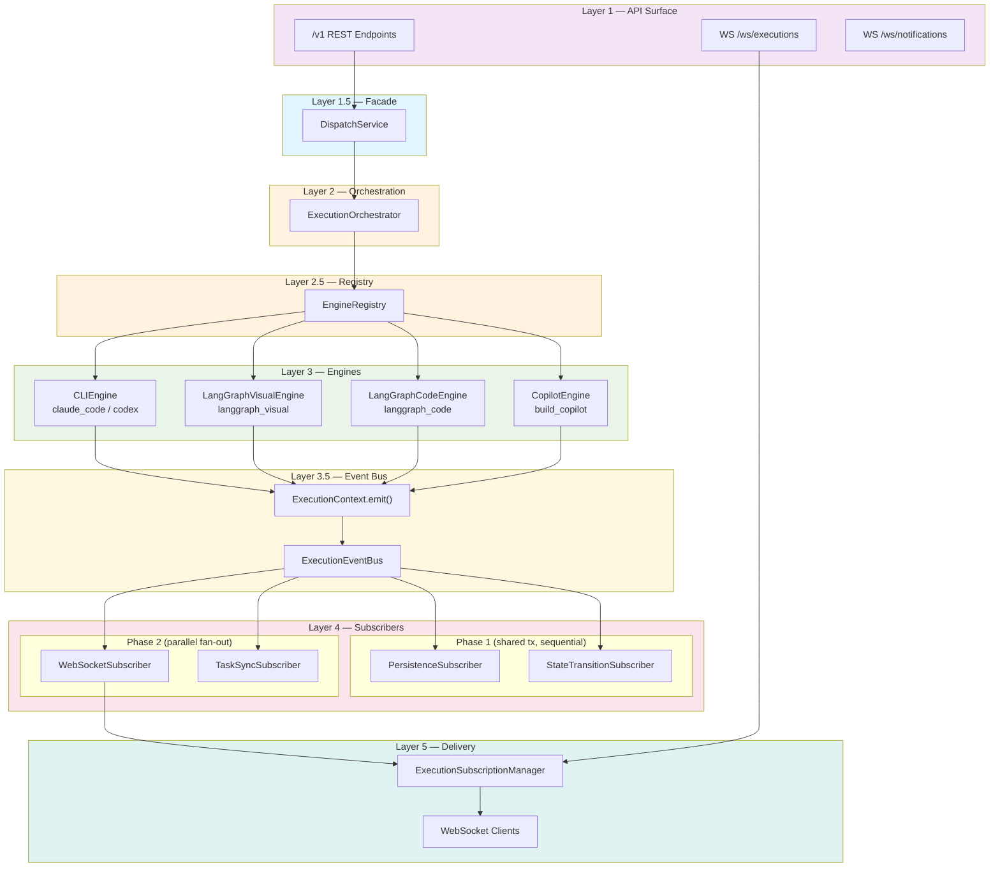
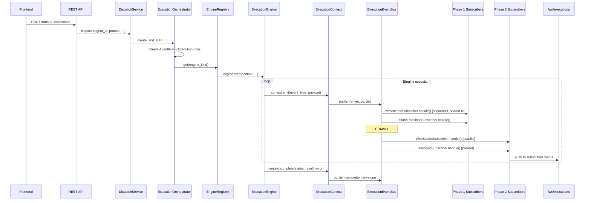
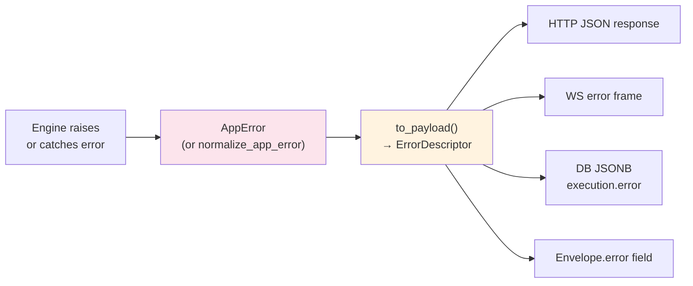

# Architecture

## 1. Overall Architecture

JoySafeter follows a layered architecture with clear separation between API surface, orchestration, execution engines, event pipeline, and real-time delivery.

```
Layer 1     API Routes (app/api/v1/) + WebSocket Handlers (app/websocket/)
Layer 1.5   DispatchService — API-facing facade
Layer 2     ExecutionOrchestrator — creates Run + Execution, builds ExecutionContext
Layer 2.5   EngineRegistry — singleton, maps engine_kind to ExecutionEngine
Layer 3     Execution Engines: CLIEngine / LangGraphVisualEngine / LangGraphCodeEngine / CopilotEngine
Layer 3.5   ExecutionContext callbacks -> ExecutionEventBus
Layer 4a    PersistenceSubscriber + StateTransitionSubscriber (Phase 1, shared DB tx)
Layer 4b    WebSocketSubscriber + TaskSyncSubscriber (Phase 2, parallel fan-out)
Layer 5     ExecutionSubscriptionManager -> WebSocket clients (/ws/executions)
```



---

## 2. Core Modules

### 2.1 Contracts — Single Source of Truth for Value Domains

Contract files in `core/contracts/` define every canonical value as `Literal` types, `StrEnum` classes, and plain `set[str]` constants. All code references these definitions rather than scattering magic strings.

| Contract file | Defines |
|---|---|
| `agent.py` | `EngineKind` (Literal), `RuntimeKind` (Literal), `ENGINE_RUNTIME_MAP`, `infer_runtime_kind()` |
| `execution.py` | `TriggerMedium` (StrEnum), `RunPurpose` (StrEnum), `RunStatusLiteral`, `ExecutionStatusLiteral`, terminal/active sets |
| `error.py` | `ErrorCode` (StrEnum, ~180 codes), `ErrorSource`, `UserAction`, canonical registry sets |

**Two orthogonal dispatch dimensions** (defined as StrEnums in `execution.py`):

- `TriggerMedium` — HOW the run was initiated: `api` | `scheduler` | `system` | `ui`
- `RunPurpose` — WHY the run exists: `production` | `draft_test` | `debug` | `internal_builder`

### 2.2 Engine Protocol + Registry + Capabilities

**Protocol** (`core/engine/protocol.py`):

```python
@runtime_checkable
class ExecutionEngine(Protocol):
    engine_kind: str
    capabilities: EngineCapabilities

    async def start(self, context: ExecutionContext, *, ...) -> None: ...
    async def cancel(self, execution_id: UUID) -> None: ...
    async def send_message(self, execution_id: UUID, message: str) -> None: ...
```

**ExecutionContext** is injected into every engine. Engines never touch persistence or WebSocket directly — they call `context.emit()`, `context.update_status()`, and `context.complete()`.

**EngineCapabilities** declares what each engine supports:

| Engine class | engine_kind(s) | cancel | msg_inject | debug_obs | artifacts | approval |
|---|---|---|---|---|---|---|
| CLIEngine | `claude_code`, `codex` | Y | Y | N | Y | Y |
| LangGraphVisualEngine | `langgraph_visual` | Y | N | Y | Y | Y |
| LangGraphCodeEngine | `langgraph_code` | Y | N | Y | N | N |
| CopilotEngine | `build_copilot` (internal) | Y | N | N | N | N |

**Registry** (`core/engine/registry.py`): A module-level singleton `engine_registry` maps `engine_kind` strings to engine instances. All engines register at import time in `core/engine/__init__.py`:

```python
engine_registry.register("langgraph_visual", LangGraphVisualEngine())
engine_registry.register("langgraph_code", LangGraphCodeEngine())
engine_registry.register("claude_code", CLIEngine("claude_code"))
engine_registry.register("codex", CLIEngine("codex"))
engine_registry.register("build_copilot", CopilotEngine())
```

**Adding a new engine** requires:
1. Implement the `ExecutionEngine` protocol
2. Register it in `core/engine/__init__.py`
3. Add the new `engine_kind` to `core/contracts/agent.py` (`ENGINE_KINDS`, `ENGINE_RUNTIME_MAP`)
4. Add error codes to `core/contracts/error.py` if needed

### 2.3 Two-Phase Event Bus

`core/events/bus.py` — `ExecutionEventBus`

All execution events flow through a two-phase publish pipeline:

- **Phase 1 (PERSIST)**: Subscribers share the caller's DB session and run **sequentially**. The bus commits once after all Phase 1 subscribers complete. This guarantees that persistence and state transitions are atomic.
  - `PersistenceSubscriber` — writes `ExecutionEvent` rows, assigns `seq` numbers
  - `StateTransitionSubscriber` — validates and applies status changes via state machines

- **Phase 2 (BROADCAST)**: Subscribers run **in parallel** via `asyncio.gather`. A failure in one does not affect others.
  - `WebSocketSubscriber` — pushes events to `ExecutionSubscriptionManager` for real-time delivery
  - `TaskSyncSubscriber` — syncs Task status based on Run terminal status

**Envelope** (`core/events/envelope.py`): `ExecutionEventEnvelope` is the canonical shape all subscribers receive:

```python
@dataclass
class ExecutionEventEnvelope:
    execution_id: UUID
    run_id: UUID
    workspace_id: UUID
    event_type: ExecutionEventType | str
    payload: dict[str, Any]
    seq: int = 0                          # filled by PersistenceSubscriber
    trigger_medium: str | None = None     # HOW: api / scheduler / system / ui
    run_purpose: str | None = None        # WHY: production / draft_test / debug / internal_builder
    thread_id: UUID | None = None
    task_id: UUID | None = None
    terminal_status: str | None = None    # completion-only
    result_summary: str | None = None
    error: dict[str, Any] | None = None   # ErrorDescriptor via AppError.to_payload()
    target_status: str | None = None      # status-change events
    container_id: str | None = None
    metrics: dict[str, Any] | None = None
```

**Event types** (`core/events/event_types.py`): `ExecutionEventType` StrEnum — content events (`assistant_text`, `thinking`, `tool_use_start/end`, `error`, `artifact_created`, `approval_requested/resolved`), lifecycle events (`execution_started/completed/status_change`, `run_status_change`), and copilot events.

### 2.4 State Machines

`core/state_machines/` centralizes all status transition rules.

**Engine** (`engine.py`): Generic `StateMachine` class with `validate(from, to)` and `is_terminal(status)`.

**Definitions** (`definitions.py`): Transition tables for 6 entities:

| State Machine | Entity | Terminal States |
|---|---|---|
| `AGENT_SM` | Agent | (none — archived can revert) |
| `VERSION_SM` | AgentVersion | (none — frozen can unfreeze) |
| `RELEASE_SM` | AgentRelease | `retired` |
| `RUN_SM` | AgentRun | `succeeded`, `failed`, `cancelled` |
| `EXECUTION_SM` | Execution | `succeeded`, `failed`, `cancelled` |
| `TASK_SM` | Task | (none — done/cancelled can reopen) |

**Transitions** (`transitions.py`): `transition_run()`, `transition_execution()`, `transition_task()` are the **only** functions that modify `.status` on domain entities. `sync_task_from_run()` auto-maps Run terminal status to Task status via `RUN_TO_TASK_SYNC`.

### 2.5 Observation Layer

`core/observation/` — OTel-backed tracing injected into `ExecutionContext`.

| Module | Purpose |
|---|---|
| `collector.py` | `ObservationCollector` — main entry point, injected as `context.collector` |
| `model.py` | `Trace` and `Observation` ORM models (tables: `traces`, `observations`) |
| `types.py` | Type definitions (`ObservationType`, `ObservationLevel`) |
| `otel/provider.py` | OTel TracerProvider setup |
| `otel/global_provider.py` | App-level singleton TracerProvider initialization |
| `otel/span_wrapper.py` | Span wrapper with JoySafeter-specific attributes |
| `otel/persistence_processor.py` | Exports spans to DB |
| `otel/broadcast_processor.py` | Exports spans to WebSocket for real-time display |
| `instrumentation/` | Engine-specific extractors: `cli_extractor.py`, `copilot_extractor.py`, `langchain_handler.py`, `file_tracker.py` |

### 2.6 Ports & Adapters

`core/ports/` defines Protocol interfaces that decouple `core/` from `services/` and `models/`:

| Port | Purpose | Implemented by |
|---|---|---|
| `ExecutionEventPort` | Publish execution events through the event bus | `services/execution_event_adapter.py` |
| `ExecutionReaderPort` | Read execution data without direct ORM queries | `services/execution_reader_adapter.py` |
| `ContextEventBridge` | Wire ExecutionContext.emit/complete to event bus | `services/execution_launcher.py` (_Bridge inner class) |
| `AgentSpawnPort` | Spawn child agent runs | `services/agent_spawn_adapter.py` |
| `McpServerPort` | Resolve MCP server instances by name | `services/mcp_server_service.py` |
| `ModelPort` | Resolve LLM models by provider+name | `services/model_service.py` |
| `MemoryPort` | Memory CRUD (get/upsert/delete) | `services/memory_service.py` |
| `ObservationCollectorPort` | Observation tracing within execution | `core/observation/collector.py` |
| `SandboxPort` | Sandbox lifecycle management | `services/sandbox_manager.py` |
| `SkillPort` | Skill CRUD + permission checks | `services/skill_service.py` |

`EventContext` dataclass carries run-level metadata so event publishing can construct complete envelopes without querying the DB on every event.

### 2.7 Error System — AppError Hierarchy + ErrorDescriptor

`common/app_errors.py` defines a unified exception hierarchy rooted at `AppError` (a `@dataclass(slots=True)` subclass of `Exception`).

**Category classes** (no constructors, just `_default_source`):

```
AppError
  ├── DomainError          (_default_source = "api")
  ├── InfraError           (_default_source = "runtime")
  ├── AuthError            (_default_source = "auth")
  ├── ValidationError      (_default_source = "validation")
  ├── PermissionDeniedError(_default_source = "permission")
  ├── ConflictError        (_default_source = "api")
  ├── RateLimitError       (_default_source = "api")
  └── InternalError        (_default_source = "internal")
```

**ErrorDescriptor** — the canonical error payload shape, output by `AppError.to_payload()`:

```json
{
  "code": "SKILL_NOT_FOUND",
  "message": "Skill not found",
  "data": {"skill_id": "..."},
  "source": "api",
  "retryable": false,
  "user_action": null,
  "detail": null
}
```

This is the **single serialization chokepoint** — all transport paths (HTTP response body, WebSocket error frames, SSE error events, DB JSONB `error` columns) flow through `to_payload()`.

### 2.8 Graph Build System

| Path | engine_kind | Engine class | Description |
|---|---|---|---|
| **DeepAgents Canvas** | `langgraph_visual` | LangGraphVisualEngine | Visual drag-and-drop builder; Manager-Worker star topology |
| **Code Mode** | `langgraph_code` | LangGraphCodeEngine | User writes LangGraph Python in browser; backend exec()s in sandbox |
| **CLI-backed** | `claude_code`, `codex` | CLIEngine | Docker container + CLI agent runtime |
| **Copilot** | `build_copilot` | CopilotEngine | Internal graph analysis and action execution |

**DeepAgents Build Pipeline:**

```
build_deep_agents_graph()
  ├── 1. resolve_all_configs()    — pure config extraction, no side effects
  ├── 2. setup shared backend     — Docker sandbox if needed
  ├── 3. preload_skills()         — batch preload with deduplication
  ├── 4. ModelResolver.resolve()  — unified LLM resolution with cache
  ├── 5. build workers            — agent_factory per node type
  └── 6. create_deep_agent()      — compile and finalize
```

### 2.9 Code Executor Security

The code executor (`core/engine/code_executor.py`) runs user LangGraph code with multiple security layers:

| Layer | Protection |
|---|---|
| Builtins blacklist | `open`, `eval`, `exec`, `compile`, `globals`, `locals`, `vars`, `dir` removed |
| Import blocklist | `os`, `sys`, `subprocess`, `socket`, `io`, `pathlib`, etc. blocked |
| Import allowlist | Only `langgraph`, `langchain`, `typing`, `json`, `pydantic`, etc. allowed |
| Exec timeout | 10-second limit via `signal.alarm` |
| Invoke timeout | 30-second limit via `asyncio.wait_for` |
| Permission checks | Save requires member role, Run requires viewer role |
| Error sanitization | Server file paths stripped from error messages |

### 2.10 Skill System

Progressive disclosure to reduce token consumption:

- **SkillService**: CRUD with permission control and versioning
- **SkillsLoader**: Batch preloads skills to Docker backend with deduplication
- **FilesystemMiddleware**: Agent reads `/workspace/skills/{skill_name}/SKILL.md` on demand

### 2.11 Memory System

Long/short-term agent memory with middleware injection:

- **MemoryManager**: Query and persist memories by user/topics
- **MemoryMiddleware**: Injects relevant memories into agent context, extracts new memories from responses
- **Memory types**: Fact, Procedure, Episodic, Semantic

---

## 3. Core Workflows

### 3.1 Execution Flow



### 3.2 Error Flow



All errors are normalized to `AppError` (or subclass), serialized via the single `to_payload()` method, and consumed identically across all transports. The frontend `ApiError` class mirrors the `ErrorDescriptor` shape with typed `source: ErrorSource`, `retryable: boolean`, and `userAction?: UserAction`.

---

## 4. Data Flow

### 4.1 WebSocket Endpoints

| Path | Handler | Purpose |
|---|---|---|
| `/ws/executions` | `ExecutionSubscriptionHandler` | Execution event stream — subscribe, snapshot replay, live events |
| `/ws/notifications` | `NotificationManager` | User-level push notifications |

### 4.2 Dispatch Dimensions

AgentRun creation uses two orthogonal dimensions defined as StrEnums in `core/contracts/execution.py`:

**TriggerMedium** — HOW: `api` | `scheduler` | `system` | `ui`

**RunPurpose** — WHY: `production` | `draft_test` | `debug` | `internal_builder`

### 4.3 Single Event Source

All engines emit events through `ExecutionContext.emit()` into `execution_events` table. The `PersistenceSubscriber` assigns monotonically increasing `seq` numbers. WebSocket clients replay from persisted events on reconnect and receive live events from the same pipeline.

### 4.4 Frontend → Backend Communication

| Channel | Use |
|---|---|
| REST API (`/api/v1/*`) | CRUD operations: agents, versions, releases, tasks, threads, runs, executions, skills, tools, models, workspaces |
| WebSocket `/ws/executions` | Real-time execution event streaming |
| WebSocket `/ws/notifications` | User notifications |
| Code API | Save and run user LangGraph code |

### 4.5 Backend → Data Layer

- **PostgreSQL**: Agent definitions, versions, releases, skills, memories, sessions, workspaces, runs, executions, execution_events, snapshots, traces, observations
- **Redis**: Session cache, rate limiting, temporary data

---

## 5. Backend File Structure

```
app/
├── api/v1/                        # REST route modules
├── common/
│   ├── app_errors.py              # AppError hierarchy + to_payload() + normalize_app_error()
│   ├── workspace_permission.py    # Workspace access check utilities
│   └── ...                        # dependencies, exceptions, pagination, permissions
├── core/
│   ├── contracts/                 # Value domain registries (single source of truth)
│   │   ├── agent.py               #   EngineKind, RuntimeKind, ENGINE_RUNTIME_MAP
│   │   ├── execution.py           #   TriggerMedium, RunPurpose (StrEnums), RunStatus, ExecutionStatus, sets
│   │   └── error.py               #   ErrorCode (StrEnum ~180), ErrorSource, UserAction
│   ├── engine/                    # Execution engine abstraction
│   │   ├── protocol.py            #   ExecutionEngine Protocol, ExecutionContext, EngineCapabilities
│   │   ├── registry.py            #   EngineRegistry singleton
│   │   ├── __init__.py            #   Registers 6 engine instances at import time
│   │   ├── cli_engine.py          #   CLIEngine (claude_code / codex)
│   │   ├── graph_engine.py        #   LangGraphVisualEngine (langgraph_visual)
│   │   ├── code_engine.py         #   LangGraphCodeEngine (langgraph_code)
│   │   ├── copilot_engine.py      #   CopilotEngine (build_copilot, internal)
│   │   └── code_executor.py       #   Sandboxed user-code executor (used by LangGraphCodeEngine)
│   ├── events/                    # Two-phase event bus
│   │   ├── bus.py                 #   ExecutionEventBus (Phase 1 + Phase 2)
│   │   ├── envelope.py            #   ExecutionEventEnvelope dataclass
│   │   ├── event_types.py         #   ExecutionEventType StrEnum
│   │   ├── subscriber.py          #   EventSubscriber Protocol + SubscriberPhase enum
│   │   └── subscribers/           #   Built-in subscriber implementations
│   ├── state_machines/            # Centralized status transition rules
│   │   ├── definitions.py         #   Transition tables for 6 entities
│   │   ├── engine.py              #   StateMachine class + InvalidTransition error
│   │   └── transitions.py         #   transition_run(), transition_execution(), transition_task()
│   ├── observation/               # OTel-backed tracing
│   │   ├── collector.py           #   ObservationCollector (injected into ExecutionContext)
│   │   ├── model.py               #   Trace + Observation ORM models
│   │   ├── otel/                  #   TracerProvider, span wrappers, processors
│   │   └── instrumentation/       #   Engine-specific extractors
│   ├── ports/                     # Protocol interfaces for core/ <-> services/ decoupling
│   │   ├── execution.py           #   ExecutionEventPort, ExecutionReaderPort, EventContext
│   │   ├── observation.py         #   ObservationCollectorPort
│   │   ├── memory.py              #   MemoryPort
│   │   ├── mcp.py                 #   McpServerPort
│   │   ├── model.py               #   ModelPort
│   │   ├── skill.py               #   SkillPort
│   │   ├── sandbox.py             #   SandboxPort
│   │   ├── agent_spawn.py         #   AgentSpawnPort
│   │   └── context_event.py       #   ContextEventBridge
│   ├── agent/                     # Agent runtime (CLI backends, base factory, memory)
│   │   ├── base_agent.py          #   get_agent() — reusable LangChain agent factory
│   │   ├── cli_backends/          #   CLI agent backends (claude_code, codex)
│   │   ├── code_agent/            #   Code agent implementation
│   │   └── memory/                #   MemoryManager + strategies
│   ├── copilot/                   # Copilot service implementation
│   ├── copilot_deepagents/        # DeepAgents copilot runner
│   ├── graph/                     # DeepAgents graph builder
│   ├── skill/                     # Skill system (loader, validators, exceptions)
│   ├── model/                     # Model provider + credential management
│   ├── tools/                     # Tool resolver + MCP integration
│   ├── a2a/                       # Agent-to-agent protocol support
│   └── constants.py               # DEFAULT_USER_ID + re-exports from contracts
├── models/                        # SQLAlchemy ORM models
├── repositories/                  # Data access layer
├── schemas/                       # Pydantic request/response schemas
├── services/                      # Service layer implementations
│   ├── dispatch_service.py        #   API-facing facade (Layer 1.5)
│   ├── execution_orchestrator.py  #   Run + Execution lifecycle (Layer 2)
│   ├── execution_launcher.py      #   Engine firing with trace + error handling
│   ├── execution_event_adapter.py #   ExecutionEventPort implementation
│   ├── execution_reader_adapter.py#   ExecutionReaderPort implementation
│   ├── runner_factory.py          #   Creates CLI execution runners
│   ├── agent_spawn_adapter.py     #   AgentSpawnPort implementation
│   └── ...                        #   (40+ service modules)
├── websocket/                     # WebSocket handlers
├── templates/                     # Email templates (Jinja2)
└── utils/                         # Shared utilities
```

---

## 6. Frontend Architecture

### 6.1 App Router Structure

Next.js App Router with route groups:

```
app/
├── (auth)/                       # Auth pages (signin, signup, verify, reset-password)
├── dashboard/                    # Dashboard
├── agents/[agentId]/             # Agent detail: edit, versions, releases, tasks, threads
├── executions/[executionId]/     # Execution detail + real-time trace
├── tasks/                        # Task management
├── skills/                       # Skill marketplace + creator
├── tools/                        # Tool management
├── memory/                       # Memory management
└── settings/                     # Models, members, sandboxes, tokens
```

### 6.2 WebSocket Client Layer

```
BaseWsClient (abstract)
├── lifecycle management (connect, disconnect, reconnect)
├── authentication (ws-token)
├── heartbeat + auto-reconnect with backoff
│
├── ExecutionWsClient     /ws/executions
├── NotificationWsClient  /ws/notifications
```

`ExecutionSubscriptionManager` on the frontend subscribes to execution IDs and dispatches incoming events to the appropriate UI stores.

### 6.3 State Management

- **Zustand**: Client-side stores for UI state (execution trace, sidebar, editor)
- **TanStack Query**: Server state with cache invalidation (agents, skills, models, etc.)

### 6.4 Error Consumption

The frontend `ApiError` class (`lib/api-client.ts`) mirrors the backend `ErrorDescriptor`:

```typescript
class ApiError extends Error {
  code: string              // e.g., "SKILL_NOT_FOUND"
  source: ErrorSource       // "api" | "engine" | "runtime" | ...
  retryable: boolean        // drives retry button visibility
  userAction?: UserAction   // "retry" | "relogin" | "configure_model" | ...
}
```

The `source` and `userAction` fields drive UI behavior: `relogin` triggers auth redirect, `retry` shows a retry button, `configure_model` navigates to model settings.

### 6.5 API Client

Unified `apiFetch()` in `lib/api-client.ts` handles:
- URL construction (`API_BASE + path`)
- CSRF token injection
- 401 auto-refresh with single-flight deduplication
- Timeout via `AbortController`
- Structured error extraction → `ApiError`
