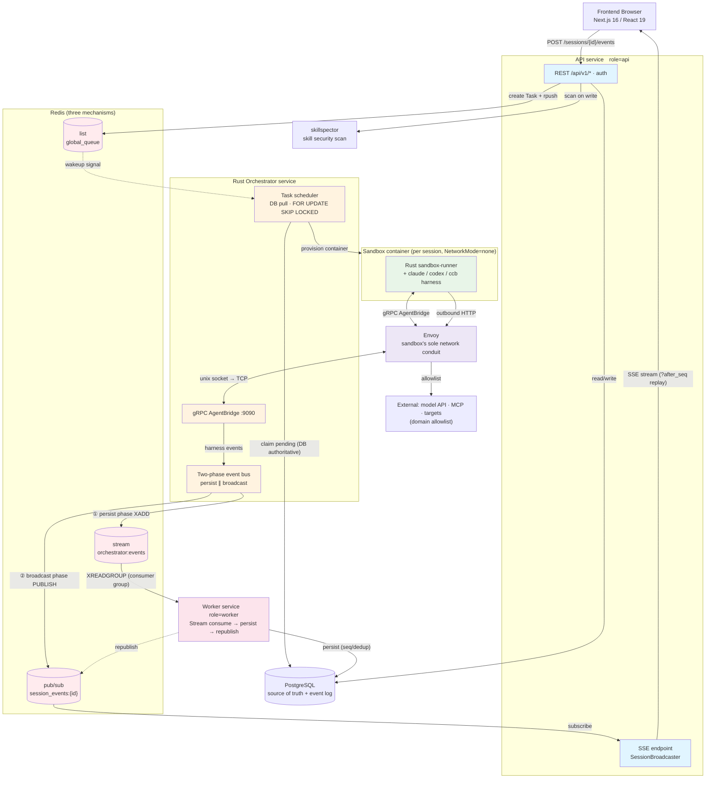
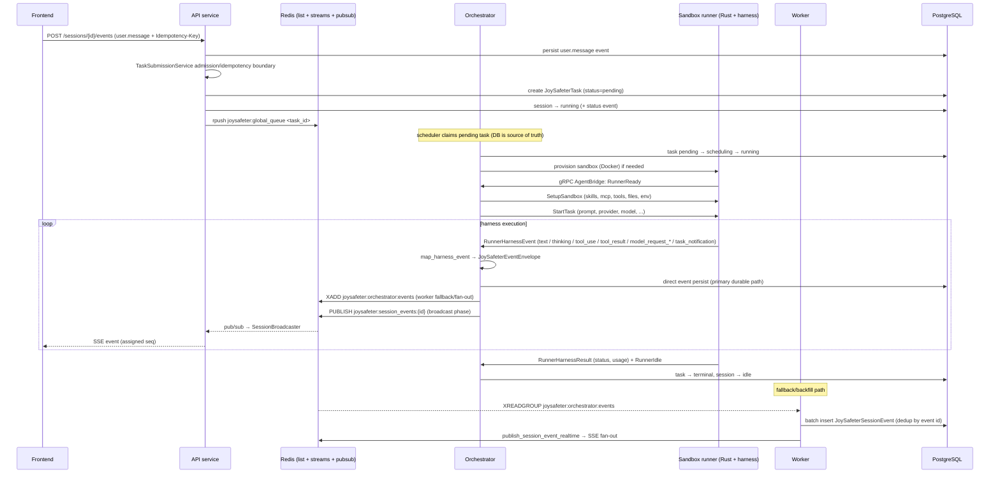

# Architecture

This document describes the current runtime architecture. Source code and automated tests are the final authority.

JoySafeter is an AI-agent orchestration platform for security work. A user defines
an **Agent** (engine + model + system prompt + tools + skills + MCP servers), opens a
**Session** (a conversation), and sends messages. Each message becomes a **Task** that
the platform schedules onto an isolated **sandbox** container, where a coding-agent
harness (Claude Code / Codex / a self-developed `ccb` runner) executes with the agent's
configured capabilities. Everything the harness does — text, thinking, tool calls,
tool results, model requests, sub-agent lifecycle — is streamed back as **events**,
persisted, and pushed to the browser live over **SSE**.

---

## 1. Deployment topology

JoySafeter runs as **two Python FastAPI services, one Rust orchestrator, and supporting
infrastructure**. The Python API and Worker share one codebase and select behavior at boot
from `JOYSAFETER_SERVICE_ROLE` (`api` / `worker`). The orchestrator is the Rust binary in
`app/joysafeter_orchestrator_rs`.



### Services & containers

| Component | Compose service | Role | Key responsibility |
|---|---|---|---|
| **API** | `api` | `JOYSAFETER_SERVICE_ROLE=api` | REST `/api/v1/*`, SSE execution stream, notification WebSocket, auth |
| **Orchestrator (Rust)** | `orchestrator-rs` (profile `rust-orchestrator`) | — | gRPC `AgentBridge` server, task scheduler, sandbox lifecycle, event bus |
| **Worker** | `worker` | `worker` | Consumes the Redis event Stream, batch-persists events to `joysafeter_session_events`, republishes for SSE |
| **Frontend** | `frontend` | — | Next.js App Router UI |
| **PostgreSQL** | `db` | — | System of record for all state |
| **Redis** | `redis` (profile `local-redis`) or external | — | Event Streams, Pub/Sub fan-out, task queue, coordination |
| **Envoy** | `joysafeter-envoy` | — | Fronts each sandbox's unix socket; enforces per-sandbox egress allowlist |
| **skillspector** | `skillspector` | — | Standalone skill security-scanning service; runtime gate is fail-closed for unusable scan states |
| **db-init** | `db-init` (profile `init`) | — | One-shot Alembic migrations |

Use the deployment helper for the supported local stack:
`cd deploy && ./deploy.sh doctor && ./deploy.sh local`.

### Collaboration contracts

Each service has one clear ownership boundary. Cross-service calls should preserve these
contracts instead of recreating older in-process shortcuts.

| Actor | Owns | Consumes | Publishes / mutates | Must not do |
|---|---|---|---|---|
| Frontend | Product UI state, auth redirects, SSE subscriptions | REST responses, SSE events, notification WS | User commands through REST | Talk to Redis, Postgres, orchestrator gRPC, or sandbox containers directly |
| API | Auth/RBAC, REST validation, CRUD, task creation, SSE replay/live bridge, skill write-time scan calls | Browser requests, DB state, Redis Pub/Sub for live events | DB rows, Redis task wakeup, Redis command relay | Run agent harnesses, create sandboxes, consume durable event streams |
| Rust orchestrator | Scheduling, task leases, sandbox lifecycle, runner gRPC, control ACKs, event emission | Pending DB tasks, Redis wakeups/commands, runner gRPC streams | Task/sandbox/session state, Redis Stream events, Redis Pub/Sub broadcasts | Serve product REST APIs, own browser auth, batch-persist event logs as the primary path |
| Sandbox runner | In-container harness execution, tool/MCP invocation, memory/file sync from inside the sandbox | `SetupSandbox` and `StartTask` over gRPC, injected env/secrets/files | Runner events/results over gRPC, memory sync messages | Reach the host network directly, mutate platform DB/Redis, bypass Envoy egress policy |
| Worker | Durable event persistence, `seq` assignment, Redis Stream recovery/redelivery | Redis Stream consumer group | `joysafeter_session_events`, replay Pub/Sub after DB write | Schedule tasks, create sandboxes, expose user-facing APIs |
| SkillSpector | Static skill security scanning service | Skill content sent by API/domain service | Scan verdicts consumed by skill domain logic | Decide runtime packaging by itself; runtime gating remains in JoySafeter skill logic |
| PostgreSQL | Source of truth for domain state, task/session/sandbox FSMs, event log | Writes from API/orchestrator/worker/db-init | Durable rows | Act as a queue or live fan-out bus |
| Redis | Wakeups, Streams, Pub/Sub, command relay, ownership/heartbeat coordination | API/orchestrator/worker pub/sub/list/stream traffic | Ephemeral and durable-stream messages | Be treated as scheduling truth; pending task rows in Postgres are authoritative |

### Failure ownership

| Symptom | Primary owner | First checks |
|---|---|---|
| User cannot log in or CRUD resources | API | `api` logs, auth config, database connectivity |
| Session created but task never starts | Orchestrator | pending task row, `global_queue` wakeup, orchestrator logs, DB lease/fencing settings |
| Sandbox never becomes ready | Orchestrator + Docker host | Docker socket mount, sandbox image, workspace volume, runner `RunnerReady` timeout |
| Agent runs but browser misses live events | API SSE bridge + Redis Pub/Sub | API `SessionBroadcaster`, Redis Pub/Sub, browser `?after_seq` replay |
| Events appear live but disappear after refresh | Orchestrator event persister + Worker fallback | Orchestrator DB persist logs, Redis Stream pending entries, worker logs, Postgres insert errors, advisory-lock contention |
| Skill cannot be used at runtime | Skill domain + SkillSpector | scan status, approval state, content drift, `SKILL_SECURITY_*` config |
| Sandbox cannot reach model/MCP/target | Envoy + orchestrator sandbox config | allowlist, Envoy config files, `JOYSAFETER_GRPC_PUBLIC_URL`, target DNS/network policy |

---

## 2. The core loop — from message to live events

This is the single most important flow. Follow it once and the rest of the architecture
falls into place.



Core ownership rules:

1. **The DB is the source of truth for scheduling.** The Redis list
   (`joysafeter:global_queue`) is only a *wakeup signal*; the orchestrator claims work by
   querying `joysafeter_tasks` with `FOR UPDATE SKIP LOCKED`. If Redis loses a signal, the
   scheduler still finds the pending row.

2. **Task submission has one owner.** API routes, follow-up chat messages, manual
   trigger runs, and worker-fired cron triggers submit through
   `TaskSubmissionService`. That service owns idempotency replay, admission control,
   task creation, session running/idle transitions, enqueue, and enqueue-failure
   compensation. Routes may validate request-specific inputs, but they should not
   hand-roll task dispatch.

3. **Session resources have one owner.** File and git-repository resources mounted
   into sessions are validated, normalized, encrypted, listed, added, deleted, and
   rotated through `SessionResourceService`. Routes may discriminate the request
   body shape, but they should not write `SessionFile` / `SessionRepo` rows or
   encrypt clone tokens inline.

4. **Task cancellation has one owner.** API cancel requests and scheduler
   replacement policy cancel through `TaskCancellationService`. That service owns
   runtime cancel relay, task state transition, linked session idle transition,
   and the `session.status_idle` event. Routes and schedulers should not mark a
   task cancelled or write session-idle compensation inline.

5. **Project lifecycle has one owner.** Project create/list/default/restore/archive
   state transitions go through `ProjectService`. Project archive owns the full
   closed loop: default-project guard, active-task gate, session sandbox destroy
   relay, sandbox state sync, session archival, trigger pause, and the final
   project archive timestamp. Routes should not recreate that chain inline.

6. **Organization membership has one owner.** Organization creation/deletion and
   member role lifecycle go through `OrganizationService` and
   `OrganizationMemberService`. Those services own owner membership bootstrap,
   default project bootstrap, owner/admin gates, role normalization, owner
   transfer, duplicate member checks, member removal, and route-specific error
   contracts. Routes may shape responses and audit events, but should not write
   `Member` rows or duplicate role policy inline.

7. **Persistence and live delivery are decoupled.** The orchestrator writes events
   directly to Postgres as the primary durable path and also publishes to Redis Stream
   for worker fallback/backfill and to Redis Pub/Sub for live SSE fan-out. The browser
   gets events fast; durable rows let a reconnecting client replay from `?after_seq`.

---

## 3. Transport map — what talks to what, and how

Runtime communication uses several purpose-built channels. This table is the definitive reference.

| Channel | Mechanism | Purpose | Anchor |
|---|---|---|---|
| Browser → API | HTTPS REST `/api/v1/*` | All CRUD + commands | `joysafeter_api/api/v1/router.py` |
| **Live events → browser** | **SSE** `GET /sessions/{id}/events/stream` | Primary execution stream (DB replay via `?after_seq`, then live) | `joysafeter_api/api/v1/sessions.py` |
| Notifications → browser | WebSocket `/ws/notifications` | User-level notifications (in-memory `NotificationManager`) | `joysafeter_api/app.py`, `joysafeter_api/websocket/notification_manager.py` |
| Per-task stream | WebSocket `/tasks/{id}/stream` | Per-task output (bridge queue → Redis fallback) | `joysafeter_api/api/v1/tasks.py` |
| Task enqueue | Redis **list** `joysafeter:global_queue` | API `rpush` → Rust orchestrator scheduler pops | `joysafeter_api/services.py`, `joysafeter_orchestrator_rs/src/kernel/queue.rs` |
| **Durable event bus** | Redis **Streams** `joysafeter:orchestrator:events` + consumer group | Orchestrator `XADD` → Worker `XREADGROUP` → DB persist | `joysafeter_orchestrator_rs/src/events/stream_publisher.rs`, `joysafeter_worker/events/stream_consumer.py` |
| **Live event fan-out** | Redis **Pub/Sub** `joysafeter:session_events:{id}` | Cross-instance SSE delivery via `SessionBroadcaster` | `joysafeter_orchestrator_rs/src/kernel/session_broadcaster.rs`, `joysafeter_shared/orchestrator_bridge/session_broadcaster.py` |
| Control/cancel relay | Redis **Pub/Sub** `joysafeter:cmd:{instance}` | Route cancel/input/shutdown to the instance owning the sandbox | `joysafeter_shared/orchestrator_bridge/runtime_commands.py`, `joysafeter_orchestrator_rs/src/kernel/command_listener.rs` |
| Orchestrator ↔ runner | **gRPC** `AgentBridge` (bidi stream, :9090) | The agent execution protocol | `proto/joysafeter.proto`, `joysafeter_orchestrator_rs/src/grpc/server.rs` |
| Runner egress | Envoy proxy (unix socket) | Per-sandbox domain allowlist, deny-all default | `joysafeter_orchestrator_rs/src/sandbox/envoy.rs` |
| Skill scan | HTTP → skillspector `:8010` | Security scan on skill writes; runtime blocks failed/scanning/unscanned/blocked skills | `joysafeter_skill_security.py` |

**API ↔ orchestrator is Redis, not direct gRPC.** Python API/worker processes use
`joysafeter_shared.orchestrator_bridge` only for lightweight API-side helpers and optional test seams; runtime control flows through
Redis command relay and ACKs. gRPC is used *only* for the Rust orchestrator ↔ in-sandbox-runner hop.

---

## 4. Services in detail

### 4.1 API service (`app/joysafeter_api/`)

The API surface. Assembles a FastAPI app (`app.py`), wraps every `/api/v1` JSON response in
a `{success, code, message, data}` envelope via `ApiV1ResponseWrapperMiddleware`
(`api/v1/middleware.py`) — the middleware **skips** any `/stream` path and any
`StreamingResponse`, which is why SSE emits raw `text/event-stream`.

**Auth** (`app/joysafeter_shared/common/joysafeter_auth/dependencies.py`) resolves a
request in priority order: `X-Api-Key` header → JWT (from `Authorization` or cookie, with
real-time DB re-verification of org/project membership) → cookie/session fallback
(auto-provisions a default org+project on first login). Every project-scoped route filters
by `auth_ctx.project_id` for multi-tenant isolation. WebSocket connections authenticate via
a short-lived token from `GET /auth/ws-token`.

**Startup** is deliberately small: `run_api_startup()` only wires the `SessionBroadcaster` for SSE.

The full REST inventory is in [§8 API surface](#8-api-surface).

### 4.2 Orchestrator service (`app/joysafeter_orchestrator_rs/`)

The engine room. Hosts the gRPC `AgentBridge` server and a set of DB-driven control loops.
Agent code does **not** run in this process — it runs inside the sandbox runner, reached
over gRPC.

| Subsystem | Module | Responsibility |
|---|---|---|
| gRPC server | `src/grpc/server.rs` | `AgentBridge.Session` bidi stream; handles runner messages, sends orchestrator commands |
| Task scheduler | `src/kernel/scheduler.rs` | Claims pending tasks (`FOR UPDATE SKIP LOCKED`), resolves a sandbox, pushes to the sandbox queue |
| Task controller | `src/kernel/task_controller.rs` | Lifecycle, startup recovery, failover/retry |
| Sandbox controller | `src/kernel/sandbox_controller.rs` | Idle sweep, provisioning poll, warm-pool, orphan cleanup |
| Sandbox resolver | `src/kernel/sandbox_resolver.rs` | 3-stage resolve: reuse session sandbox → claim from pool → create new; injects runner env |
| Sandbox bridge | `src/kernel/sandbox_bridge.rs` | Per-sandbox in-memory state: runner stream, status, subscribers, control queue |
| Redis coordinator | `src/kernel/redis_coordinator.rs` | Cross-instance HA: owner mapping, heartbeats, queues, event publishing |
| Command listener | `src/kernel/command_listener.rs` | Redis command relay for cancel/input/shutdown/memory updates with ACKs |
| Event bus | `src/events/bus.rs` | In-process event bus feeding stream persistence and realtime fan-out |
| Session broadcaster | `src/kernel/session_broadcaster.rs` | Live SSE fan-out via Redis Pub/Sub |

Startup order (`src/main.rs`): config + database + Redis coordinator → queue/scheduler/controller →
bridge registry → sandbox provider/controller/resolver → session broadcaster → memory subscribers →
Envoy/image builder as configured → event bus + stream/realtime subscribers → command listener →
gRPC server on `:9090` → task recovery and background loops.

### 4.3 Worker service (`app/joysafeter_worker/`)

The durable persistence tier. Runs exactly one loop: `EventStreamWorker`
(`events/stream_consumer.py`) consumes the Redis Stream via a consumer group.

- `XREADGROUP` for new events; `XAUTOCLAIM` for messages idle > 60s (crash recovery / redelivery).
- Each event → `EventBatchSender` (`events/batch_writer.py`): groups by `session_id`, takes a
  Postgres advisory lock per session, computes the next `seq` from `MAX(seq)`, dedups, inserts
  `JoySafeterSessionEvent` rows.
- After insert, calls `publish_session_event_realtime()` → SSE fan-out.
- **ACK only after a successful DB write** — if persistence fails, the message is redelivered.

> **Note:** `event_stream_enabled` defaults to **false** in raw settings, but the supported
> Compose stack enables it. In the current split runtime, Rust `orchestrator-rs` emits events
> to Redis Stream and the Worker persists them; `JOYSAFETER_EVENT_STREAM_FALLBACK_TO_DB=true`
> allows the orchestrator to fall back to direct DB persistence if Redis Stream publishing fails.

---

## 5. The agent execution protocol — gRPC `AgentBridge`

Defined in `proto/joysafeter.proto`. One bidirectional streaming RPC:
`rpc Session(stream RunnerMessage) returns (stream OrchestratorMessage)`. The orchestrator
is the server; the in-sandbox Rust runner is the client. The DB is the source of truth — the
gRPC stream carries execution, not scheduling.

### Runner → Orchestrator (`RunnerMessage`)

| Message | Meaning |
|---|---|
| `RunnerReady` | First message; carries `sandbox_id`, `runner_token` (HMAC-verified), available providers, reconnect state |
| `RunnerHarnessEvent` | The live event stream (see below) |
| `RunnerHarnessResult` | Terminal result: `status`, `output`, `error`, `TokenUsage` (with per-model breakdown), `duration_ms` |
| `RunnerHeartbeat` | Liveness (also, any message resets the heartbeat deadline; 120s timeout) |
| `RunnerIdle` | Harness went idle; persists `harness_session_id` / `work_dir` back to the session |
| `MemoryFileSync` | Agent wrote a memory file inside the sandbox → sync back |

**`RunnerHarnessEvent`** carries `seq` + `timestamp_ms` + a `oneof`:
`TextEvent` · `ThinkingEvent` · `ToolUseEvent` (`tool`, `call_id`, `input_json`,
`is_control_request`) · `ToolResultEvent` · `ErrorEvent` · `StatusEvent` · `LogEvent` ·
`ModelRequestStartEvent` (`model`) · `ModelRequestEndEvent` (`model` + 4 token counters) ·
`TaskNotificationEvent` (background sub-agent lifecycle: phase, description, status, summary,
result, token/tool metrics).

### Orchestrator → Runner (`OrchestratorMessage`)

| Message | Payload |
|---|---|
| `SetupSandbox` | One-time prep: `skills[]` (SkillArchive tar.gz), `mcp_servers[]`, `custom_tools[]`, `setup_commands[]`, `memory_mounts[]`, `files[]` (inline) / `file_refs[]` (by URL), `repos[]`, allowed/disallowed/ask tool lists, `provider`, `model`, env |
| `StartTask` | `task_id`, `provider`, `prompt`, `system_prompt`, `model`, `max_turns`, `timeout_seconds`, env, per-task `mcp_servers`/`repos`/`skills`/`custom_tools`, tool policy lists |
| `CancelTask` | `reason` |
| `SendInput` | `content` (control-request reply / interrupt injection) |
| `Shutdown` | `reason` |
| `MemoryFileUpdate` | Push a memory-store file change into the sandbox |

> Secrets are deliberately **empty over gRPC** — provider API keys reach the harness via
> container environment variables injected at sandbox creation, never across the wire.

---

## 6. Engines, sandboxes, and the runner

### 6.1 Where engines actually run

Engine selection is just a string — the agent's `engine_kind` (`claude` / `codex` / `native`)
travels as the `provider` field in `SetupSandbox`/`StartTask`, and the **in-sandbox Rust
runner** picks the matching harness. It also selects the Docker image
(`image_claude` / `image_codex` / `image_native`).

> The Python `runtime/*Adapter` classes (`ClaudeAdapter`, `CodexAdapter`, `NativeAdapter`,
> `MockAdapter`) and `kernel/task_runner.py` exist but are **not on the live path** (zero
> callers) — they are a reference/parity twin of the Rust runner. Real execution is in Rust.

### 6.2 The Rust sandbox-runner (`sandbox-runner/`)

A Cargo workspace (edition 2024, tonic/prost gRPC). Four crates:

| Crate | Role |
|---|---|
| `joysafeter-types` | Shared types + the `HarnessAdapter` trait SPI (`start`/`cancel`/`send_input`/`provider`/`is_available`), `HarnessInput`, `HarnessEvent` (mirrors the proto oneof) |
| `joysafeter-runtime` | `AdapterRegistry` + the concrete engine adapters (claude / codex / native / mock) |
| `joysafeter-runner` | The in-sandbox binary that speaks gRPC `AgentBridge` back to the orchestrator |
| `joysafeter-ctl` | `joysafeterctl` operator/dev CLI (declarative REST client) |

The runner boots from env (`JOYSAFETER_ORCHESTRATOR_URL`, `JOYSAFETER_SANDBOX_ID`,
`JOYSAFETER_RUNNER_TOKEN`), dials the orchestrator (TCP or unix socket via Envoy), sends
`RunnerReady`, and services `StartTask`/`Setup`/`Cancel`/`Input`/`Shutdown`. For each task it
picks the adapter by `provider`, unpacks skills, runs setup commands, clones repos, writes
`.claude/settings.json` (MCP + tools + tool rules), builds `HarnessInput`, and launches the
harness as a persistent subprocess:

| `provider` | Adapter | Launches | Protocol |
|---|---|---|---|
| `claude` | `ClaudeAdapter` | `claude` CLI | stream-json over stdin/stdout, `--permission-prompt-tool stdio` |
| `codex` | `CodexAdapter` | `codex app-server --listen stdio://` | JSON-RPC |
| `native` | `NativeAdapter` | **`ccb`** binary | claude-style stream-json — the self-developed "Harness-Core" engine |
| `mock` | `MockAdapter` | test double | env-gated |

### 6.3 Sandbox providers (`app/joysafeter_orchestrator_rs/src/sandbox/`)

Selected by `JOYSAFETER_SANDBOX_PROVIDER` (default `docker`). SPI: `SandboxProvider`
(`create/start/stop/destroy/status/exec/inject_files/setup_networking/...`).

| Provider | Backing | Notes |
|---|---|---|
| **Docker** | local `aiodocker` | Default. Mounts `work_dir:/workspace`, memory under `/mnt/memory/<name>`. Hardened: `CapDrop ALL`, no-new-privileges, PidsLimit, non-root user. Restricted networking → `NetworkMode=none` + Envoy unix socket |
| **E2B** | E2B REST (Firecracker VMs) | Requires `E2B_API_KEY` + `E2B_TEMPLATE_ID` |
| **Daytona** | Daytona REST | Requires `DAYTONA_API_URL` + `DAYTONA_API_KEY` |

**Envoy** (`sandbox/envoy_manager.py`) gives each sandbox its own network namespace with no
direct egress: the runner reaches the orchestrator through a unix-socket gRPC pipe, and all
outbound HTTP goes through an Envoy listener with a **deny-all-by-default domain allowlist**.

---

## 7. Domain model

Persisted in PostgreSQL via async SQLAlchemy 2.0. There is **no `execution`, `run`, or `mission` table**.
The run unit is `JoySafeterTask`; the
conversation unit is `JoySafeterSession` with an append-only event log.

### 7.1 Central entities

| Entity | Table | Role |
|---|---|---|
| `JoySafeterAgent` | `joysafeter_agents` | Agent definition. Capabilities (`skills`, `tools`, `mcp_servers`, `model`, `agents`, `commands`) stored **denormalized as JSONB** on the row, not join tables. Versioned via `joysafeter_agent_versions` |
| `JoySafeterSession` | `joysafeter_sessions` | Conversation/thread. Accumulates token usage; snapshots the agent at creation |
| `JoySafeterSessionEvent` | `joysafeter_session_events` | **Append-only event log**, `unique(session_id, seq)`. The persisted event stream |
| `JoySafeterTask` | `joysafeter_tasks` | The run/execution unit. Links to a session via `chat_session_id` |
| `JoySafeterSandbox` | `joysafeter_sandboxes` | Sandbox lifecycle record; ≤1 active sandbox per session |
| `JoySafeterSecret` | `joysafeter_secrets` | Provider API keys, values **AES-256-GCM encrypted**. Injected as env at run time |
| `JoySafeterVault` / `VaultCredential` | `joysafeter_vaults` / `_vault_credentials` | MCP-server credentials (encrypted tokens, OAuth auto-refresh) |
| `JoySafeterSkill` (+ versions, files, scans, collaborators, usage) | `joysafeter_skills*` | Full skill subsystem: 4-tier visibility, lifecycle FSM, security scans, versioned snapshots |
| `JoySafeterMemoryStore` / `Memory` / `MemoryVersion` | `joysafeter_memory*` | Agent-writable KV stores with append-only version history |
| `JoySafeterFile` / `SessionFile` / `SessionRepo` | `joysafeter_files*` | Uploaded files & git repos mounted into sessions |
| Identity | `joysafeter_users`, `_auth_sessions`, `_oauth_account`, `_organizations`, `_organization_members`, `_organization_projects`, `_project_members`, `_api_keys` | Users, sessions, OAuth links, orgs, projects, membership, API keys |

Persistence pattern: a thin `BaseRepository[T]` exists for auth/skills, but most services issue
SQLAlchemy statements directly against a per-request `AsyncSession` and commit inside the
service method (no unit-of-work).

### 7.2 State machines

Four distinct FSMs govern lifecycle. Transitions are guarded (conditional `UPDATE ... WHERE
status = ...` or advisory-locked) so concurrent writers can't corrupt state.

| FSM | Entity | States | Terminal |
|---|---|---|---|
| **Task** | `JoySafeterTask` | `pending → scheduling → running → {completed, failed, aborted, timeout, cancelled}` (+ retry → `pending`) | the 5 outcomes |
| **Session** | `JoySafeterSession` | `idle ↔ running ↔ rescheduling`, any → `terminated` | `terminated` (reactivatable) |
| **Sandbox** | `JoySafeterSandbox` | `creating → provisioning → pooled → idle ↔ running → stopping → stopped / error → destroyed` | `destroyed` |
| **Skill lifecycle** | `JoySafeterSkill` | `draft → pending_review → {approved, rejected}`, `approved → archived`, reopen/unarchive edges | — |

The skill FSM has a **runtime gate** on top: `is_skill_usable()` only admits a skill into a
session bundle if it is `approved`, its `security_status` is allow-listed, **and** its content
hash matches the last scan (drift detection). A disapproved or drifted skill is silently dropped.

---

## 8. API surface

All paths are under `/api/v1`. Routers are wired in `joysafeter_api/api/v1/router.py`. There
are **no** standalone `models` / `mcp` / `tools` / `copilot` / `graphs` routers — those
concepts live inside the agent (JSONB fields) or in `secrets` / `vaults`.

| Group | Prefix | Highlights |
|---|---|---|
| **Auth** | `/auth` | sign-up/in, logout, refresh, password reset, email verify, `ws-token`, `switch-context`, projects, api-keys, members |
| **OAuth / SSO** | `/auth/oauth` | provider list, authorize, callback, account link/unlink |
| **Agents** | `/agents` | CRUD, archive, versions, `/tasks`, `/sessions` |
| **Tasks** | `/tasks` | create+enqueue, list, get, cancel, **WS** `/tasks/{id}/stream` |
| **Sessions** | `/sessions` | CRUD, archive, stop, `POST /events` (send), `GET /events` (history), **SSE** `/events/stream`, resources (files/repos) |
| **Environments** | `/environments` | Sandbox image/config CRUD |
| **Secrets** | `/secrets` | Provider credentials (model API keys) + default selection |
| **Vaults** | `/vaults` | MCP credentials + OAuth config |
| **Skills** | `/skills` | CRUD, `import-zip`, files, versions, security-scans, lifecycle transitions, admin rescan |
| **Skills AI authoring** | `/skills/ai-authoring` | **SSE** `/chat` (LLM authoring turn), `/save-draft` |
| **Sandboxes** | `/sandboxes` | list, get, stop |
| **Memory stores** | `/memory_stores` | store + memory CRUD, versions, redact; sandbox memory sync is relayed through the Rust runtime |
| **Files** | `/files` | upload, list, metadata, download, delete |
| **Organizations** | `/organizations` | org + member CRUD, transfer-ownership |
| **Quickstart** | `/quickstart` | **SSE** `/chat` — guided onboarding LLM proxy |
| **Health** | `/health` | readiness (Postgres + Redis), liveness |

---

## 9. Cross-cutting concerns

### 9.1 Multi-model — the "unified protocol"

There is **no coded multi-provider adapter registry** in the backend. The shared LLM layer
(`joysafeter_shared/llm/openai_stream.py`) is a single OpenAI-compatible SSE streaming helper:
credentials (`api_key`, `base_url`, `model`) are passed in, never resolved there. Any provider
— OpenAI, Claude, Gemini, DeepSeek, Qwen, etc. — is reached generically by pointing `base_url`
at its OpenAI-compatible gateway. This helper backs only first-party features (skill authoring,
quickstart). **Agent-workload model traffic is delegated to the CLI harness inside the
sandbox** (Claude Code / Codex / `ccb`), so real-world model routing, retry, and fallback live
in the runner and the CLIs, not in Python. Model config and credentials are DB-driven
(`joysafeter_secrets`, encrypted), managed via the Secrets UI.

### 9.2 Skills — the capability layer

Skills are versioned plugin packs (30 in-repo: 21 pentest, ~5 utility, ~6 planning/meta), each
a `SKILL.md`-fronted directory. The pipeline spans three layers:

1. **Parse & validate** (`joysafeter_shared/skill/`) — SKILL.md YAML frontmatter + Agent-Skills
   spec constraints (name/description/allowed-tools), binary/size guards.
2. **Permission gate** (`joysafeter_shared/common/skill_permissions.py`) — 4-tier visibility
   (private/project/organization/public) with strict active-org isolation.
3. **Security scan** (`joysafeter_domain/.../joysafeter_skill_security.py` → **skillspector**
   service) — records failed/scanning states on scanner failure, blocks `DO_NOT_INSTALL`
   recommendations, and computes canonical sha256 for drift detection.
4. **Pack & deliver** — the Rust orchestrator's `HarnessInputBuilder` resolves a published version
   when the task starts, applies `ensure_skill_runtime_ready`, builds the `tar.gz` `SkillArchive`
   from version files, and records usage. The runner unpacks the injected archive in the sandbox;
   missing versions or failed gates stop input construction instead of silently degrading.

### 9.3 Observability — full-chain tracing

`joysafeter_shared/observation/` is a genuine OTel implementation:

- A global `TracerProvider` (optional OTLP export) + **two custom span processors**:
  `PersistenceProcessor` (buckets spans by `execution.id`, batch-drains to the `traces` /
  `observations` tables, aggregates token/cost) and `BroadcastProcessor` (live span streaming).
- `TracingMiddleware` extracts W3C `traceparent` on ingress and echoes `x-trace-id`; loguru
  injects the live `trace_id` into every log line for correlation.
- Token/cost metering is recorded on span attributes (`llm.usage.*`, `llm.cost.*`), which
  aggregate into `Trace` totals.

### 9.4 Security posture

- **Auth:** JWT (HS256) with org/project/role claims + real-time DB re-verification; HttpOnly
  cookies; CSRF token on mutating requests; passwords SHA-256 pre-hashed client-side.
- **Credential encryption:** AES-256-GCM for provider secrets, repository tokens, and vault/OAuth credentials
  (`JOYSAFETER_VAULT_ENCRYPTION_KEY`). Startup fails when the key is missing or invalid; stored credential
  values must use the `enc:` envelope, and plaintext/corrupt records are rejected rather than passed through.
- **SSRF guard:** blocks cloud-metadata IPs, resolves DNS to defeat rebinding; private RFC-1918
  allowed by default (internal LLM/MCP endpoints), opt-in hardening flags.
- **Sandbox isolation:** dropped capabilities, non-root, no-new-privileges, PID limits, and
  Envoy deny-all egress.
- **Skill scanning:** runtime only packs skills that are approved, have `passed` / `warning`
  security status, and have not drifted from the last scan.

---

## 10. Source layout

```
backend/app/
├── joysafeter_api/            # API service: REST routers, SSE, WS notifications, auth deps
│   ├── api/v1/                #   routers (auth, agents, sessions, tasks, skills, secrets, vaults, ...)
│   ├── websocket/             #   notification manager + WS auth
│   ├── app.py / main.py       #   app assembly + entrypoint
│   └── startup.py             #   wires SessionBroadcaster
├── joysafeter_orchestrator_rs/ # Rust orchestrator service
│   ├── src/grpc/              #   AgentBridge server (+ generated proto)
│   ├── src/kernel/            #   scheduler, controllers, sandbox resolver/bridge, coordinator, queue
│   ├── src/runtime/           #   HarnessAdapter SPI + adapters
│   ├── src/sandbox/           #   Docker/E2B/Daytona providers, Envoy manager, image builder
│   ├── src/events/            #   event bus + stream/realtime subscribers
│   ├── src/main.rs            #   boot/shutdown wiring
│   └── Cargo.toml             #   Rust crate manifest
├── joysafeter_worker/         # Worker service
│   └── events/                #   EventStreamWorker (Redis Stream consumer) + EventBatchSender
├── joysafeter_domain/         # Data model + business logic
│   ├── models/                #   SQLAlchemy tables
│   ├── repositories/          #   thin base repo (auth/skills)
│   ├── schemas/               #   Pydantic DTOs
│   └── services/              #   agent/task/session/skill/secret/vault/memory/... services + FSMs
└── joysafeter_shared/         # Cross-service foundation
    ├── llm/                   #   OpenAI-compatible SSE helper
    ├── skill/                 #   SKILL.md parse + validate
    ├── observation/           #   OTel provider + processors + trace/observation models
    ├── security/ security.py  #   JWT, passwords, SSRF guard, credential-key setting
    ├── storage/               #   pluggable file backend (local / s3 / oss)
    ├── cache/                 #   pooled Redis client + distributed lock
    ├── oauth/                 #   pluggable SSO (oauth2, jd_sso)
    ├── runtime/               #   app_factory, lifecycle, docker_check (shared by all 3 services)
    ├── config/                #   settings + service_role (the 3-service split switch)
    └── database.py            #   async SQLAlchemy engine/session

proto/joysafeter.proto         # AgentBridge gRPC contract
sandbox-runner/                # Rust workspace: types / runtime / runner / ctl
skills/                        # 30 skill packs (pentest / utility / planning)
deploy/docker-compose.yml      # 3-service + infra topology (Rust orchestrator profile)
frontend/                      # Next.js App Router UI
```
