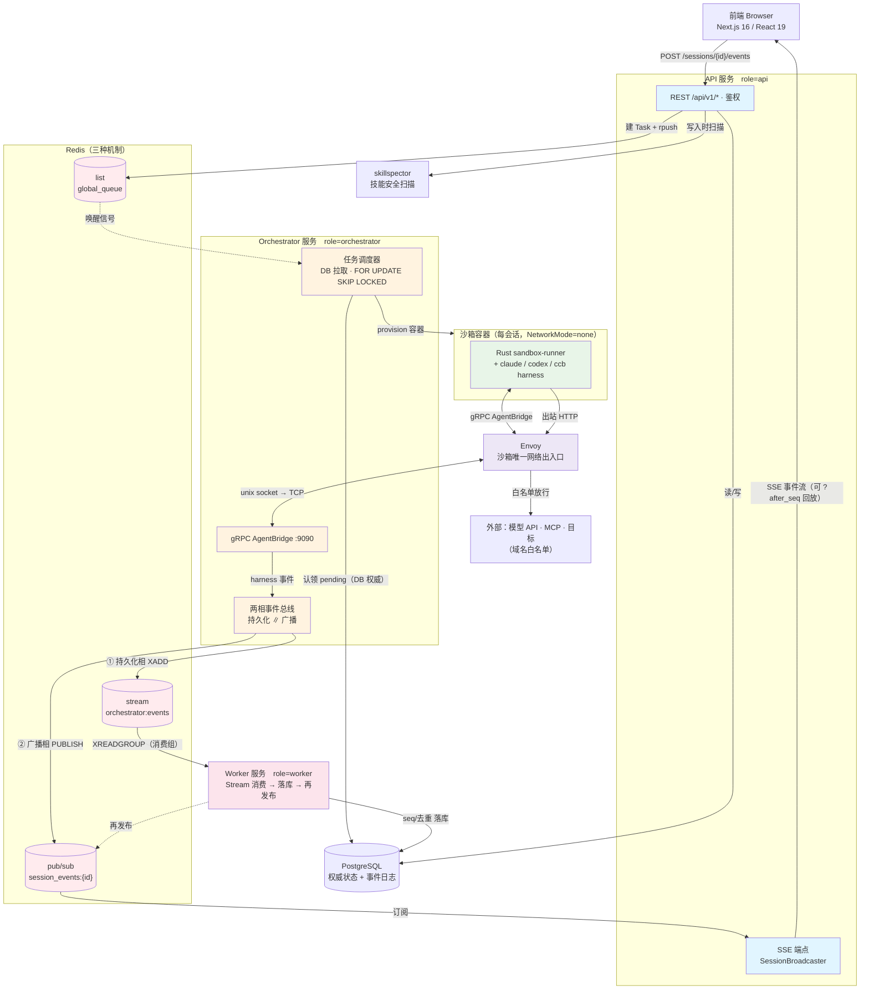
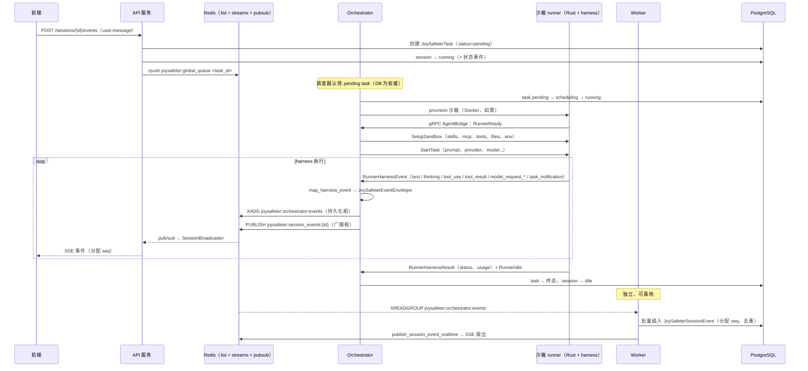

# 架构（Architecture）

> **状态：** 已按 `joysafeter-v2` 分支的真实代码核对（2026-07-03）。
> 本文档描述的是**当前实际运行的代码**。v2 之前的单进程设计
> （DispatchService / ExecutionOrchestrator / EngineRegistry / 进程内 `ExecutionEventBus` / `/ws/executions`）
> 已被**移除**——若你在找旧模型，见 [§11 迁移说明](#11-迁移说明v1--v2)。

JoySafeter 是一个面向安全工作的 AI Agent 编排平台。用户定义一个 **Agent**（引擎 + 模型 +
系统提示词 + 工具 + 技能 + MCP 服务器），打开一个 **Session**（会话）并发送消息。每条消息会变成一个
**Task**，平台把它调度到隔离的**沙箱**容器中，由一个编码 Agent harness（Claude Code / Codex /
自研 `ccb` runner）携带该 Agent 配置的能力执行。harness 做的一切——文本、思考、工具调用、工具结果、
模型请求、子 Agent 生命周期——都以**事件**的形式流回、持久化，并通过 **SSE** 实时推送到浏览器。

---

## 1. 部署拓扑

JoySafeter 以**三个 FastAPI 服务 + 支撑基础设施**的形态运行。三个服务共享同一份代码库，每个服务在启动时
根据 `JOYSAFETER_SERVICE_ROLE` 环境变量（`api` / `orchestrator` / `worker`，或用 `all` 在单进程中
跑全部，便于本地开发）选择自身行为。切分机制在
`app/joysafeter_shared/config/service_role.py`——每个角色判定对 `all` 也返回真。



### 服务与容器

| 组件 | Compose 服务 | 角色 | 关键职责 |
|---|---|---|---|
| **API** | `api` | `JOYSAFETER_SERVICE_ROLE=api` | REST `/api/v1/*`、SSE 执行流、通知 WebSocket、鉴权 |
| **Orchestrator（Rust）** | `orchestrator-rs`（profile `rust-orchestrator`） | — | gRPC `AgentBridge` 服务、任务调度器、沙箱生命周期、事件总线 |
| **Worker** | `worker` | `worker` | 消费 Redis 事件 Stream，批量持久化到 `joysafeter_session_events`，再发布供 SSE 使用 |
| **前端** | `frontend` | — | Next.js App Router UI |
| **PostgreSQL** | `db` | — | 所有状态的权威存储 |
| **Redis** | `redis`（profile `local-redis`）或外部 | — | 事件 Streams、Pub/Sub 扇出、任务队列、协调 |
| **Envoy** | `joysafeter-envoy` | — | 代理每个沙箱的 unix socket；强制每沙箱出口白名单 |
| **skillspector** | `skillspector` | — | 独立的技能安全扫描服务；运行时闸门对不可用扫描状态 fail-closed |
| **db-init** | `db-init`（profile `init`） | — | 一次性 Alembic 迁移 |

当前支持的本地栈使用 Rust orchestrator profile：
`docker compose --profile local-redis --profile rust-orchestrator up`。

---

## 2. 核心闭环——从消息到实时事件

这是最重要的一条链路。走通一次，其余架构自然贯通。



需要牢记两点：

1. **调度的权威是数据库。** Redis list（`joysafeter:global_queue`）只是一个*唤醒信号*；orchestrator
   通过 `FOR UPDATE SKIP LOCKED` 查询 `joysafeter_tasks` 来认领工作。即使 Redis 丢了信号，调度器
   仍能找到 pending 行。

2. **持久化与实时投递解耦。** orchestrator 的事件总线有*持久化相*（→ Redis Stream，由 Worker 可靠消费）
   和*广播相*（→ Redis Pub/Sub，由 SSE 层临时消费）。浏览器快速拿到事件；Worker 保证事件带单调 `seq`
   落库 Postgres，因此重连的客户端可从 `?after_seq` 回放。

---

## 3. 传输映射——谁与谁通信、如何通信

旧文档只描述了一个进程内 WebSocket 总线。实际是若干各司其职的通道。此表为权威参考。

| 通道 | 机制 | 用途 | 锚点 |
|---|---|---|---|
| 浏览器 → API | HTTPS REST `/api/v1/*` | 所有 CRUD + 命令 | `joysafeter_api/api/v1/router.py` |
| **实时事件 → 浏览器** | **SSE** `GET /sessions/{id}/events/stream` | 主执行流（`?after_seq` 回放 DB，再转实时） | `joysafeter_api/api/v1/sessions.py` |
| 通知 → 浏览器 | WebSocket `/ws/notifications` | 用户级通知（进程内 `NotificationManager`） | `joysafeter_api/app.py`、`joysafeter_api/websocket/notification_manager.py` |
| 遗留任务流 | WebSocket `/tasks/{id}/stream` | 单任务输出（bridge 队列 → Redis 回退） | `joysafeter_api/api/v1/tasks.py` |
| 任务入队 | Redis **list** `joysafeter:global_queue` | API `rpush` → orchestrator 调度器弹出 | `joysafeter_api/api/v1/sessions.py`、`joysafeter_orchestrator/kernel/queue.py` |
| **可靠事件总线** | Redis **Streams** `joysafeter:orchestrator:events` + 消费组 | orchestrator `XADD` → Worker `XREADGROUP` → 落库 | `joysafeter_orchestrator/events/stream_publisher.py`、`joysafeter_worker/events/stream_consumer.py` |
| **实时事件扇出** | Redis **Pub/Sub** `joysafeter:session_events:{id}` | 跨实例 SSE 投递（`SessionBroadcaster`） | `joysafeter_orchestrator/session_broadcaster.py` |
| 控制/取消中继 | Redis **Pub/Sub** `joysafeter:cmd:{instance}` | 把 cancel/input 路由到拥有该沙箱的实例 | `joysafeter_api/api/v1/sessions.py`、`joysafeter_orchestrator/kernel/command_listener.py` |
| orchestrator ↔ runner | **gRPC** `AgentBridge`（双向流，:9090） | Agent 执行协议 | `proto/joysafeter.proto`、`grpc/server.py` |
| runner 出口 | Envoy 代理（unix socket） | 每沙箱域名白名单，默认全拒 | `sandbox/envoy_manager.py` |
| 技能扫描 | HTTP → skillspector `:8010` | 技能写入时安全扫描；运行时拦截 failed/scanning/unscanned/blocked 技能 | `joysafeter_skill_security.py` |

**API ↔ orchestrator 走 Redis，而非直接 gRPC。** API 进程内联了 orchestrator 代码，但把每个进程内句柄
（调度器、bridge、broadcaster）都视为可选，缺失时降级到 Redis。这正是 API 与 orchestrator 可拆分为独立
进程的原因。gRPC *仅*用于 bridge ↔ 沙箱内 runner 这一跳，与拥有该沙箱的进程同置。

---

## 4. 服务详解

### 4.1 API 服务（`app/joysafeter_api/`）

API 面。装配 FastAPI 应用（`app.py`），通过 `ApiV1ResponseWrapperMiddleware`
（`api/v1/middleware.py`）把每个 `/api/v1` 的 JSON 响应包成 `{success, code, message, data}`
信封——该中间件会**跳过**任何 `/stream` 路径与任何 `StreamingResponse`，这就是 SSE 能直出
`text/event-stream` 的原因。

**鉴权**（`app/joysafeter_shared/common/joysafeter_auth/dependencies.py`）按优先级解析请求：
`X-Api-Key` 头 → JWT（来自 `Authorization` 或 Cookie，并实时向 DB 复核 org/project 成员关系）→
Cookie/session 回退（首次登录自动开通默认 org+project）。所有 project 作用域路由都按 `auth_ctx.project_id`
过滤以实现多租户隔离。WebSocket 连接用 `GET /auth/ws-token` 的短时 token 鉴权。

**启动**现在几乎不做事——`run_api_startup()` 只为 SSE 装配 `SessionBroadcaster`；v1 的模型注册表与
MCP 服务器启动钩子已删除。

完整 REST 清单见 [§8 API 面](#8-api-面)。

### 4.2 Orchestrator 服务（`app/joysafeter_orchestrator/`）

引擎室。托管 gRPC `AgentBridge` 服务以及一组数据库驱动的控制循环。Agent 代码**不**在本进程运行——
它在沙箱 runner 内运行，通过 gRPC 触达。

| 子系统 | 模块 | 职责 |
|---|---|---|
| gRPC 服务 | `grpc/server.py` | `AgentBridge.Session` 双向流；处理 runner 消息、下发 orchestrator 命令 |
| 任务调度器 | `kernel/scheduler.py` | 认领 pending 任务（`FOR UPDATE SKIP LOCKED`），解析沙箱，推入沙箱队列 |
| 任务控制器 | `kernel/task_controller.py` | 生命周期、启动恢复、故障转移/重试 |
| 沙箱控制器 | `kernel/sandbox_controller.py` | 空闲清扫、provisioning 轮询、预热池、孤儿清理 |
| 沙箱解析器 | `kernel/sandbox_resolver.py` | 三段式解析：复用会话沙箱 → 从池认领 → 新建；注入 runner env |
| 沙箱 bridge | `kernel/sandbox_bridge.py` | 每沙箱的进程内状态：runner 流、状态、订阅者、控制队列 |
| Redis 协调器 | `kernel/redis_coordinator.py` | 跨实例 HA：owner 映射、心跳、`publish_event` |
| 事件总线 | `events/bus.py` | 两相（持久化 ∥ 广播）进程内总线 + 4 个订阅者 |
| 会话广播器 | `session_broadcaster.py` | 实时 SSE 扇出：本地队列 + Redis Pub/Sub |

启动顺序（`lifespan.py`）：Redis + 协调器 → 内存队列 → 调度器/控制器 → bridge 注册表 → 沙箱 provider +
控制器 → 会话广播器 → 事件批写器 → 沙箱解析器 → 内存订阅者 → **Envoy**（如启用）→ **镜像构建器**
（如启用）→ 运行时配置 + SIGHUP 热重载 → 适配器发现 → vault cipher → **事件总线 + 4 订阅者** →
**:9090 gRPC 服务** → 任务恢复 → 5 个后台循环。

### 4.3 Worker 服务（`app/joysafeter_worker/`）

可靠持久化层。只跑一个循环：`EventStreamWorker`（`events/stream_consumer.py`）通过消费组消费 Redis Stream。

- `XREADGROUP` 取新事件；`XAUTOCLAIM` 取空闲 > 60s 的消息（崩溃恢复/重投）。
- 每条事件 → `EventBatchSender`（`events/batch_writer.py`）：按 `session_id` 分组，对每个 session 取
  Postgres advisory lock，从 `MAX(seq)` 计算下一个 `seq`，去重，插入 `JoySafeterSessionEvent`。
- 插入后调用 `publish_session_event_realtime()` → SSE 扇出。
- **仅在 DB 写入成功后 ACK**——持久化失败则消息重投。

> **注意：** `event_stream_enabled` 默认为**假**。在单进程 `all` 模式下 orchestrator 直接持久化事件；
> Worker + Stream 链路是拆分、水平扩展部署下的可选模式（compose 文件启用了它）。

---

## 5. Agent 执行协议——gRPC `AgentBridge`

定义于 `proto/joysafeter.proto`。一个双向流式 RPC：
`rpc Session(stream RunnerMessage) returns (stream OrchestratorMessage)`。orchestrator 为服务端，
沙箱内 Rust runner 为客户端。DB 是权威——gRPC 流承载执行，而非调度。

### Runner → Orchestrator（`RunnerMessage`）

| 消息 | 含义 |
|---|---|
| `RunnerReady` | 首条消息；携带 `sandbox_id`、`runner_token`（HMAC 校验）、可用 provider、重连状态 |
| `RunnerHarnessEvent` | 实时事件流（见下） |
| `RunnerHarnessResult` | 终态结果：`status`、`output`、`error`、`TokenUsage`（含按模型细分）、`duration_ms` |
| `RunnerHeartbeat` | 存活（任何消息都会重置心跳期限；120s 超时） |
| `RunnerIdle` | harness 进入空闲；把 `harness_session_id` / `work_dir` 持久化回会话 |
| `MemoryFileSync` | Agent 在沙箱内写了 memory 文件 → 同步回来 |

**`RunnerHarnessEvent`** 携带 `seq` + `timestamp_ms` + 一个 `oneof`：
`TextEvent` · `ThinkingEvent` · `ToolUseEvent`（`tool`、`call_id`、`input_json`、
`is_control_request`）· `ToolResultEvent` · `ErrorEvent` · `StatusEvent` · `LogEvent` ·
`ModelRequestStartEvent`（`model`）· `ModelRequestEndEvent`（`model` + 4 个 token 计数）·
`TaskNotificationEvent`（后台子 Agent 生命周期：phase、description、status、summary、result、
token/tool 指标）。

### Orchestrator → Runner（`OrchestratorMessage`）

| 消息 | 载荷 |
|---|---|
| `SetupSandbox` | 一次性准备：`skills[]`（SkillArchive tar.gz）、`mcp_servers[]`、`custom_tools[]`、`setup_commands[]`、`memory_mounts[]`、`files[]`（内联）/ `file_refs[]`（按 URL）、`repos[]`、allowed/disallowed/ask 工具列表、`provider`、`model`、env |
| `StartTask` | `task_id`、`provider`、`prompt`、`system_prompt`、`model`、`max_turns`、`timeout_seconds`、env、每任务的 `mcp_servers`/`repos`/`skills`/`custom_tools`、工具策略列表 |
| `CancelTask` | `reason` |
| `SendInput` | `content`（控制请求回复 / 中断注入） |
| `Shutdown` | `reason` |
| `MemoryFileUpdate` | 把 memory-store 文件变更推入沙箱 |

> 密钥在 gRPC 上刻意**留空**——provider API key 通过沙箱创建时注入的容器环境变量触达 harness，绝不过线传输。

---

## 6. 引擎、沙箱与 runner

### 6.1 引擎实际在哪里运行

引擎选择只是一个字符串——Agent 的 `engine_kind`（`claude` / `codex` / `native`）作为 `SetupSandbox`/
`StartTask` 的 `provider` 字段传递，**沙箱内 Rust runner** 据此挑选对应 harness，同时也据此选定 Docker
镜像（`image_claude` / `image_codex` / `image_native`）。

> Python 的 `runtime/*Adapter` 类（`ClaudeAdapter`、`CodexAdapter`、`NativeAdapter`、`MockAdapter`）
> 与 `kernel/task_runner.py` 虽存在，但**不在实时路径上**（零调用者）——它们是 Rust runner 的参考/对齐孪生。
> 真正的执行在 Rust。

### 6.2 Rust sandbox-runner（`sandbox-runner/`）

一个 Cargo workspace（edition 2024，tonic/prost gRPC）。四个 crate：

| Crate | 角色 |
|---|---|
| `joysafeter-types` | 共享类型 + `HarnessAdapter` trait SPI（`start`/`cancel`/`send_input`/`provider`/`is_available`）、`HarnessInput`、`HarnessEvent`（镜像 proto oneof） |
| `joysafeter-runtime` | `AdapterRegistry` + 具体引擎适配器（claude / codex / native / mock） |
| `joysafeter-runner` | 沙箱内二进制，向 orchestrator 讲 gRPC `AgentBridge` |
| `joysafeter-ctl` | `joysafeterctl` 运维/开发 CLI（声明式 REST 客户端） |

runner 从 env 启动（`JOYSAFETER_ORCHESTRATOR_URL`、`JOYSAFETER_SANDBOX_ID`、`JOYSAFETER_RUNNER_TOKEN`），
拨号 orchestrator（TCP 或经 Envoy 的 unix socket），发送 `RunnerReady`，并服务
`StartTask`/`Setup`/`Cancel`/`Input`/`Shutdown`。每个任务按 `provider` 挑适配器，解包技能、跑 setup
命令、克隆 repo、写 `.claude/settings.json`（MCP + 工具 + 工具规则）、构建 `HarnessInput`，把 harness
作为常驻子进程拉起：

| `provider` | 适配器 | 拉起 | 协议 |
|---|---|---|---|
| `claude` | `ClaudeAdapter` | `claude` CLI | stdin/stdout 上的 stream-json，`--permission-prompt-tool stdio` |
| `codex` | `CodexAdapter` | `codex app-server --listen stdio://` | JSON-RPC |
| `native` | `NativeAdapter` | **`ccb`** 二进制 | claude 风格 stream-json——自研 "Harness-Core" 引擎（仅在 Rust runner 侧为独立引擎） |
| `mock` | `MockAdapter` | 测试替身 | 由 env 开关 |

### 6.3 沙箱 provider（`app/joysafeter_orchestrator/sandbox/`）

由 `JOYSAFETER_SANDBOX_PROVIDER` 选择（默认 `docker`）。SPI：`SandboxProvider`
（`create/start/stop/destroy/status/exec/inject_files/setup_networking/...`）。

| Provider | 后端 | 说明 |
|---|---|---|
| **Docker** | 本地 `aiodocker` | 默认。挂载 `work_dir:/workspace`，memory 挂到 `/mnt/memory/<name>`。加固：`CapDrop ALL`、no-new-privileges、PidsLimit、非 root。受限网络 → `NetworkMode=none` + Envoy unix socket |
| **E2B** | E2B REST（Firecracker VM） | 需 `E2B_API_KEY` + `E2B_TEMPLATE_ID` |
| **Daytona** | Daytona REST | 需 `DAYTONA_API_URL` + `DAYTONA_API_KEY` |

**Envoy**（`sandbox/envoy_manager.py`）给每个沙箱独立网络命名空间、无直接出口：runner 经 unix-socket gRPC
管道触达 orchestrator，所有出站 HTTP 都过一个带**默认全拒域名白名单**的 Envoy listener。

---

## 7. 领域模型

以异步 SQLAlchemy 2.0 持久化到 PostgreSQL。v2 词汇与 v1 不同：**没有 `execution`、`run` 或 `mission` 表**。
运行单元是 `JoySafeterTask`；会话单元是带追加式事件日志的 `JoySafeterSession`。

### 7.1 核心实体

| 实体 | 表 | 角色 |
|---|---|---|
| `JoySafeterAgent` | `joysafeter_agents` | Agent 定义。能力（`skills`、`tools`、`mcp_configs`、`model`、`agents`、`commands`）以 **JSONB 反范式**存在行上，非 join 表。经 `joysafeter_agent_versions` 版本化 |
| `JoySafeterSession` | `joysafeter_sessions` | 会话/线程。累计 token 用量；创建时快照 Agent |
| `JoySafeterSessionEvent` | `joysafeter_session_events` | **追加式事件日志**，`unique(session_id, seq)`。即持久化的事件流 |
| `JoySafeterTask` | `joysafeter_tasks` | 运行/执行单元。经 `chat_session_id` 关联会话 |
| `JoySafeterSandbox` | `joysafeter_sandboxes` | 沙箱生命周期记录；每会话 ≤1 个活跃沙箱 |
| `JoySafeterSecret` | `joysafeter_secrets` | provider API key，值 **AES-256-GCM 加密**。运行时作为 env 注入 |
| `JoySafeterVault` / `VaultCredential` | `joysafeter_vaults` / `_vault_credentials` | MCP 服务器凭据（加密 token、OAuth 自动刷新） |
| `JoySafeterSkill`（+ 版本、文件、扫描、协作者、用量） | `joysafeter_skills*` | 完整技能子系统：四级可见性、生命周期 FSM、安全扫描、版本快照 |
| `JoySafeterMemoryStore` / `Memory` / `MemoryVersion` | `joysafeter_memory*` | Agent 可写 KV 存储，带追加式版本历史 |
| `JoySafeterFile` / `SessionFile` / `SessionRepo` | `joysafeter_files*` | 挂入会话的上传文件与 git repo |
| 身份 | `joysafeter_users`、`_auth_sessions`、`_oauth_account`、`_organizations`、`_organization_members`、`_organization_projects`、`_project_members`、`_api_keys` | 用户、会话、OAuth 关联、组织、项目、成员、API key |

持久化模式：auth/skills 有一个薄 `BaseRepository[T]`，但大多数服务直接对每请求的 `AsyncSession` 下 SQLAlchemy
语句并在服务方法内 commit（无 unit-of-work）。

### 7.2 状态机

四个不同 FSM 治理生命周期。转移带守卫（条件式 `UPDATE ... WHERE status = ...` 或 advisory-lock），并发写入不会破坏状态。

| FSM | 实体 | 状态 | 终态 |
|---|---|---|---|
| **Task** | `JoySafeterTask` | `pending → scheduling → running → {completed, failed, aborted, timeout, cancelled}`（+ retry → `pending`） | 5 个结果 |
| **Session** | `JoySafeterSession` | `idle ↔ running ↔ rescheduling`，任意 → `terminated` | `terminated`（可再激活） |
| **Sandbox** | `JoySafeterSandbox` | `creating → provisioning → pooled → idle ↔ running → stopping → stopped / error → destroyed` | `destroyed` |
| **技能生命周期** | `JoySafeterSkill` | `draft → pending_review → {approved, rejected}`、`approved → archived`、reopen/unarchive 边 | — |

技能 FSM 之上还有**运行时闸门**：`is_skill_usable()` 仅当技能为 `approved`、其 `security_status` 在白名单、
**且**内容哈希与上次扫描一致（漂移检测）时才把它纳入会话包。不合规或漂移的技能会被静默丢弃。

---

## 8. API 面

所有路径在 `/api/v1` 下。路由在 `joysafeter_api/api/v1/router.py` 装配。**没有**独立的
`models` / `mcp` / `tools` / `copilot` / `graphs` 路由——这些概念存于 Agent（JSONB 字段）或
`secrets` / `vaults`。

| 分组 | 前缀 | 要点 |
|---|---|---|
| **Auth** | `/auth` | 注册/登录、登出、refresh、密码重置、邮箱验证、`ws-token`、`switch-context`、projects、api-keys、members |
| **OAuth / SSO** | `/auth/oauth` | provider 列表、authorize、callback、账号关联/解绑 |
| **Agents** | `/agents` | CRUD、archive、versions、`/tasks`、`/sessions` |
| **Tasks** | `/tasks` | 创建+入队、列表、获取、取消、**WS** `/tasks/{id}/stream` |
| **Sessions** | `/sessions` | CRUD、archive、stop、`POST /events`（发送）、`GET /events`（历史）、**SSE** `/events/stream`、resources（文件/repo） |
| **Environments** | `/environments` | 沙箱镜像/配置 CRUD |
| **Secrets** | `/secrets` | provider 凭据（模型 API key）+ 默认选择 |
| **Vaults** | `/vaults` | MCP 凭据 + OAuth 配置 |
| **Skills** | `/skills` | CRUD、`import-zip`、files、versions、security-scans、生命周期转移、admin 重扫 |
| **Skills AI 创作** | `/skills/ai-authoring` | **SSE** `/chat`（LLM 创作回合）、`/save-draft` |
| **Sandboxes** | `/sandboxes` | 列表、获取、停止 |
| **Memory stores** | `/memory_stores` | store + memory CRUD、versions、redact、**SSE** `/events/stream` |
| **Files** | `/files` | 上传、列表、元数据、下载、删除 |
| **Organizations** | `/organizations` | 组织 + 成员 CRUD、transfer-ownership |
| **Quickstart** | `/quickstart` | **SSE** `/chat`——引导式 onboarding LLM 代理 |
| **Health** | `/health` | 就绪（Postgres + Redis）、存活 |

---

## 9. 横切关注点

### 9.1 多模型——"统一协议"

后端**没有**编码化的多 provider 适配器注册表。共享 LLM 层
（`joysafeter_shared/llm/openai_stream.py`）是一个 OpenAI 兼容的 SSE 流式辅助：凭据（`api_key`、
`base_url`、`model`）由外部传入，绝不在此解析。任意 provider——OpenAI、Claude、Gemini、DeepSeek、
Qwen 等——都通过把 `base_url` 指向其 OpenAI 兼容网关来泛化触达。该辅助只支撑第一方功能（技能创作、
quickstart）。**Agent 工作负载的模型流量委托给沙箱内的 CLI harness**（Claude Code / Codex / `ccb`），
因此真实的模型路由、重试与回退位于 runner 和 CLI 中，而非 Python。模型配置与凭据是 DB 驱动的
（`joysafeter_secrets`，加密），经 Secrets UI 管理。

### 9.2 技能——能力层

技能是版本化的插件包（仓库内 30 个：21 个 pentest、约 5 个 utility、约 6 个 planning/meta），每个是一个
以 `SKILL.md` 打头的目录。流水线横跨三层：

1. **解析与校验**（`joysafeter_shared/skill/`）——SKILL.md YAML frontmatter + Agent-Skills 规范约束
   （name/description/allowed-tools）、二进制/尺寸守卫。
2. **权限闸门**（`joysafeter_shared/common/skill_permissions.py`）——四级可见性
   （private/project/organization/public）+ 严格 active-org 隔离。
3. **安全扫描**（`joysafeter_domain/.../joysafeter_skill_security.py` → **skillspector** 服务）——
   扫描器失败会记录 failed/scanning 状态，拦截 `DO_NOT_INSTALL` 建议，规范 sha256 用于漂移检测。
4. **打包与投递**——`SkillPacker` 在会话开始时把引用解析为 `tar.gz` `SkillArchive`，应用 `is_skill_usable`
   闸门、记录用量；orchestrator 把归档注入沙箱，runner 解包。

### 9.3 可观测性——全链路追踪

`joysafeter_shared/observation/` 是货真价实的 OTel 实现：

- 一个全局 `TracerProvider`（可选 OTLP 导出）+ **两个自定义 span processor**：
  `PersistenceProcessor`（按 `execution.id` 分桶 span，批量落到 `traces` / `observations` 表，聚合
  token/成本）与 `BroadcastProcessor`（实时 span 流）。
- `TracingMiddleware` 在入口提取 W3C `traceparent` 并回显 `x-trace-id`；loguru 把实时 `trace_id`
  注入每行日志以便关联。
- token/成本计量记录在 span 属性（`llm.usage.*`、`llm.cost.*`）上，聚合进 `Trace` 总计。

### 9.4 安全态势

- **鉴权：** JWT（HS256）带 org/project/role 声明 + 实时 DB 复核；HttpOnly Cookie；变更请求带 CSRF token；
  密码在客户端先做 SHA-256 预哈希。
- **凭据加密：** provider secret 与 vault token 用 AES-256-GCM（`credential_encryption_key`），与 Rust
  `agentd` 兼容的 cipher。
- **SSRF 守卫：** 拦截云元数据 IP、解析 DNS 以挫败 rebinding；默认允许私有 RFC-1918（内部 LLM/MCP 端点），
  可选加固开关。
- **沙箱隔离：** 丢弃能力、非 root、no-new-privileges、PID 限制、Envoy 全拒出口。
- **技能扫描：** 运行时只打包已审批、`security_status` 为 `passed` / `warning` 且内容未漂移的技能。

---

## 10. 源码布局

```
backend/app/
├── joysafeter_api/            # API 服务：REST 路由、SSE、WS 通知、鉴权依赖
│   ├── api/v1/                #   路由（auth、agents、sessions、tasks、skills、secrets、vaults...）
│   ├── websocket/             #   通知管理器 + WS 鉴权
│   ├── app.py / main.py       #   应用装配 + 入口
│   └── startup.py             #   装配 SessionBroadcaster
├── joysafeter_orchestrator/   # Orchestrator 服务
│   ├── grpc/                  #   AgentBridge 服务（+ 生成的 proto）
│   ├── kernel/                #   调度器、控制器、沙箱解析器/bridge、协调器、队列
│   ├── runtime/               #   HarnessAdapter SPI + 适配器（参考/对齐——非实时路径）
│   ├── sandbox/               #   Docker/E2B/Daytona provider、Envoy 管理器、镜像构建器
│   ├── events/                #   两相事件总线 + 订阅者（stream/persist/broadcast/task）
│   ├── session_broadcaster.py #   SSE 扇出（本地队列 + Redis pub/sub）
│   └── lifespan.py            #   启停装配
├── joysafeter_worker/         # Worker 服务
│   └── events/                #   EventStreamWorker（Redis Stream 消费者）+ EventBatchSender
├── joysafeter_domain/         # 数据模型 + 业务逻辑
│   ├── models/                #   SQLAlchemy 表
│   ├── repositories/          #   薄 base repo（auth/skills）
│   ├── schemas/               #   Pydantic DTO
│   └── services/              #   agent/task/session/skill/secret/vault/memory... 服务 + FSM
└── joysafeter_shared/         # 跨服务基座
    ├── llm/                   #   OpenAI 兼容 SSE 辅助
    ├── skill/                 #   SKILL.md 解析 + 校验
    ├── observation/           #   OTel provider + processor + trace/observation 模型
    ├── security/ security.py  #   JWT、密码、SSRF 守卫、凭据密钥设置
    ├── storage/               #   可插拔文件后端（local / s3 / oss）
    ├── cache/                 #   池化 Redis 客户端 + 分布式锁
    ├── oauth/                 #   可插拔 SSO（oauth2、jd_sso）
    ├── runtime/               #   app_factory、lifecycle、docker_check（三服务共享）
    ├── config/                #   settings + service_role（三服务切分开关）
    └── database.py            #   异步 SQLAlchemy engine/session

proto/joysafeter.proto         # AgentBridge gRPC 契约
sandbox-runner/                # Rust workspace：types / runtime / runner / ctl
skills/                        # 30 个技能包（pentest / utility / planning）
deploy/docker-compose.yml      # 三服务 + 基础设施拓扑（python/rust orchestrator profile）
frontend/                      # Next.js App Router UI
```

---

## 11. 迁移说明（v1 → v2）

如果你见过旧架构文档，下面说明变了什么、以及为何旧名字在代码里已无法解析：

| v1（已移除） | v2（当前） |
|---|---|
| 单进程 | 3 服务（`api` / `orchestrator` / `worker`），按 `JOYSAFETER_SERVICE_ROLE` 切分 |
| 进程内 `ExecutionEventBus` | 两相总线 → **Redis Streams**（可靠，Worker）+ **Redis Pub/Sub**（实时，SSE） |
| WebSocket `/ws/executions` | **SSE** `/sessions/{id}/events/stream`；WS 只用于 `/ws/notifications` |
| `DispatchService` → `ExecutionOrchestrator` → `EngineRegistry` | API 经 Redis 入队；orchestrator 调度器从 DB 拉取 |
| 进程内 `CLIEngine` / `LangGraphVisualEngine` / `CopilotEngine` | Rust `sandbox-runner` 经 gRPC `AgentBridge` 执行 harness |
| `Execution` / `Run` / `Task` / `Mission` 实体 | `JoySafeterTask`（运行单元）+ `JoySafeterSession` + `JoySafeterSessionEvent`（日志） |
| `ModelPort` / 模型 provider 注册表 | OpenAI 兼容辅助 + DB 存储 secret；工作负载路由在 CLI harness |

**仍存的概念**（核实仍在，虽位置迁移）：集中式状态机、`AppError` / `ErrorDescriptor` 错误模型、
基于 OTel 的观测层。
