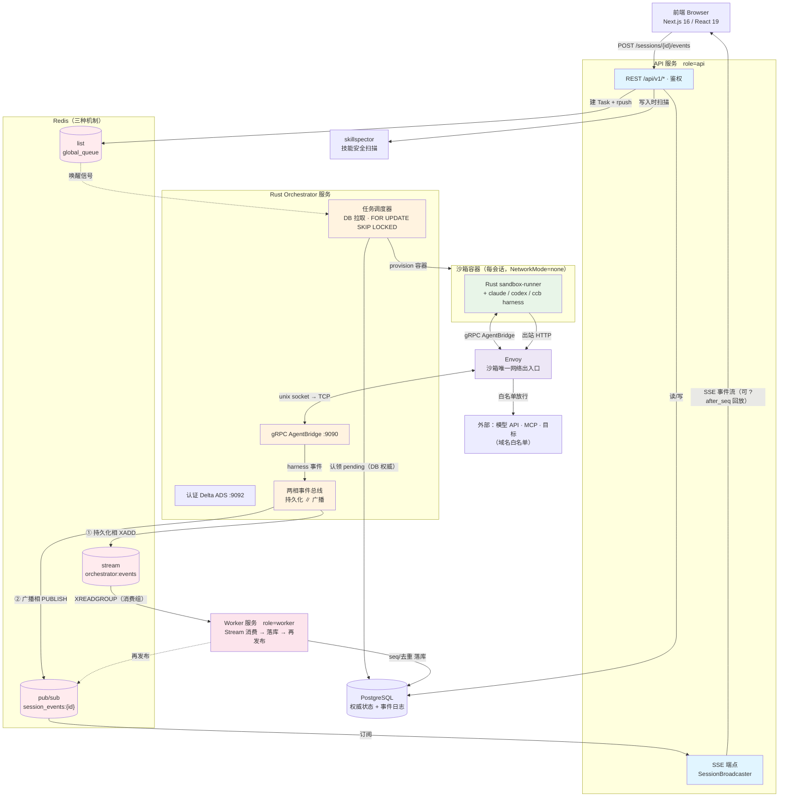
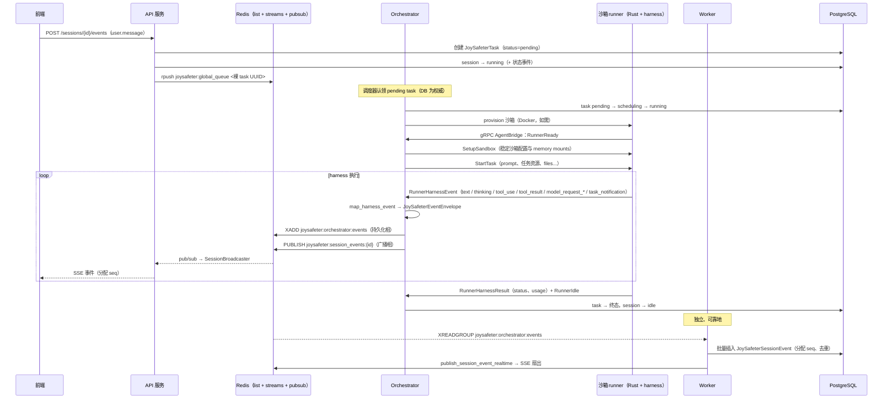

# 架构（Architecture）

本文档描述当前运行时架构，代码和自动化测试是最终事实来源。

JoySafeter 是一个面向安全工作的 AI Agent 编排平台。用户定义一个 **Agent**（引擎 + 模型 +
系统提示词 + 工具 + 技能 + MCP 服务器），打开一个 **Session**（会话）并发送消息。每条消息会变成一个
**Task**，平台把它调度到隔离的**沙箱**容器中，由一个编码 Agent harness（Claude Code / Codex /
自研 `ccb` runner）携带该 Agent 配置的能力执行。harness 做的一切——文本、思考、工具调用、工具结果、
模型请求、子 Agent 生命周期——都以**事件**的形式流回、持久化，并通过 **SSE** 实时推送到浏览器。

---

## 1. 部署拓扑

JoySafeter 以**两个 Python FastAPI 服务 + 一个 Rust orchestrator + 支撑基础设施**的形态运行。
Python API 与 Worker 共享同一份代码库，并通过 `JOYSAFETER_SERVICE_ROLE`（`api` / `worker`）
选择自身行为。orchestrator 是 `app/joysafeter_orchestrator_rs` 中的 Rust 二进制。



### 服务与容器

| 组件 | Compose 服务 | 角色 | 关键职责 |
|---|---|---|---|
| **API** | `api` | `JOYSAFETER_SERVICE_ROLE=api` | REST `/api/v1/*`、SSE 执行流、通知 WebSocket、鉴权 |
| **Orchestrator（Rust）** | `orchestrator-rs`（profile `rust-orchestrator`） | — | gRPC `AgentBridge` 服务、任务调度器、沙箱生命周期、事件总线 |
| **Worker** | `worker` | `worker` | 消费 Redis 事件 Stream，批量持久化到 `joysafeter_session_events`，再发布供 SSE 使用 |
| **前端** | `frontend` | — | Next.js App Router UI |
| **PostgreSQL** | `db` | — | 所有状态的权威存储 |
| **Redis** | `redis`（profile `local-redis`）或外部 | — | 事件 Streams、Pub/Sub 扇出、任务队列、协调 |
| **Envoy** | `joysafeter-envoy` | — | 代理每个沙箱的 unix socket；强制每沙箱出口白名单 |
| **skillspector** | `skillspector` | — | 独立的技能安全扫描服务；默认仅提示风险，可选只在发布版本时强制 |
| **db-init** | `db-init`（profile `init`） | — | 一次性 Alembic 迁移 |

当前支持的本地栈使用部署脚本：
`cd deploy && ./deploy.sh doctor && ./deploy.sh local`。

### 协同契约

每个服务只有一个清晰的所有权边界。跨服务调用必须保持这些契约。

| 参与方 | 拥有什么 | 消费什么 | 发布 / 修改什么 | 不应该做什么 |
|---|---|---|---|---|
| 前端 | 产品 UI 状态、鉴权跳转、SSE 订阅 | REST 响应、SSE 事件、通知 WS | 通过 REST 发起用户命令 | 直接访问 Redis、Postgres、orchestrator gRPC 或沙箱容器 |
| API | Auth/RBAC、REST 校验、CRUD、任务创建、SSE 回放/实时桥接、Skill 写入时扫描调用 | 浏览器请求、DB 状态、Redis Pub/Sub 实时事件 | DB 行、Redis 任务唤醒、Redis 命令中继 | 运行 agent harness、创建沙箱、消费可靠事件 Stream |
| Rust orchestrator | 调度、任务租约、沙箱生命周期、runner gRPC、单一 elected xDS authority、控制命令 ACK、事件发射 | DB pending 任务、Redis 唤醒/命令、runner gRPC 流、Envoy ACK/NACK | task/sandbox/session 状态、网络策略 generation/status、Redis Stream 事件、Redis Pub/Sub 广播、authority 拥有的 xDS 资源 | 承载产品 REST API、拥有浏览器鉴权、作为主路径批量持久化事件日志，或让非 authority 副本修改 xDS |
| 沙箱 runner | 容器内 harness 执行、工具/MCP 调用、沙箱内 memory/file sync | gRPC `SetupSandbox` / `StartTask`、沙箱 env、任务级 files | gRPC runner 事件/结果、memory sync 消息 | 接收通用 secrets map 或远程 MCP 明文认证材料、直连宿主网络、修改平台 DB/Redis、绕过 Envoy 出站策略 |
| Worker | 可靠事件持久化、`seq` 分配、Redis Stream 恢复/重投 | Redis Stream 消费组 | `joysafeter_session_events`、DB 写入后再发布 Pub/Sub | 调度任务、创建沙箱、暴露用户 API |
| SkillSpector | 静态 Skill 安全扫描服务 | API/domain service 发送的 Skill 内容 | 风险提示与可选发布时强制 verdict | 决定运行时打包或使已发布版本失效 |
| PostgreSQL | 领域状态、task/session/sandbox FSM、MCP runtime generation、网络策略状态、事件日志的权威存储 | API/orchestrator/worker/db-init 写入 | 持久化行 | 充当队列或实时扇出总线 |
| Redis | 唤醒、Streams、Pub/Sub、命令中继、ownership/heartbeat 协调 | API/orchestrator/worker 的 list/stream/pubsub 流量 | 临时消息与可靠 Stream 消息 | 被当作调度或 xDS 状态权威；两者都以 Postgres 为准 |

### 故障归属

| 现象 | 首要归属 | 优先检查 |
|---|---|---|
| 用户无法登录或 CRUD 资源 | API | `api` 日志、鉴权配置、数据库连通性 |
| Session 已创建但任务不启动 | Orchestrator | pending task 行、`global_queue` 唤醒、orchestrator 日志、DB lease/fencing 配置 |
| 沙箱一直未 ready | Orchestrator + Docker 宿主机 | Docker socket 挂载、sandbox 镜像、workspace volume、runner `RunnerReady` 超时 |
| Agent 在跑但浏览器收不到实时事件 | API SSE bridge + Redis Pub/Sub | API `SessionBroadcaster`、Redis Pub/Sub、浏览器 `?after_seq` 回放 |
| 实时能看到事件但刷新后消失 | Worker | Redis Stream pending、worker 日志、Postgres 插入错误、advisory lock 竞争 |
| Skill 运行时不可用 | Skill domain | 引用版本是否存在、版本文件是否完整 |
| 沙箱无法访问模型/MCP/目标 | elected xDS authority + Envoy | PostgreSQL generation/status、authority Lease/epoch、Envoy ACK/NACK、目标 DNS 与网络模式 |

---

## 2. 核心闭环——从消息到实时事件

这是最重要的一条链路。走通一次，其余架构自然贯通。



需要牢记两点：

1. **调度的权威是数据库。** Redis list（`joysafeter:global_queue`）只是一个*唤醒信号*；orchestrator
   通过 `FOR UPDATE SKIP LOCKED` 查询 `joysafeter_tasks` 来认领工作。即使 Redis 丢了信号，调度器
   仍能找到 pending 行。

2. **持久化与实时投递解耦。** orchestrator 的事件总线有*持久化相*（→ Redis Stream，由 Worker 可靠消费）
   和*广播相*（→ Redis Pub/Sub，由 SSE 层临时消费）。浏览器快速拿到事件；Worker 保证事件带单调 `seq`
   落库 Postgres，因此重连的客户端可从 `?after_seq` 回放。

3. **Sandbox 状态写入统一使用 CAS。** Rust runtime 通过
   `transition_sandbox_cas(expected_status, new_status)` 校验 sandbox FSM，并在同一条带期望状态的更新中落库。
   系统不再提供先读状态再写入的兼容 API，陈旧观察者无法自行推断 expected state 后覆盖并发结果。

---

## 3. 传输映射——谁与谁通信、如何通信

运行时使用若干各司其职的通信通道。此表为权威参考。

| 通道 | 机制 | 用途 | 锚点 |
|---|---|---|---|
| 浏览器 → API | HTTPS REST `/api/v1/*` | 所有 CRUD + 命令 | `joysafeter_api/api/v1/router.py` |
| **实时事件 → 浏览器** | **SSE** `GET /sessions/{id}/events/stream` | 主执行流（`?after_seq` 回放 DB，再转实时） | `joysafeter_api/api/v1/sessions.py` |
| 通知 → 浏览器 | WebSocket `/ws/notifications` | 用户级通知（进程内 `NotificationManager`） | `joysafeter_api/app.py`、`joysafeter_api/websocket/notification_manager.py` |
| 单任务流 | WebSocket `/tasks/{id}/stream` | 单任务输出（bridge 队列 → Redis 回退） | `joysafeter_api/api/v1/tasks.py` |
| 任务入队 | Redis **list** `joysafeter:global_queue` | API `rpush` → Rust orchestrator 调度器弹出 | `joysafeter_api/services.py`、`joysafeter_orchestrator_rs/src/kernel/queue.rs` |
| **可靠事件总线** | Redis **Streams** `joysafeter:orchestrator:events` + 消费组 | orchestrator `XADD` → Worker `XREADGROUP` → 落库 | `joysafeter_orchestrator_rs/src/events/stream_publisher.rs`、`joysafeter_worker/events/stream_consumer.py` |
| **实时事件扇出** | Redis **Pub/Sub** `joysafeter:session_events:{id}` | 跨实例 SSE 投递（`SessionBroadcaster`） | `joysafeter_orchestrator_rs/src/kernel/session_broadcaster.rs`、`joysafeter_shared/orchestrator_bridge/session_broadcaster.py` |
| 控制/取消中继 | Redis **Pub/Sub** `joysafeter:cmd:{instance}` | 把 cancel/input/shutdown 路由到拥有该沙箱的实例 | `joysafeter_shared/orchestrator_bridge/runtime_commands.py`、`joysafeter_orchestrator_rs/src/kernel/command_listener.rs` |
| 网络策略唤醒 | Redis **Stream** `joysafeter:network-policy:requests` | 唤醒 elected xDS authority 处理精确 PostgreSQL generation 或 teardown；不保存 xDS 状态 | `joysafeter_orchestrator_rs/src/kernel/ha/redis_impl.rs`、`joysafeter_orchestrator_rs/src/xds/authority.rs` |
| orchestrator ↔ runner | **gRPC** `AgentBridge`（双向流，:9090） | Agent 执行协议 | `proto/joysafeter.proto`、`joysafeter_orchestrator_rs/src/grpc/server.rs` |
| runner 出口 | Envoy 代理（unix socket） | 每沙箱域名白名单，默认全拒 | `joysafeter_orchestrator_rs/src/sandbox/envoy.rs` |
| 技能扫描 | HTTP → skillspector `:8010` | 写入时信息扫描；可选仅在发布时执行新的 fail-closed 扫描 | `joysafeter_skill_security.py` |

**API ↔ orchestrator 走 Redis，而非直接 gRPC。** Python API/worker 进程不再导入已删除的 Python
orchestrator 包。它们只通过 `joysafeter_shared.orchestrator_bridge` 使用轻量 API 侧 helper 和测试 seam；
运行时控制通过 Redis 命令中继和 ACK 闭合。gRPC *仅*用于 Rust orchestrator ↔ 沙箱内 runner 这一跳。

---

## 4. 服务详解

### 4.1 API 服务（`app/joysafeter_api/`）

API 面。装配 FastAPI 应用（`app.py`），通过 `ApiV1ResponseWrapperMiddleware`
（`api/v1/middleware.py`）把每个 `/api/v1` 的 JSON 响应包成 `{success, code, message, data}`
信封——该中间件会**跳过**任何 `/stream` 路径与任何 `StreamingResponse`，这就是 SSE 能直出
`text/event-stream` 的原因。

**鉴权**（`app/joysafeter_shared/common/joysafeter_auth/dependencies.py`）按优先级解析请求：
`X-Api-Key` 头 → JWT（来自 `Authorization` 或 Cookie，并实时向 DB 复核 org/project 成员关系）→
Cookie/session 回退（首次登录自动开通默认 org+project）。所有 project 作用域路由都按 `auth_ctx.project_id`
过滤以实现多租户隔离。WebSocket 连接用 `GET /auth/ws-token` 的短时 token 鉴权。

**启动**保持最小化：`run_api_startup()` 只为 SSE 装配 `SessionBroadcaster`。

完整 REST 清单见 [§8 API 面](#8-api-面)。

### 4.2 Orchestrator 服务（`app/joysafeter_orchestrator_rs/`）

引擎室。托管 gRPC `AgentBridge` 服务以及一组数据库驱动的控制循环。Agent 代码**不**在本进程运行——
它在沙箱 runner 内运行，通过 gRPC 触达。

| 子系统 | 模块 | 职责 |
|---|---|---|
| gRPC 服务 | `src/grpc/server.rs` | `AgentBridge.Session` 双向流；处理 runner 消息、下发 orchestrator 命令 |
| xDS 控制面 | `src/xds/control_plane.rs`、`src/xds/resource_store.rs`、`src/xds/node_ownership.rs`、`src/xds/delta.rs` | 单一进程级装配根、原子且显式归属的资源世界、完整 sandbox-to-node 生命周期与 Delta reconciliation |
| xDS authority/transport | `src/xds/authority.rs`、`src/xds/auth.rs`、`src/xds/transport.rs`、`src/xds/leader.rs` | `Standby → Staging → RecoveryServing → Ready → Revoked`、epoch fencing、认证 ADS 与 leader endpoint 发布 |
| 任务调度器 | `src/kernel/scheduler.rs` | 认领 pending 任务（`FOR UPDATE SKIP LOCKED`），解析沙箱，推入沙箱队列 |
| 任务控制器 | `src/kernel/task_controller.rs` | 生命周期、启动恢复、故障转移/重试 |
| 沙箱控制器 | `src/kernel/sandbox_controller.rs` | 空闲清扫、provisioning 轮询、预热池、孤儿清理 |
| 沙箱解析器 | `src/kernel/sandbox_resolver.rs` | 三段式解析：复用会话沙箱 → 从池认领 → 新建；注入 runner env |
| 沙箱 bridge | `src/kernel/sandbox_bridge.rs` | 每沙箱的进程内状态：runner 流、状态、订阅者、控制队列 |
| Redis 协调器 | `src/kernel/redis_coordinator.rs` | 跨实例 HA：owner 映射、心跳、队列、事件发布 |
| 命令监听器 | `src/kernel/command_listener.rs` | Redis cancel/input/shutdown/memory_update 中继与 ACK |
| 事件总线 | `src/events/bus.rs` | 进程内事件总线，驱动 stream 持久化和实时扇出 |
| 会话广播器 | `src/kernel/session_broadcaster.rs` | 实时 SSE 扇出：Redis Pub/Sub |

启动顺序（`src/bootstrap/application.rs`；`src/main.rs` 只负责委托）：配置 + 数据库 + Redis 协调器 → 单一进程级 xDS authority 与
`XdsControlPlane` → provider adapter 接收控制面 → 独立认证的 `:9092` ADS 服务 → provider 初始化 → `Staging` / `RecoveryServing`
PostgreSQL 恢复 → `Ready` → `:9090` Runner gRPC → 任务与生命周期后台循环。`multi` 模式在
`RecoveryServing` 即发布 leader endpoint，让 Envoy 能完成恢复 ACK；正常变更必须等到 `Ready`。
Lease 丢失和进程退出先进入 `Revoked`，再移除 endpoint 并停止传输。启用受管出口但没有 Kubernetes
Lease-elected xDS authority 时进程 fail closed。

#### Orchestrator 主流程、子流程与扩展边界

orchestrator 只有一个组合根，下面挂接可独立替换的子流程。主流程只能选择实现、连接端口、按依赖顺序启动并统一
监督退出，不得复制 provider、network-policy、xDS 或 transport 的领域判断。因此具体 provider 通过 Registry/
Factory 装载，`main.rs` 和业务服务不得通过分支硬编码实例化。

| 领域 | 模块 | 拥有的能力 | 输入 → 输出 | 允许依赖 | 失败归属 |
|---|---|---|---|---|---|
| 进程入口 | `src/main.rs` | 日志、配置入口和委托 | 环境 → `JoySafeterConfig` → `OrchestratorApplication` | `bootstrap` | 进程配置非法 |
| 组合根 | `src/bootstrap/application.rs` | 进程级对象图、启动顺序、后台循环启动和协同退出 | 已验证配置 → 已初始化端口、服务、handle | 配置、DB/Redis 构造器、Registry、应用服务、transport | 必需基础设施缺失或跨组件拓扑非法 |
| Provider Registry | `src/bootstrap/registry.rs` | provider 名称规范化、查找和 factory 分派 | provider 名 + factory context → `RuntimeComponents` | 只依赖 factory 接口 | 未知/禁用 provider、factory 构造失败 |
| Runtime Factory | `src/bootstrap/runtime_factories.rs` | Docker/Kubernetes/Daytona/E2B adapter 装配及仅用于组合的事件 handler | 配置 + 共享 xDS context → provider、network-policy runtime、可选 Envoy manager | 具体 adapter，不被业务调用 | provider 配置或构造失败 |
| 监督 | `src/bootstrap/supervisor.rs` | OS 退出信号、健康与指标 HTTP 暴露 | readiness + xDS snapshot → 进程生命周期/HTTP 响应 | 稳定健康接口 | listener 失败归本模块；领域失败仍回归原 owner |
| 策略材料 adapter | `src/bootstrap/network_policy_material.rs` | `NetworkPolicyMaterialResolver` 的 PostgreSQL/凭据实现 | `SandboxId` → `DesiredNetworkPolicy` 输入 | DB query、credential projection | sandbox 缺失、凭据重建或材料读取失败 |

新增 sandbox 后端时，只向 `ProviderFactoryRegistry` 注册一个 `ProviderFactory`，统一产出
`SandboxProvider`、`NetworkPolicyRuntime` 和可选 `EnvoyManager`。调用方只消费 trait，不按 provider 类型
downcast 或分支。Registry 只能存在于 bootstrap，不能退化成业务代码随处读取的 service locator。

#### Network-policy 领域与应用流程

`src/kernel/network_policy/` 拥有业务期望、确定性 revision、精确 generation 编排，以及 runtime 结果到
PostgreSQL 状态转换的规则。它不拥有容器、Pod、ADS session 或 JSON/protobuf 编码。

| 模块 | 职责与对外能力 | 依赖与边界 |
|---|---|---|
| `mod.rs` | `DesiredNetworkPolicy`、规范化脱敏 revision、`NetworkPolicyGeneration` 值对象 | 纯领域输入；不能访问 provider/transport |
| `envoy_model.rs` | 已验证且 transport-neutral 的 listener/cluster/credential 策略模型 | 纯模型与校验；renderer 依赖它，不能反向依赖 renderer |
| `material.rs` | `NetworkPolicyMaterialResolver` 输入端口 | 由 bootstrap 实现；领域只看 `SandboxId → DesiredNetworkPolicy` |
| `ports.rs` | `NetworkPolicyRuntime` 执行端口和 `NetworkPolicyRequestQueue` 唤醒端口 | 基础设施实现；PostgreSQL 始终是权威 |
| `request.rs` | 中立 reconcile/remove 命令；需要时携带精确 generation | 可经 Redis 运输，但不携带 runtime 状态 |
| `application.rs` | 准备 generation、校验材料、apply/remove、等待投递、持久化精确 CAS 结果 | 使用 DB query、领域端口和 authority guard；不构造 provider/xDS server |
| `authority.rs` | `NetworkPolicyAuthorityHandler`，把领域工作适配到通用 elected-authority worker | 在当前 mutation guard 下加载 DB inventory、apply/prune |
| `recovery.rs` | 重建并校验存活 limited-network inventory，分类 ready/deferred/quarantine | 读取 PostgreSQL、调用 runtime recovery 端口、持久化精确恢复结果 |

正常 reconcile 的唯一数据链路是：

```text
业务触发
  → NetworkPolicyMaterialResolver.resolve(sandbox_id)
  → DesiredNetworkPolicy.revision/render_for
  → PostgreSQL prepare_generation(hash, version)
  → 本地 authority apply 或 Redis 精确 generation 唤醒
  → NetworkPolicyRuntime.apply
  → Envoy 精确 CDS/LDS ACK quorum
  → PostgreSQL mark_generation_applied CAS
```

材料/校验错误归 network-policy application；stale/missing 是 PostgreSQL 并发结果；provider/render/delivery
错误归 `NetworkPolicyRuntime`；NACK/timeout 归 xDS delivery。任何一层都不得通过改写 ready、换 generation
重试或把 Redis 当真相来掩盖失败。恢复遵循同一套材料和 generation 规则，但必须先原子安装完整资源世界，再
持久化各 ready 项。

#### xDS 领域、authority 与 transport

`src/xds/` 拥有进程内 xDS authority 与协议状态。它只接收已验证资源和显式 ownership；不读取业务凭据、不决定
desired policy、不管理容器/Pod，也不持久化 sandbox 生命周期。

| 模块 | 拥有的能力 | 输入 → 输出 / 失败行为 |
|---|---|---|
| `authority.rs` | authority FSM、epoch、recovery/mutation guard、application 串行锁、撤销 | Lease/生命周期事件 → fenced capability guard；旧 epoch fail closed |
| `leader.rs` | Kubernetes Lease 观察与 leader-only Pod label 发布 | Lease + authority phase → xDS Service endpoint 资格；API 失败只重试，不授予 authority |
| `authority_worker.rs` | 与 Redis/network-policy 无关的通用 recover/reconcile/apply 循环 | request source + `AuthorityWork` handler → 串行、带 guard 的工作 |
| `control_plane.rs` | 组合 resource、ownership、delivery、ADS 的稳定进程内 facade | 显式 sandbox resource/placement → delivery attempt 与 snapshot |
| `model.rs` | resource type、显式 owner、managed resource、sandbox bundle | 只有类型值；禁止从名称反推 owner |
| `resource_store.rs` | 原子资源世界与有界 revision log | 带 owner 的资源批次 → 单调 world revision |
| `node_ownership.rs` | sandbox-to-node 真相和 ownership transition | 中立 placement fact → scoped visibility revision |
| `inventory.rs` | 原子 recovery inventory 校验与安装结果 | 完整恢复世界 → installed/deferred inventory |
| `delivery.rs` | 精确 generation delivery attempt 与 CDS/LDS quorum 完成 | world revision + node session ACK/NACK → attempt 终态 |
| `delta.rs` | Delta ADS subscription、重连 reconcile、per-node session、stream closure | 已认证协议消息 ↔ resource delta/ACK/NACK 更新 |
| `auth.rs` | shared-token keyring 解析和 client principal 认证 | request metadata → principal 或 `Unauthenticated` |
| `transport.rs` | 仅独立 tonic ADS listener | `XdsControlPlane` + authenticator → `:9092` server handle |
| `metrics.rs` | 有界基数健康状态和 Prometheus 投影 | 内部计数/状态 → health/metrics snapshot |

authority 生命周期是 xDS mutation 的唯一权限模型。`RecoveryAuthorityGuard` 只允许启动原子恢复；
`MutationAuthorityGuard` 只在 `Ready` 存在。Lease 丢失会撤销 epoch、关闭既有 ADS stream 并使在途工作失效。
resource store、node ownership、delivery quorum 和 ADS session 分离，避免某个状态机通过共享临时 context 暗中
污染另一个状态机。

#### Sandbox 与 transport adapter

| 模块 | 拥有的能力 | 明确不拥有 |
|---|---|---|
| `src/sandbox/provider.rs` | 可替换 create/start/stop/destroy/status/exec/file 生命周期与 capability 端口 | 不做 PostgreSQL generation 转换，不访问 xDS authority |
| `src/sandbox/docker.rs` | Docker container、mount、socket 与 runtime facts | 不直接发布/删除 xDS resource |
| `src/sandbox/k8s.rs` | Pod/PVC/spec 生命周期与 watcher 装配 | 不判断 ownership，不修改 xDS state |
| `src/sandbox/pod_watcher.rs` | 观察 Kubernetes Pod 并发出中立 `PlacementEvent` | 不依赖 `XdsControlPlane` 或 policy application |
| `src/sandbox/runtime.rs` | socket preparation、placement event 的小型基础设施端口 | 不包含 provider/xDS 实现 |
| `src/sandbox/envoy.rs` | `NetworkPolicyRuntime` adapter：socket 准备、模型批处理、等待 delivery | 不拥有 desired policy、durable generation 或 ADS protocol state |
| `src/sandbox/envoy_render/{json,proto}.rs` | 把已验证 listener/cluster spec 纯转换为 Envoy JSON/protobuf | 无 I/O、DB、authority、delivery 或 provider lifecycle |
| `src/sandbox/envoy_delivery.rs` | provider-facing `EnvoyDelivery` 端口及 `XdsControlPlane` adapter | 不做 desired-policy 决策，不隐式推断 owner |
| `src/sandbox/envoy_filesystem.rs` | 受限的本地 filesystem delivery adapter | 不宣称支持非空原子恢复或完整 CDS/LDS 语义 |
| `src/grpc/server.rs` | Runner `AgentBridge` 认证、stream 协议、执行/控制消息 | 不承载 ADS、不选举 authority、不修改 xDS resource state |

Kubernetes placement 链路刻意采用依赖反转：watcher 只发 `PlacementEvent`，bootstrap factory 安装 handler，
再把事件映射到 `XdsControlPlane` ownership 调用。这样 Kubernetes facts 可替换，provider 也拿不到 xDS context。
Runner gRPC 与 ADS 使用不同 server 和端口（`:9090`/`:9091` 对比 `:9092`），执行协议与控制面协议的变更、认证、
限流和失败处理不会互相泄漏。

### 4.3 Worker 服务（`app/joysafeter_worker/`）

可靠持久化层。只跑一个循环：`EventStreamWorker`（`events/stream_consumer.py`）通过消费组消费 Redis Stream。

- `XREADGROUP` 取新事件；`XAUTOCLAIM` 取空闲 > 60s 的消息（崩溃恢复/重投）。
- 每条事件 → `EventBatchSender`（`events/batch_writer.py`）：按 `session_id` 分组，对每个 session 取
  Postgres advisory lock，从 `MAX(seq)` 计算下一个 `seq`，去重，插入 `JoySafeterSessionEvent`。
- 插入后调用 `publish_session_event_realtime()` → SSE 扇出。
- **仅在 DB 写入成功后 ACK**——持久化失败则消息重投。

> **注意：** 原始配置里 `event_stream_enabled` 默认为**假**，但当前支持的 Compose 栈会启用它。
> 在拆分运行时中，Rust `orchestrator-rs` 将事件写入 Redis Stream，再由 Worker 持久化；
> `JOYSAFETER_EVENT_STREAM_FALLBACK_TO_DB=true` 时，如果 Redis Stream 发布失败，orchestrator
> 可降级为直接 DB 落库。

---

## 5. Agent 执行协议——gRPC `AgentBridge`

定义于 `proto/joysafeter.proto`。一个双向流式 RPC：
`rpc Session(stream RunnerMessage) returns (stream OrchestratorMessage)`。orchestrator 为服务端，
沙箱内 Rust runner 为客户端。DB 是权威——gRPC 流承载执行，而非调度。

### Runner → Orchestrator（`RunnerMessage`）

| 消息 | 含义 |
|---|---|
| `RunnerReady` | 首条消息；携带 `sandbox_id`、`runner_token`（HMAC 校验）、可用 provider、重连状态 |
| `RunnerHarnessEvent` | 实时事件流（见下） |
| `RunnerHarnessResult` | 终态结果：`status`、`output`、`error`、`TokenUsage`（含按模型细分）、`duration_ms` |
| `RunnerHeartbeat` | 存活（任何消息都会重置心跳期限；120s 超时） |
| `RunnerIdle` | harness 进入空闲；把 `harness_session_id` / `work_dir` 持久化回会话 |
| `MemoryFileSync` | Agent 在沙箱内写了 memory 文件 → 同步回来 |

**`RunnerHarnessEvent`** 携带 `seq` + `timestamp_ms` + 一个 `oneof`：
`TextEvent` · `ThinkingEvent` · `ToolUseEvent`（`tool`、`call_id`、`input_json`、
`is_control_request`）· `ToolResultEvent` · `ErrorEvent` · `StatusEvent` · `LogEvent` ·
`ModelRequestStartEvent`（`model`）· `ModelRequestEndEvent`（`model` + 4 个 token 计数）·
`TaskNotificationEvent`（后台子 Agent 生命周期：phase、description、status、summary、result、
token/tool 指标）。

### Orchestrator → Runner（`OrchestratorMessage`）

| 消息 | 载荷 |
|---|---|
| `SetupSandbox` | 一次性准备稳定沙箱配置：`skills[]`、`mcp_servers[]`、`custom_tools[]`、`setup_commands[]`、`memory_mounts[]`、`repos[]`、工具策略列表、`provider`、`model`、env |
| `StartTask` | 权威任务快照：`task_id`、prompt/system prompt、provider/model、执行限制、env、任务级 `mcp_servers`/`repos`/`skills`/`custom_tools`、工具策略，以及 `files[]`/`file_refs[]` |
| `CancelTask` | `reason` |
| `SendInput` | `content`（控制请求回复 / 中断注入） |
| `Shutdown` | `reason` |
| `MemoryFileUpdate` | 把 memory-store 文件变更推入沙箱 |

> 协议不再提供通用 `secrets` map。受管 MCP 凭据与受限网络模式下的模型凭据停留在 Envoy
> 边界；非受限网络模式的模型凭据只通过沙箱创建 env 提供；仓库克隆凭据使用窄化且仅限 clone 的
> `RepoConfig.authorization_token`，不再借用可复用的 secrets 容器。

---

## 6. 引擎、沙箱与 runner

### 6.1 引擎实际在哪里运行

引擎选择只是一个字符串——Agent 的 `engine_kind`（`claude` / `codex` / `native` / `pi`）作为 `SetupSandbox`/
`StartTask` 的 `provider` 字段传递，**沙箱内 Rust runner** 据此挑选对应 harness，同时也据此选定 Docker
镜像（`image_claude` / `image_codex` / `image_native` / `image_pi`）。

Rust runner 是唯一的 harness 执行路径。Python 服务不再保留平行的 adapter 或 task-runner 实现。

### 6.2 Rust sandbox-runner（`sandbox-runner/`）

一个 Cargo workspace（edition 2024，tonic/prost gRPC）。四个 crate：

| Crate | 角色 |
|---|---|
| `joysafeter-types` | 共享类型 + `HarnessAdapter` trait SPI（`start`/`cancel`/`send_input`/`provider`/`is_available`）、`HarnessInput`、`HarnessEvent`（镜像 proto oneof） |
| `joysafeter-runtime` | `AdapterRegistry` + 具体引擎适配器（claude / codex / native / pi / mock） |
| `joysafeter-runner` | 沙箱内二进制，向 orchestrator 讲 gRPC `AgentBridge` |
| `joysafeter-ctl` | `joysafeterctl` 运维/开发 CLI（声明式 REST 客户端） |

runner 从 env 启动（`JOYSAFETER_ORCHESTRATOR_URL`、`JOYSAFETER_SANDBOX_ID`、`JOYSAFETER_RUNNER_TOKEN`），
拨号 orchestrator（TCP 或经 Envoy 的 unix socket），发送 `RunnerReady`，并服务
`StartTask`/`Setup`/`Cancel`/`Input`/`Shutdown`。每个任务按 `provider` 挑适配器，解包技能、跑 setup
命令、克隆 repo、写 `.claude/settings.json`（MCP + 工具 + 工具规则）、构建 `HarnessInput`，把 harness
作为常驻子进程拉起：

| `provider` | 适配器 | 拉起 | 协议 |
|---|---|---|---|
| `claude` | `ClaudeAdapter` | `claude` CLI | stdin/stdout 上的 stream-json，`--permission-prompt-tool stdio` |
| `codex` | `CodexAdapter` | `codex app-server --listen stdio://` | JSON-RPC |
| `native` | `NativeAdapter` | **`ccb`** 二进制 | claude 风格 stream-json——自研 "Harness-Core" 引擎（仅在 Rust runner 侧为独立引擎） |
| `pi` | `PiAdapter` | `pi` CLI | 按 provider 配置选择 OpenAI Responses / Chat Completions / Anthropic messages |
| `mock` | `MockAdapter` | 测试替身 | 由 env 开关 |

### 6.3 沙箱 provider（`app/joysafeter_orchestrator_rs/src/sandbox/`）

由 `JOYSAFETER_SANDBOX_PROVIDER` 选择（默认 `docker`）。SPI：`SandboxProvider`
（`create/start/stop/destroy/status/exec/inject_files/setup_networking/...`）。

| Provider | 后端 | 说明 |
|---|---|---|
| **Docker** | 本地 `aiodocker` | 默认。挂载 `work_dir:/workspace`，memory 挂到 `/mnt/memory/<name>`。加固：`CapDrop ALL`、no-new-privileges、PidsLimit、非 root。受限网络 → `NetworkMode=none` + Envoy unix socket |
| **E2B** | E2B REST（Firecracker VM） | 需 `E2B_API_KEY` + `E2B_TEMPLATE_ID` |
| **Daytona** | Daytona REST | 需 `DAYTONA_API_URL` + `DAYTONA_API_KEY` |

**Envoy** 给每个沙箱独立网络命名空间、无直接出口：runner 经 unix-socket gRPC 管道触达 orchestrator，
所有出站 HTTP 都经过带**默认全拒域名白名单**的 Envoy listener。模块边界固定如下：

- `src/sandbox/envoy.rs` 只编排沙箱网络生命周期；
- `src/kernel/network_policy/envoy_model.rs` 拥有已验证、provider-neutral 的策略与 Envoy-facing 值模型；
- `src/sandbox/envoy_render/{json,proto}.rs` 只对这些已验证模型做纯渲染；
- `src/sandbox/envoy_delivery.rs` 定义唯一 `EnvoyDelivery` provider 端口，并适配 `XdsControlPlane`；
- `src/sandbox/envoy_filesystem.rs` 只是非原子的本地兼容适配器，明确拒绝非空恢复与带独立 cluster 的
  listener/cluster 原子发布；
- `src/xds/control_plane.rs` 是进程内控制面的唯一装配根，`resource_store.rs` 是唯一内存资源真相，
  `node_ownership.rs` 是唯一 sandbox-to-node 真相，`delta.rs` 独占协议协调。

provider 只通过 `EnvoyDelivery` 提交显式 owner 资源，不访问 Delta transport 内部，也不从 listener/cluster
名称反推归属。已删除的 `sandbox/lds_backend.rs` 兼容门面不得恢复。

### 6.4 MCP runtime plan 与 xDS authority

Rust orchestrator 把 Agent MCP 配置解析为唯一、不可变的 `ResolvedMcpRuntimePlan`。Runner-safe 配置、
Envoy 凭据路由、DNS 固定结果和网络策略 readiness 都只能从该计划投影，调用方不得各自重新解释 transport、
endpoint、认证或网络模式。

- 远程 transport 仅为 `streamable_http`、`sse`；本地进程仅为 `local_stdio`。旧别名只在不可逆迁移中改写，
  API、前端、CLI、protobuf、runner 和 orchestrator runtime 均不保留兼容分支。
- Agent 负责声明所有 MCP 服务器；项目级 Credential Group 只保存加密 HTTP 认证材料；Session 通过
  `credential_group_ids` 决定本次运行可使用哪些凭据。凭据不会永久绑定到 Agent。
- runtime planner 按规范化 URL 匹配：`required` 必须恰好一个匹配，`optional` 允许零或一个，`none`
  忽略匹配。只有与 Agent 可注入端点相关的重复凭据才构成冲突，无关 URL 不阻止 Session。
- 托管凭据注入仅支持 `streamable_http`；`sse` 必须使用 `auth_requirement: none`；`local_stdio.env`
  是普通 Agent 配置，不得放置密钥。
- limited 网络沙箱只收到 `mcp-egress.internal/r/<route-key>/` 形式的不透明 URL；真实 authority 与认证头只存在于
  Envoy 边界。MCP 凭据运行时方案封闭为 `static_bearer`、`header_api_key`、`custom_header`。
- PostgreSQL 的 `runtime_config_generation` 与网络策略 hash/version/status 是持久化真相；只有捕获 generation
  仍匹配且精确网络策略 generation 已 `ready`，任务才可执行。

多副本 xDS 只允许一种拓扑：

```text
PostgreSQL desired generation/status
        ↓
Redis network-policy 精确 generation 唤醒（非状态）
        ↓
单一 Kubernetes Lease-elected xDS authority
        ↓
Envoy ACK/NACK
        ↓
PostgreSQL terminal generation CAS
```

所有 orchestrator 副本都可调度、拥有 runner bridge 并发送唤醒；只有 authority 可 recover/apply/remove/prune
provider-local xDS。Envoy DaemonSet 连接带 `joysafeter-xds-leader=true` selector 的专用 Service，runner 流量
继续走普通负载均衡 Service。authority 激活顺序为 Lease → `Staging` → PostgreSQL 全量恢复并原子安装资源世界 →
`RecoveryServing` → 发布 leader endpoint → Envoy ACK → `Ready`。合法 generation 对应的 Kubernetes data plane
尚未初始化时，该 sandbox 不进入活动资源世界并归类为 deferred，而不是 quarantine；精确 generation 保持
`pending`，交由 PostgreSQL 驱动的 degraded-policy reconciler 重试。只有无效策略状态或终态投递失败才进入
quarantine。失去 Lease 会 fence epoch、关闭 ADS 与已有流、移除 label。

所有变更由 authority application lock 串行化并携带 epoch guard。ACK/NACK 只能从精确 `pending` generation
终结，因此迟到失败不能覆盖已 ACK 状态；teardown 在删除前必须重新核对 PostgreSQL 当前生命周期与网络模式。
Redis 消息丢失由 PostgreSQL 驱动的 degraded-policy reconcile 和周期 prune 修复，新 leader 永远从 PostgreSQL
重建，而不是依赖 Redis 历史回放。

健康端口暴露 `/healthz/xds` 与 `/metrics`。只有 `Ready` authority 的 `/healthz/xds` 返回 200；其他阶段和
xDS 禁用状态都返回 503。指标标签保持有界，覆盖 authority phase/epoch、恢复结果与耗时、ADS 鉴权/拒绝、
活跃 Envoy 节点、待 ACK delivery 数量与最长等待、ACK/NACK、重连删除、ownership 迁移、旧 session 关闭和
持久化 degraded inventory；sandbox ID、资源名、hash、token、payload 与错误文本不得成为标签。

xDS 当前使用独立 shared-token keyring，按要求暂不启用 mTLS。服务端接受
`JOYSAFETER_XDS_AUTH_KEYRING` 中所有 token；Envoy bootstrap 只使用
`JOYSAFETER_XDS_AUTH_WRITE_KEY_ID` 选中的 token，并要求 `JOYSAFETER_XDS_AUTH_TOKEN` 与之相等。
无中断轮换分三批：先加入新 token 但继续写旧 key；全部 authority 能接受双 key 后切换 write key 与 Envoy
token；确认所有 Envoy 已重连且鉴权/拒绝指标正常后，再移除旧 token。

---

## 7. 领域模型

以异步 SQLAlchemy 2.0 持久化到 PostgreSQL。系统**没有 `execution`、`run` 或 `mission` 表**。
运行单元是 `JoySafeterTask`；会话单元是带追加式事件日志的 `JoySafeterSession`。

### 7.1 核心实体

| 实体 | 表 | 角色 |
|---|---|---|
| `JoySafeterAgent` | `joysafeter_agents` | Agent 定义。能力（`skills`、`tools`、`mcp_servers`、`model`、`agents`、`commands`）以 **JSONB 反范式**存在行上，非 join 表。经 `joysafeter_agent_versions` 版本化 |
| `JoySafeterSession` | `joysafeter_sessions` | 会话/线程。累计 token 用量；创建时快照 Agent |
| `JoySafeterSessionEvent` | `joysafeter_session_events` | **追加式事件日志**，`unique(session_id, seq)`。即持久化的事件流 |
| `JoySafeterTask` | `joysafeter_tasks` | 运行/执行单元。经 `chat_session_id` 关联会话 |
| `JoySafeterSandbox` | `joysafeter_sandboxes` | 沙箱生命周期记录；每会话 ≤1 个活跃沙箱 |
| `JoySafeterCredential` | `joysafeter_credentials` | 统一的模型、服务和 MCP 凭据；值使用 **AES-256-GCM 加密**，仅在授权运行时按字段解密 |
| `JoySafeterCredentialGroup` | `joysafeter_credential_groups` | 项目级 MCP 凭据分组；会话绑定位于 `joysafeter_session_credential_groups` |
| `JoySafeterSkill`（+ 版本、文件、扫描、协作者、用量） | `joysafeter_skills*` | 完整技能子系统：四级可见性、生命周期 FSM、安全扫描、版本快照 |
| `JoySafeterMemoryStore` / `Memory` / `MemoryVersion` | `joysafeter_memory*` | Agent 可写 KV 存储，带追加式版本历史 |
| `JoySafeterFile` / `SessionFile` / `SessionRepo` | `joysafeter_files*` | 挂入会话的上传文件与 git repo |
| 身份 | `joysafeter_users`、`_auth_sessions`、`_oauth_account`、`_organizations`、`_organization_members`、`_organization_projects`、`_project_members`、`_api_keys` | 用户、会话、OAuth 关联、组织、项目、成员、API key |

持久化模式：auth/skills 有一个薄 `BaseRepository[T]`，但大多数服务直接对每请求的 `AsyncSession` 下 SQLAlchemy
语句并在服务方法内 commit（无 unit-of-work）。

### 7.2 状态机

四个不同 FSM 治理生命周期。转移带守卫（条件式 `UPDATE ... WHERE status = ...` 或 advisory-lock），并发写入不会破坏状态。

| FSM | 实体 | 状态 | 终态 |
|---|---|---|---|
| **Task** | `JoySafeterTask` | `pending → scheduling → running → {completed, failed, aborted, timeout, cancelled}`（+ retry → `pending`） | 5 个结果 |
| **Session** | `JoySafeterSession` | `idle ↔ running ↔ rescheduling`，任意 → `terminated` | `terminated`（可再激活） |
| **Sandbox** | `JoySafeterSandbox` | `creating → provisioning → pooled → idle ↔ running → stopping → stopped / error → destroyed` | `destroyed` |
| **技能生命周期** | `JoySafeterSkill` | `draft → pending_review → {approved, rejected}`、`approved → archived`、reopen/unarchive 边 | — |

发布版本要求当前 Skill 为 `approved`。版本发布后，Agent 引用、运行时打包和晋级只依赖不可变的已发布
版本，不再回查父 Skill 后续的生命周期或扫描状态。

---

## 8. API 面

所有路径在 `/api/v1` 下。路由在 `joysafeter_api/api/v1/router.py` 装配。**没有**独立的
`models` / `mcp` / `tools` / `copilot` / `graphs` 路由——这些概念存于 Agent（JSONB 字段）或
统一 Credential / Credential Group。

### 8.1 类型化实体 ID

公共 API 与日志统一使用 canonical 前缀 ID（`agent_<uuid>`、`agentver_<uuid>`、`apikey_<uuid>`、`sess_<uuid>`、`task_<uuid>`、
`trig_<uuid>`、`env_<uuid>`、`cred_<uuid>`、`credgrp_<uuid>`、`sbx_<uuid>`、
`memstore_<uuid>`、`mem_<uuid>`、`memver_<uuid>`、`skill_<uuid>`、`sklfile_<uuid>`、
`sklscan_<uuid>`、`sklver_<uuid>`、`sklvfile_<uuid>`、`skluse_<uuid>`、`file_<uuid>`、
`sesrsc_<uuid>`、`evt_<uuid>`、`vol_<uuid>`、`stgrant_<uuid>`、`staudit_<uuid>`、`user_<uuid>`、`org_<uuid>`、`orgmem_<uuid>`、`proj_<uuid>`、`projmem_<uuid>`、`oauthacct_<uuid>`、`authsess_<uuid>`、`credaudit_<uuid>`、`secaudit_<uuid>`、`sbxnetpol_<uuid>`）。前缀是语义判别器：让跨实体误传在 UUID 进入领域逻辑前即可被
识别并拒绝。应用/领域层使用对应的类型（`AgentId`、`AgentVersionId`、`ApiKeyId`、`SessionId`、`TaskId`、`TriggerId`、
`EnvironmentId`、`CredentialId`、`CredentialGroupId`、`SandboxId`、`MemoryStoreId`、`MemoryId`、
`MemoryVersionId`、`SkillId`、`SkillFileId`、`SkillSecurityScanId`、`SkillVersionId`、
`SkillVersionFileId`、`SkillUsageId`、`FileId`、`SessionResourceId`、`EventId`、`StorageVolumeId`、
`StorageGrantId`、`StorageMountAuditId`、`UserId`、`OrganizationId`、`OrganizationMemberId`、`ProjectId`、`ProjectMemberId`、`OAuthAccountId`、`AuthSessionId`、`CredentialAccessAuditId`、`SecurityAuditId`、`SandboxNetworkPolicyId`）；PostgreSQL、Redis、protobuf 与明确记录的跨语言适配器使用裸 UUID。因此，
使用类型化 ID 并不意味着取消前缀，而是把前缀校验集中到边界，禁止 service、route、前端和
测试自行拆装前缀。Rust ID newtype 不实现 `Deref<Uuid>`；物理适配器必须显式调用 `.as_uuid()`，
避免内存中的实体身份静默降级为存储身份。Agent、Session、Trigger 与执行快照中的环境绑定统一使用
`environment_id`：公共及持久化 JSON 只接受 canonical `env_<uuid>`，PostgreSQL 以 native UUID 外键关联
Environment 生命周期 owner。环境名称仅用于展示与查询，不再作为身份输入。
Sandbox provider label、容器/Pod 名称、Envoy resource/socket 名称、runner 环境变量、Redis ownership
key/payload 与 protobuf 字段属于物理边界，必须显式把 `SandboxId` 解包为裸 UUID；公共 API 响应、
错误、日志和前端状态始终保留 `sbx_<uuid>`。
Memory 同步遵循同一规则：API 路径、schema、日志与前端状态保留 canonical Memory ID；Redis
`memory_update` payload 和 runner protobuf mount 显式携带裸 Memory Store UUID，Rust 在订阅查找前
将其恢复为 `MemoryStoreId`。
文件元数据、文件路由、Session 文件/仓库资源、日志与前端状态保留 `file_<uuid>` / `sesrsc_<uuid>`；
PostgreSQL UUID 列与对象存储 key 必须显式解包 `FileId`，物理存储 key 绝不能包含公共 `file_` 前缀。
已持久化的 Session 事件在 REST/SSE payload、日志、前端状态及应用/Rust 事件流中保留 `evt_<uuid>`；
SQL UUID 列和 Redis Stream 字段携带裸 Event UUID，并在重新进入类型化应用代码时立即恢复为 `EventId`。
Skill CRUD、生命周期、安全扫描、版本、版本文件快照、使用日志、路由与前端状态统一保留六类
canonical Skill ID；仅 SQL join、Rust bundle 与存储适配器在物理边界显式解包为裸 UUID。AI
authoring 的草稿文件在持久化前没有实体身份，禁止用空字符串或伪造的 `SkillFileId` 占位。
当前契约使用 `model_credential_id`、`environment_credential_ids`、`credential_ref`、
`credential_field` 和 `credential_group_ids`。持久化快照固定使用
`joysafeter.agent_execution_snapshot.v2`；更早的字段与快照 schema 必须在部署前由迁移完成重写，
运行时读取器直接拒绝，不再桥接。

| 分组 | 前缀 | 要点 |
|---|---|---|
| **Auth** | `/auth` | 注册/登录、登出、refresh、密码重置、邮箱验证、`ws-token`、`switch-context`、projects、api-keys、members |
| **OAuth / SSO** | `/auth/oauth` | provider 列表、authorize、callback、账号关联/解绑 |
| **Agents** | `/agents` | CRUD、archive、versions、`/tasks`、`/sessions` |
| **Tasks** | `/tasks` | 创建+入队、列表、获取、取消、**WS** `/tasks/{id}/stream` |
| **Sessions** | `/sessions` | CRUD、archive、stop、`POST /events`（发送）、`GET /events`（历史）、**SSE** `/events/stream`、resources（文件/repo） |
| **Triggers** | `/triggers` | Cron/webhook 触发器 CRUD、手动 `/run`、运行历史、入站 `/webhook`（含签名 `/webhook-sample`、`/test`） |
| **Environments** | `/environments` | 沙箱镜像/配置 CRUD |
| **Credentials** | `/credentials` | 模型连接、服务凭据、MCP 成员、生命周期、连通性测试、引用与默认选择 |
| **Credential groups** | `/credential-groups` | MCP 凭据分组、生命周期、成员关系与引用 |
| **LLM** | `/llm` | 模型 `/catalog`（OpenAI 兼容 provider 模型） |
| **Skills** | `/skills` | CRUD、`import-zip`、files、versions、security-scans、生命周期转移、admin 重扫 |
| **Skills AI 创作** | `/skills/ai-authoring` | **SSE** `/chat`（LLM 创作回合）、`/save-draft` |
| **Sandboxes** | `/sandboxes` | 列表、获取、停止 |
| **Network policies** | `/network-policies` | 出口 `/diagnostics`、按会话策略 `/sessions/{id}` |
| **Memory stores** | `/memory_stores` | store + memory CRUD、versions、redact；沙箱 memory sync 经 Rust runtime 中继 |
| **Files** | `/files` | 上传、列表、元数据、下载、删除 |
| **Storage volumes** | `/storage-volumes` | 卷 `/catalog` + CRUD、项目与组织授权、`/audit/logs` |
| **Organizations** | `/organizations` | 组织 + 成员 CRUD、transfer-ownership |
| **Analytics** | `/analytics` | 用量分析：汇总、时序、引擎占比、调用、Agent 对比/排名、时延/错误统计 |
| **Quickstart** | `/quickstart` | **SSE** `/chat`——引导式 onboarding LLM 代理 |
| **Health** | `/health` | 就绪（Postgres + Redis）、存活 |

---

## 9. 横切关注点

### 9.1 多模型——"统一协议"

后端**没有**编码化的多 provider 适配器注册表。共享 LLM 层
（`joysafeter_shared/llm/openai_stream.py`）是一个 OpenAI 兼容的 SSE 流式辅助：凭据（`api_key`、
`base_url`、`model`）由外部传入，绝不在此解析。任意 provider——OpenAI、Claude、Gemini、DeepSeek、
Qwen 等——都通过把 `base_url` 指向其 OpenAI 兼容网关来泛化触达。该辅助只支撑第一方功能（技能创作、
quickstart）。**Agent 工作负载的模型流量委托给沙箱内的 CLI harness**（Claude Code / Codex / `ccb`），
因此真实的模型路由、重试与回退位于 runner 和 CLI 中，而非 Python。模型配置与凭据是 DB 驱动的
（`joysafeter_credentials`，加密），经统一 Credentials UI 管理。

### 9.2 技能——能力层

技能是版本化的插件包（仓库内 4 个：`pptx`、`xlsx` 文档工具，加 `skill-creator`、`skill-security-auditor`），每个是一个
以 `SKILL.md` 打头的目录。流水线横跨三层：

1. **解析与校验**（`joysafeter_shared/skill/`）——SKILL.md YAML frontmatter + Agent-Skills 规范约束
   （name/description/allowed-tools）、二进制/尺寸守卫。
2. **权限闸门**（`joysafeter_shared/common/skill_permissions.py`）——四级可见性
   （private/project/organization/public）+ 严格 active-org 隔离。
3. **安全扫描**（`joysafeter_domain/.../joysafeter_skill_security.py` → **skillspector** 服务）——
   默认记录风险和规范 sha256；当 `SKILL_SECURITY_SCAN_ENFORCEMENT_ENABLED=true` 时，仅在发布版本时
   对同一份快照执行新的 fail-closed 扫描，默认值为 `false`。
4. **打包与投递**——Rust orchestrator 的 `HarnessInputBuilder` 在任务启动时解析已发布版本，从不可变
   版本文件现场生成 `tar.gz` `SkillArchive` 并记录用量；归档随后注入沙箱，由 runner 解包。无可用版本
   会终止输入构建，不会静默降级。

版本暴露在所有边界统一按层级解析：同项目 Agent 可使用任意已发布版本，`latest` 解析为最高 SemVer；
同组织跨项目只能使用 organization/public 指针对应版本；跨组织只能使用 public 指针对应版本。Skill
列表/详情/版本 API、Agent 保存校验与 Rust 运行时使用同一规则。跨项目读取展示暴露的不可变版本快照，
不会返回父 Skill 后续编辑但尚未晋级的草稿内容。

### 9.3 可观测性——全链路追踪

`joysafeter_shared/telemetry/` 负责应用级 OTel provider：

- 全局 `TracerProvider` 初始化请求链路追踪，并可选通过 OTLP 导出 span。
- `TracingMiddleware` 在入口提取 W3C `traceparent` 并回显 `x-trace-id`；loguru 把实时 `trace_id`
  注入每行日志以便关联。
- 产品分析指标来自持久化的 Session、Task 与 session event。已删除的 `Trace` / `Observation`
  持久化原型不属于运行时或数据库契约。

### 9.4 安全态势

- **鉴权：** JWT（HS256）带 org/project/role 声明 + 实时 DB 复核；HttpOnly Cookie；变更请求带 CSRF token；
  密码在客户端先做 SHA-256 预哈希。
- **凭据加密：** provider secret、Task Identity、仓库 token 与 OAuth 凭据统一使用 AES-256-GCM。
  历史 `enc:`/`enc:v1:` 由 `JOYSAFETER_VAULT_ENCRYPTION_KEY` 读取；启用
  `JOYSAFETER_CREDENTIAL_ENCRYPTION_KEYRING` 与 `JOYSAFETER_CREDENTIAL_ENCRYPTION_WRITE_KEY_ID` 后，
  新写入使用 `enc:v2:<key_id>:`，并把该完整前缀作为 AES-GCM 关联数据，防止 key ID 被替换。
  canary 初始化采用仅缺失时插入：并发时首个提交者胜出，其他调用者不覆盖并校验已落库结果，失败时通过
  savepoint 回滚本次部分写入。服务启动会校验密钥语法、数据库 canary、JSON 对象形状，以及所有持久化
  信封是否仍有可用读 key；worker 有界重包裹旧密文并拒绝静默接纳明文或异常存储形状。在重包裹完成及
  回滚窗口关闭前不得移除旧读 key。启动检查不会全量解密业务密文；认证标签损坏会在材料实际使用或进入
  重包裹批次时失败。独立离线命令 `credential_encryption_rotation.py --verify-integrity` 会在 PostgreSQL
  `REPEATABLE READ, READ ONLY` 事务内按主键游标分页，对四类存储中的全部非空当前/历史密文逐条解密
  校验，并且只输出记录坐标与稳定错误类别。
- **SSRF 守卫：** 拦截云元数据 IP、解析 DNS 以挫败 rebinding；默认允许私有 RFC-1918（内部 LLM/MCP 端点），
  可选加固开关。
- **沙箱隔离：** 丢弃能力、非 root、no-new-privileges、PID 限制、Envoy 全拒出口。
- **技能扫描：** 默认只提示风险；可选全局开关仅在发布时强制新扫描，运行时不回查父 Skill 的扫描状态。

---

## 10. 源码布局

```
backend/app/
├── joysafeter_api/            # API 服务：REST 路由、SSE、WS 通知、鉴权依赖
│   ├── api/v1/                #   路由（auth、agents、sessions、tasks、skills、credentials、credential groups...）
│   ├── websocket/             #   通知管理器 + WS 鉴权
│   ├── app.py / main.py       #   应用装配 + 入口
│   └── startup.py             #   装配 SessionBroadcaster
├── joysafeter_orchestrator_rs/ # Rust Orchestrator 服务
│   ├── src/grpc/              #   AgentBridge 服务（+ 生成的 proto）
│   ├── src/kernel/            #   调度器、控制器、沙箱解析器/bridge、协调器、队列
│   ├── src/runtime/           #   HarnessAdapter SPI + 适配器
│   ├── src/sandbox/           #   Docker/E2B/Daytona provider、Envoy 管理器、镜像构建器
│   ├── src/events/            #   事件总线 + stream/realtime 订阅者
│   ├── src/main.rs            #   启停装配
│   └── Cargo.toml             #   Rust crate manifest
├── joysafeter_worker/         # Worker 服务
│   └── events/                #   EventStreamWorker（Redis Stream 消费者）+ EventBatchSender
├── joysafeter_application/    # 用例编排；拥有事务边界与应用端口
│   ├── api_keys/              #   项目 API key 生命周期编排
│   ├── credentials/           #   凭据/分组生命周期、绑定、快照与资源解析
│   ├── sensitive_material_cleanup/ # 敏感材料擦除、重包裹与离线完整性巡检
│   └── sessions/              #   凭据感知的会话创建、资源与仓库 token 保护
├── joysafeter_domain/         # 数据模型 + 业务逻辑
│   ├── models/                #   SQLAlchemy 表
│   ├── repositories/          #   薄 base repo（auth/skills）
│   ├── schemas/               #   Pydantic DTO
│   └── services/              #   agent/task/session/skill/memory... 领域服务、策略与 FSM
├── joysafeter_infrastructure/ # 应用端口的基础设施适配器
│   ├── credentials/           #   SQLAlchemy、材料、审计、依赖与网络策略适配器
│   ├── repository_access/     #   仓库凭据材料适配器
│   └── runtime_configuration/ #   运行时配置状态适配器
└── joysafeter_shared/         # 跨服务基座
    ├── llm/                   #   OpenAI 兼容 SSE 辅助
    ├── skill/                 #   SKILL.md 解析 + 校验
    ├── telemetry/             #   OTel tracer provider 生命周期
    ├── security/ security.py  #   JWT、密码、SSRF 守卫、凭据密钥设置
    ├── storage/               #   可插拔文件后端（local / s3 / oss）
    ├── cache/                 #   池化 Redis 客户端 + 分布式锁
    ├── oauth/                 #   可插拔 SSO（oauth2、jd_sso）
    ├── runtime/               #   app_factory、lifecycle、docker_check（三服务共享）
    ├── config/                #   settings + service_role（三服务切分开关）
    └── database.py            #   异步 SQLAlchemy engine/session

proto/joysafeter.proto         # AgentBridge gRPC 契约
sandbox-runner/                # Rust workspace：types / runtime / runner / ctl
skills/                        # 4 个技能包（pptx、xlsx、skill-creator、skill-security-auditor）
deploy/docker-compose.yml      # 三服务 + 基础设施拓扑（Rust orchestrator profile）
frontend/                      # Next.js App Router UI
```
