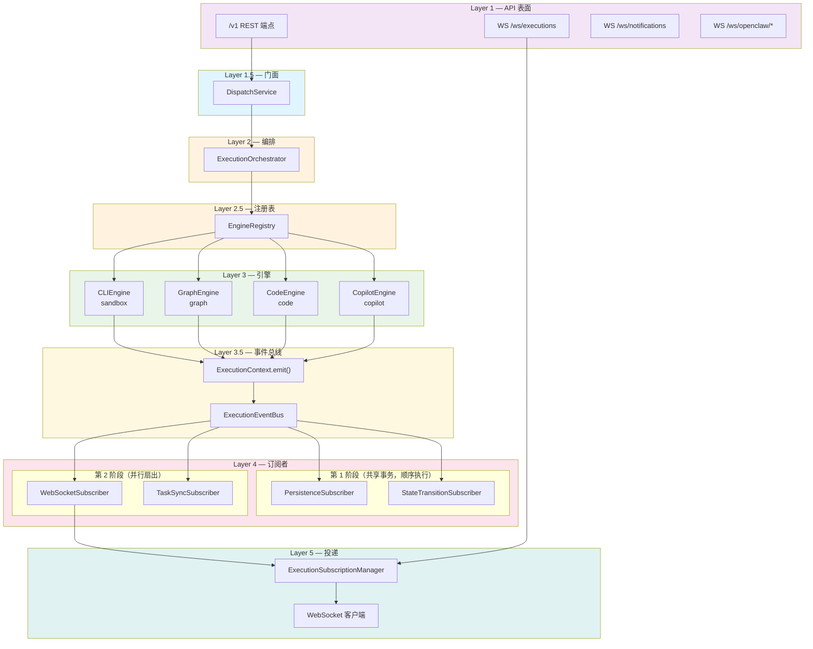
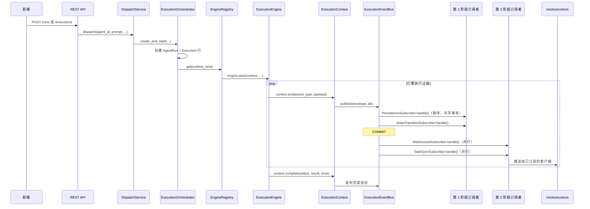
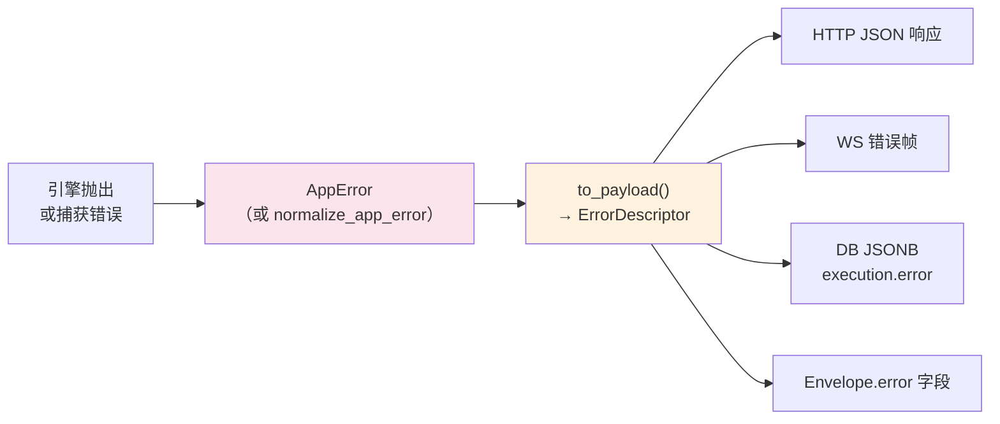

# 架构设计

## 1. 整体架构

JoySafeter 采用分层架构，API 表面、编排层、执行引擎、事件管道、实时推送各司其职。

```
Layer 1     API 路由 (app/api/v1/) + WebSocket 处理器 (app/websocket/)
Layer 1.5   DispatchService — 面向 API 的门面
Layer 2     ExecutionOrchestrator — 创建 Run + Execution，构建 ExecutionContext
Layer 2.5   EngineRegistry — 单例，runtime_kind → ExecutionEngine
Layer 3     执行引擎：CLIEngine / GraphEngine / CodeEngine / CopilotEngine
Layer 3.5   ExecutionContext 回调 → ExecutionEventBus
Layer 4a    PersistenceSubscriber + StateTransitionSubscriber（第 1 阶段，共享 DB 事务）
Layer 4b    WebSocketSubscriber + TaskSyncSubscriber（第 2 阶段，并行扇出）
Layer 5     ExecutionSubscriptionManager → WebSocket 客户端 (/ws/executions)
```



---

## 2. 核心模块

### 2.1 契约（Contracts）— 值域唯一来源

`core/contracts/` 下三个契约文件以 `Literal` 类型 + `set[str]` 常量定义所有规范化值。全部代码引用这些定义，不散布魔术字符串。

| 契约文件 | 定义内容 |
|---|---|
| `agent.py` | `DefinitionKindLiteral`、`RuntimeKindLiteral`、`DEFINITION_RUNTIME_KIND` 映射、`infer_runtime_kind()` |
| `execution.py` | `RunStatusLiteral`、`ExecutionStatusLiteral`、`TriggerSourceLiteral`、终态/活跃集合 |
| `error.py` | `ErrorCode`（StrEnum，~180 码）、`ErrorSource`、`UserAction`、规范化注册集合 |

### 2.2 引擎协议 + 注册表 + 能力矩阵

**协议** (`core/engine/protocol.py`)：

```python
@runtime_checkable
class ExecutionEngine(Protocol):
    engine_kind: str
    capabilities: EngineCapabilities

    async def start(self, context: ExecutionContext, *, ...) -> None: ...
    async def cancel(self, execution_id: UUID) -> None: ...
    async def send_message(self, execution_id: UUID, message: str) -> None: ...
```

**ExecutionContext** 在启动时注入每个引擎。引擎不直接接触持久化或 WebSocket —— 只调用 `context.emit()`、`context.update_status()` 和 `context.complete()`。

**EngineCapabilities** 声明各引擎支持的能力：

**Agent 运行时引擎**（用户面向的 Agent 执行环境）：

| 引擎 | runtime_kind | cancel | msg_inject | debug_obs | artifacts | approval |
|---|---|---|---|---|---|---|
| CLIEngine | sandbox | Y | Y | N | Y | Y |
| GraphEngine | graph | Y | N | Y | Y | Y |
| CodeEngine | code | Y | N | Y | N | N |

**内部平台引擎**（复用执行管道的平台工具，非用户面向的 Agent 运行时）：

| 引擎 | engine_kind | cancel | msg_inject | debug_obs | artifacts | approval |
|---|---|---|---|---|---|---|
| CopilotEngine | build_copilot | Y | N | N | N | N |

> CopilotEngine 是 Graph Builder AI 助手，帮助用户在画布上设计 Agent 图。它不是 Agent 运行时——没有任何用户创建的 Agent 以 `build_copilot` 作为 `runtime_kind`。它复用执行管道（Run → Execution → EventBus → WebSocket）进行流式传输和持久化。

**注册表** (`core/engine/registry.py`)：模块级单例 `engine_registry` 将引擎键映射到引擎实例。引擎在 `core/engine/__init__.py` 导入时自动注册：

```python
# Agent 运行时引擎（用户面向）
engine_registry.register("sandbox", CLIEngine())
engine_registry.register("graph", GraphEngine())
engine_registry.register("code", CodeEngine())

# 内部平台引擎（非用户面向的 Agent 运行时）
engine_registry.register("build_copilot", CopilotEngine())
engine_registry.register("copilot", CopilotEngine())  # 向后兼容已有 DB 记录
```

**添加新 Agent 运行时引擎**需要：
1. 实现 `ExecutionEngine` 协议
2. 在 `core/engine/__init__.py` 中注册
3. 在 `core/contracts/agent.py` 中添加新的 `runtime_kind`（`RUNTIME_KINDS`、`DEFINITION_RUNTIME_KIND`）
4. 如需新错误码，在 `core/contracts/error.py` 中添加

**添加新内部平台引擎**只需：
1. 实现 `ExecutionEngine` 协议
2. 在 `core/engine/__init__.py` 中注册
3. 在 `core/contracts/agent.py` 的 `INTERNAL_ENGINE_KINDS` 中添加

### 2.3 两阶段事件总线

`core/events/bus.py` — `ExecutionEventBus`

所有执行事件通过两阶段发布管道流转：

- **第 1 阶段（PERSIST）**：订阅者共享调用方的 DB 会话，**顺序执行**。所有第 1 阶段订阅者完成后总线统一提交。保证持久化和状态变迁的原子性。
  - `PersistenceSubscriber` — 写入 `ExecutionEvent` 行，分配 `seq` 序号
  - `StateTransitionSubscriber` — 通过状态机校验并执行状态变迁

- **第 2 阶段（BROADCAST）**：订阅者通过 `asyncio.gather` **并行执行**。一个失败不影响其他。
  - `WebSocketSubscriber` — 推送事件到 `ExecutionSubscriptionManager` 进行实时投递
  - `TaskSyncSubscriber` — 根据 Run 终态同步 Task 状态

**信封** (`core/events/envelope.py`)：`ExecutionEventEnvelope` 是所有订阅者接收的规范化数据结构：

```python
@dataclass
class ExecutionEventEnvelope:
    execution_id: UUID
    run_id: UUID
    workspace_id: UUID
    event_type: ExecutionEventType | str
    payload: dict[str, Any]
    seq: int = 0                          # 由 PersistenceSubscriber 填充
    trigger_source: str | None = None
    thread_id: UUID | None = None
    task_id: UUID | None = None
    terminal_status: str | None = None    # 仅完成事件
    error: dict[str, Any] | None = None   # ErrorDescriptor，通过 AppError.to_payload()
    ...
```

**事件类型** (`core/events/event_types.py`)：`ExecutionEventType` StrEnum —— 内容事件（`assistant_text`、`thinking`、`tool_use_start/end`、`error`、`artifact_created`、`approval_requested/resolved`）、生命周期事件（`execution_started/completed/status_change`、`run_status_change`）和 Copilot 事件。

### 2.4 状态机

`core/state_machines/` 集中管理所有状态转换规则。

**引擎** (`engine.py`)：通用 `StateMachine` 类，提供 `validate(from, to)` 和 `is_terminal(status)`。

**定义** (`definitions.py`)：6 个实体的转换表：

| 状态机 | 实体 | 终态 |
|---|---|---|
| `AGENT_SM` | Agent | (无 — archived 可恢复) |
| `VERSION_SM` | AgentVersion | (无 — frozen 可解冻) |
| `RELEASE_SM` | AgentRelease | `retired` |
| `RUN_SM` | AgentRun | `succeeded`、`failed`、`cancelled` |
| `EXECUTION_SM` | Execution | `succeeded`、`failed`、`cancelled` |
| `TASK_SM` | Task | (无 — done/cancelled 可重新打开) |

**转换函数** (`transitions.py`)：`transition_run()`、`transition_execution()`、`transition_task()` 是**唯一**修改领域实体 `.status` 的函数。`sync_task_from_run()` 通过 `RUN_TO_TASK_SYNC` 自动将 Run 终态映射为 Task 状态。

### 2.5 观测层（Observation）

`core/observation/` — 基于 OTel 的追踪，注入 `ExecutionContext`。

| 模块 | 用途 |
|---|---|
| `collector.py` | `ObservationCollector` — 主入口，注入为 `context.collector` |
| `model.py` | 观测 span 数据模型 |
| `types.py` | 类型定义 |
| `otel/provider.py` | OTel TracerProvider 设置 |
| `otel/span_wrapper.py` | Span 包装器，附加 JoySafeter 专属属性 |
| `otel/persistence_processor.py` | 将 span 导出到 DB |
| `otel/broadcast_processor.py` | 将 span 导出到 WebSocket 实时展示 |
| `instrumentation/` | 引擎专属提取器：`cli_extractor.py`、`copilot_extractor.py`、`langchain_handler.py`、`file_tracker.py` |

### 2.6 端口与适配器（Ports & Adapters）

`core/ports/execution.py` 定义 Protocol 接口，解耦 `core/` 和 `services/`：

- **`ExecutionEventPort`** — 通过事件总线发布执行事件的端口。由 `services/execution_event_adapter.py` 实现，`core/agent/cli_backends/execution_runner.py` 使用。
- **`ExecutionReaderPort`** — 在 `core/` 中读取执行数据，无需直接 ORM 查询。由 `services/execution_reader_adapter.py` 实现。

`EventContext` 数据类携带 Run 级元数据，使事件发布无需每次查询 DB 即可构建完整信封。

### 2.7 错误系统 — AppError 层次结构 + ErrorDescriptor

`common/app_errors.py` 定义了以 `AppError`（`@dataclass(slots=True)` + `Exception` 子类）为根的统一异常层次。

**分类类**（无构造函数，仅 `_default_source`）：

```
AppError
  ├── DomainError          (_default_source = "api")
  ├── InfraError           (_default_source = "runtime")
  ├── AuthError            (_default_source = "auth")
  ├── ValidationError      (_default_source = "validation")
  ├── PermissionDeniedError(_default_source = "permission")
  ├── ConflictError        (_default_source = "api")
  ├── RateLimitError       (_default_source = "api")
  └── InternalError        (_default_source = "internal")
```

**叶子类**提供默认值并使用 `**kw` 透传：

```
DomainError
  ├── NotFoundError          (code=NOT_FOUND)
  ├── InvalidRequestError    (code=BAD_REQUEST)
  └── ModelConfigError       (code=MODEL_*)
AuthError
  └── AuthenticationError    (code=UNAUTHORIZED, user_action=relogin)
PermissionDeniedError
  └── AccessDeniedError      (code=FORBIDDEN)
...
```

**ErrorDescriptor** — 规范化错误载荷，由 `AppError.to_payload()` 输出：

```json
{
  "code": "SKILL_NOT_FOUND",
  "message": "技能未找到",
  "data": {"skill_id": "..."},
  "source": "api",
  "retryable": false,
  "user_action": null,
  "detail": null
}
```

这是**唯一的序列化出口** —— 所有传输路径（HTTP 响应体、WebSocket 错误帧、SSE 错误事件、DB JSONB `error` 列）均通过 `to_payload()` 流转。

**错误码注册表**：`core/contracts/error.py` 包含 `ErrorCode` StrEnum，约 180 个条目，按领域分组（Generic、Auth、Agent、Run、Execution、Engine、Model、Sandbox、Skill、Tool/MCP、Task 等）。

### 2.8 图构建系统

两条路径构建 Agent 图：

| 路径 | definition_kind | 引擎 | 说明 |
|---|---|---|---|
| **Code 模式** | `code` | CodeEngine | 用户在浏览器写 LangGraph Python；后端沙箱 exec() |
| **DeepAgents 画布** | `graph` | GraphEngine | 可视化拖拽；Manager-Worker 星型拓扑 |
| **CLI-backed** | `claude_code`、`codex`、`openclaw` | CLIEngine | Docker 容器 + CLI agent 运行时 |
| **Copilot** | (内部) | CopilotEngine | 图分析与动作执行 |

**DeepAgents 构建流水线：**

```
build_deep_agents_graph()
  ├── 1. resolve_all_configs()    — 纯配置提取，无副作用
  ├── 2. 初始化共享后端             — 按需创建 Docker 沙箱
  ├── 3. preload_skills()         — 批量预加载，自动去重
  ├── 4. ModelResolver.resolve()  — 统一 LLM 解析，带缓存
  ├── 5. 构建 Worker               — agent_factory 按节点类型创建
  └── 6. create_deep_agent()      — 编译并最终化
```

### 2.9 代码执行器安全

代码执行器通过多层安全机制运行用户 LangGraph 代码：

| 安全层 | 保护措施 |
|---|---|
| Builtins 黑名单 | 移除 `open`、`eval`、`exec`、`compile`、`globals`、`locals`、`vars`、`dir` |
| Import 黑名单 | 封锁 `os`、`sys`、`subprocess`、`socket`、`io`、`pathlib` 等 |
| Import 白名单 | 仅允许 `langgraph`、`langchain`、`typing`、`json`、`pydantic` 等 |
| 执行超时 | exec 10 秒限制（`signal.alarm`） |
| 调用超时 | ainvoke 30 秒限制（`asyncio.wait_for`） |
| 权限检查 | 保存需要 member 角色，运行需要 viewer 角色 |
| 错误脱敏 | 从错误信息中移除服务器文件路径 |

### 2.10 技能系统

渐进式加载，减少 token 消耗：

- **SkillService**：CRUD + 权限控制 + 版本管理
- **SkillsLoader**：批量预加载到 Docker 后端，自动去重
- **FilesystemMiddleware**：Agent 按需读取 `/workspace/skills/{skill_name}/SKILL.md`

技能异常继承自统一错误树：

```
DomainError → SkillLoadError、SkillNotFoundError（经 NotFoundError）
PermissionDeniedError → SkillPermissionDeniedError（经 AccessDeniedError）
InternalError → SkillFileWriteError（经 InternalServiceError）
```

### 2.11 记忆系统

长/短期 Agent 记忆，中间件注入：

- **MemoryManager**：按用户/主题查询和持久化记忆
- **MemoryMiddleware**：将相关记忆注入 Agent 上下文，从响应中提取新记忆
- **记忆类型**：事实（Fact）、程序（Procedure）、情景（Episodic）、语义（Semantic）

---

## 3. 核心工作流

### 3.1 执行流



### 3.2 错误流



所有错误统一规范化为 `AppError`（或子类），通过唯一的 `to_payload()` 方法序列化，在所有传输路径中一致消费。前端 `ApiError` 类镜像 `ErrorDescriptor` 形状，提供类型化的 `source: ErrorSource`、`retryable: boolean` 和 `userAction?: UserAction`。

---

## 4. 数据流

### 4.1 WebSocket 端点

| 路径 | 处理器 | 用途 |
|---|---|---|
| `/ws/executions` | `ExecutionSubscriptionHandler` | 执行事件流 — 订阅、快照回放、实时事件 |
| `/ws/notifications` | `NotificationManager` | 用户级推送通知 |
| `/ws/openclaw/dashboard` | `OpenClawHandler` | OpenClaw 看板桥接 |
| `/ws/openclaw/bridge/{user_id}` | `OpenClawHandler` | OpenClaw 设备桥接 |

### 4.2 触发来源

AgentRun 创建接受 `core/contracts/execution.py` 中定义的规范化触发来源：

`task` | `chat` | `api` | `scheduler` | `draft_test` | `draft_copilot` | `debug` | `copilot`

### 4.3 单一事件源

所有引擎通过 `ExecutionContext.emit()` 将事件写入 `execution_events` 表。`PersistenceSubscriber` 分配单调递增的 `seq` 序号。WebSocket 客户端重连时从已持久化的事件回放，并从同一管道接收实时事件。

### 4.4 前端 → 后端通信

| 通道 | 用途 |
|---|---|
| REST API (`/api/v1/*`) | CRUD 操作：agents、versions、releases、tasks、threads、runs、executions、skills、tools、models、workspaces |
| WebSocket `/ws/executions` | 实时执行事件流 |
| WebSocket `/ws/notifications` | 用户通知 |
| Code API | 保存和运行用户 LangGraph 代码 |

### 4.5 后端 → 数据层

- **PostgreSQL**：Agent 定义、版本、发布、技能、记忆、会话、工作空间、runs、executions、execution_events、snapshots、traces
- **Redis**：会话缓存、限流、临时数据

---

## 5. 后端文件结构

```
app/
├── api/v1/                        # REST 路由模块
├── common/
│   └── app_errors.py              # AppError 层次结构 + to_payload() + normalize_app_error()
├── core/
│   ├── contracts/                 # 值域注册表（唯一来源）
│   │   ├── agent.py               #   DefinitionKind、RuntimeKind、DEFINITION_RUNTIME_KIND
│   │   ├── execution.py           #   RunStatus、ExecutionStatus、TriggerSource、终态集合
│   │   └── error.py               #   ErrorCode（StrEnum ~180）、ErrorSource、UserAction
│   ├── engine/                    # 执行引擎抽象
│   │   ├── protocol.py            #   ExecutionEngine Protocol、ExecutionContext、EngineCapabilities
│   │   ├── registry.py            #   EngineRegistry 单例
│   │   ├── __init__.py            #   导入时注册 4 个内建引擎
│   │   ├── cli_engine.py          #   CLIEngine（Docker + CLI agent 运行时）
│   │   ├── graph_engine.py        #   GraphEngine（LangGraph 编译器）
│   │   ├── code_engine.py         #   CodeEngine（进程内代码 agent）
│   │   └── copilot_engine.py      #   CopilotEngine（图分析）
│   ├── events/                    # 两阶段事件总线
│   │   ├── bus.py                 #   ExecutionEventBus（第 1 + 第 2 阶段）
│   │   ├── envelope.py            #   ExecutionEventEnvelope 数据类
│   │   ├── event_types.py         #   ExecutionEventType StrEnum
│   │   ├── subscriber.py          #   EventSubscriber Protocol + SubscriberPhase 枚举
│   │   └── subscribers/           #   内建订阅者实现
│   │       ├── persistence.py     #     PersistenceSubscriber（第 1 阶段）
│   │       ├── state_transition.py#     StateTransitionSubscriber（第 1 阶段）
│   │       ├── websocket.py       #     WebSocketSubscriber（第 2 阶段）
│   │       └── task_sync.py       #     TaskSyncSubscriber（第 2 阶段）
│   ├── state_machines/            # 集中化状态转换规则
│   │   ├── definitions.py         #   6 个实体的转换表
│   │   ├── engine.py              #   StateMachine 类 + InvalidTransition 错误
│   │   └── transitions.py         #   transition_run()、transition_execution()、transition_task()
│   ├── observation/               # 基于 OTel 的追踪
│   │   ├── collector.py           #   ObservationCollector（注入 ExecutionContext）
│   │   ├── otel/                  #   TracerProvider、span 包装器、处理器
│   │   └── instrumentation/       #   引擎专属提取器
│   ├── ports/                     # Protocol 接口，解耦 core/ <-> services/
│   │   └── execution.py           #   ExecutionEventPort、ExecutionReaderPort、EventContext
│   ├── agent/                     # CLI agent 后端（claude_code、codex、openclaw）
│   ├── copilot/                   # Copilot 服务实现
│   ├── graph/                     # DeepAgents 图构建器 + 代码执行器
│   ├── skill/                     # 技能系统（服务、加载器、异常）
│   ├── model/                     # 模型提供商 + 凭据管理
│   ├── tools/                     # 工具解析器 + MCP 集成
│   └── a2a/                       # Agent-to-Agent 协议支持
├── models/                        # SQLAlchemy ORM 模型
├── repositories/                  # 数据访问层
├── schemas/                       # Pydantic 请求/响应 Schema
├── services/                      # 服务层实现
│   ├── dispatch_service.py        #   面向 API 的门面（Layer 1.5）
│   ├── execution_orchestrator.py  #   Run + Execution 生命周期（Layer 2）
│   ├── execution_event_adapter.py #   ExecutionEventPort 实现
│   ├── execution_reader_adapter.py#   ExecutionReaderPort 实现
│   ├── runner_factory.py          #   创建 CLI 执行 runner
│   ├── agent_service.py           #   Agent CRUD
│   ├── agent_version_service.py   #   版本管理
│   ├── agent_release_service.py   #   发布生命周期
│   ├── agent_run_service.py       #   Run 查询
│   ├── copilot_service.py         #   Copilot 流式处理
│   ├── skill_service.py           #   技能 CRUD + 权限
│   ├── model_service.py           #   模型解析（provider_name, model_name）
│   ├── sandbox_manager.py         #   沙箱池管理
│   └── ...                        #   （40+ 服务模块）
├── websocket/                     # WebSocket 处理器
│   ├── execution_subscription_handler.py  # /ws/executions 处理器
│   ├── execution_subscription_manager.py  # 订阅注册 + 广播
│   ├── notification_manager.py            # /ws/notifications
│   ├── openclaw_handler.py                # /ws/openclaw/* 处理器
│   └── auth.py                            # WS 认证
├── templates/                     # 邮件模板（Jinja2）
└── utils/                         # 共享工具
```

---

## 6. 前端架构

### 6.1 App Router 路由结构

Next.js App Router + 路由分组：

```
app/
├── (auth)/                       # 认证页面（登录、注册、验证、重置密码）
├── dashboard/                    # 仪表盘
├── agents/[agentId]/             # Agent 详情：编辑、版本、发布、任务、会话
├── executions/[executionId]/     # 执行详情 + 实时追踪
├── tasks/                        # 任务管理
├── skills/                       # 技能市场 + 创建器
├── tools/                        # 工具管理
├── memory/                       # 记忆管理
├── openclaw/                     # OpenClaw 看板
└── settings/                     # 模型、成员、沙箱、Token
```

### 6.2 WebSocket 客户端层

```
BaseWsClient（抽象基类）
├── 生命周期管理（连接、断开、重连）
├── 认证（ws-token）
├── 心跳 + 指数退避自动重连
│
├── ExecutionWsClient     /ws/executions
├── NotificationWsClient  /ws/notifications
└── (OpenClaw 客户端)     /ws/openclaw/*
```

前端 `ExecutionSubscriptionManager` 订阅执行 ID，将收到的事件分发到对应的 UI Store。

### 6.3 状态管理

- **Zustand**：客户端 Store，管理 UI 状态（执行追踪、侧边栏、编辑器）
- **TanStack Query**：服务端状态 + 缓存失效（agents、skills、models 等）

### 6.4 错误消费

前端 `ApiError` 类（`lib/api-client.ts`）镜像后端 `ErrorDescriptor`：

```typescript
class ApiError extends Error {
  code: string              // 如 "SKILL_NOT_FOUND"
  source: ErrorSource       // "api" | "engine" | "runtime" | ...
  retryable: boolean        // 控制重试按钮可见性
  userAction?: UserAction   // "retry" | "relogin" | "configure_model" | ...
}
```

`source` 和 `userAction` 字段驱动 UI 行为：`relogin` 触发认证重定向，`retry` 显示重试按钮，`configure_model` 跳转到模型设置。

### 6.5 API 客户端

`lib/api-client.ts` 中的统一 `apiFetch()` 处理：
- URL 构建（`API_BASE + path`）
- CSRF Token 注入
- 401 自动刷新 + 单航班去重
- 基于 `AbortController` 的超时
- 结构化错误提取 → `ApiError`
