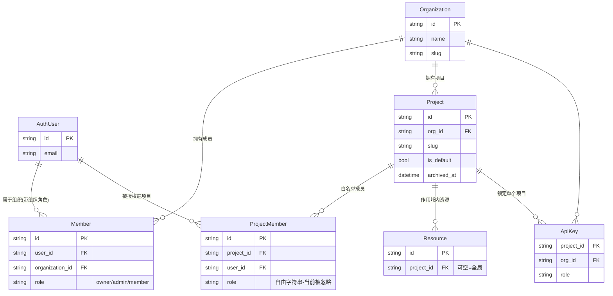
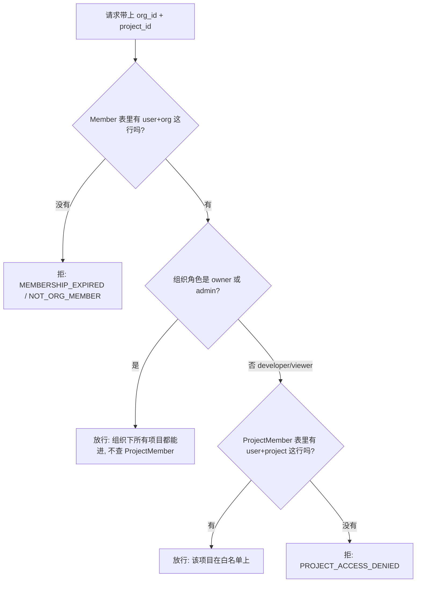

# 组织 / 项目 / 成员 模型说明与功能缺口

日期:2026-07-17
范围:后端权限模型(组织、项目、两类成员、角色)的现状梳理,以及基于源码确认的功能缺口清单。
结论先行:系统里有两张都叫「成员」的表,回答的是两个不同问题。组织成员管「你是不是这个组织的人、多大官」,项目成员管「你能不能进这个具体项目」。管理层(owner/admin)拿万能钥匙、免查项目名单;普通成员(developer/viewer)必须在项目白名单上。目前这套「项目级白名单」只做了一半:有表、有鉴权门、有服务方法,但缺管理入口。

## 一、两个概念的区分

- 组织成员 = `Member` 表(`joysafeter_organization_members`)。把用户绑到组织,`role` ∈ owner / admin / member。回答:你是不是这个组织的人,以及在组织里的职级。
- 项目成员 = `ProjectMember` 表(`joysafeter_project_members`)。把用户绑到某个具体项目,`role` 是自由字符串、当前被忽略。回答:你能不能进这个项目。

这两者不是「都要满足」的叠加关系,而是有条件的:组织成员是根基(所有人都要有),项目成员只对 developer / viewer 才起作用。owner / admin 靠组织角色直接通吃组织下所有项目,系统根本不查 ProjectMember 表。

角色说明:
- 存储层是 `OrgRole`(owner / admin / member),读取时经 `JoySafeterRole.normalize` 归一化,其中 `member` 被映射成 `developer`(`context.py`)。
- 鉴权引擎是 `JoySafeterRole`(owner / admin / developer / viewer),权限方法:`can_write` = owner/admin/developer;`can_manage_members` = owner/admin;`can_manage_projects` = owner/admin;`can_manage_org` = owner。
- `role_has_org_wide_project_access` = `can_manage_projects`,即只有 owner / admin 全组织通吃。

## 二、数据关系图

`Member` 和 `ProjectMember` 都是连接表,一个连组织、一个连项目。资源(agent / secret / vault / environment / session)统一挂在 `project_id` 上,作用域是项目;`project_id` 为空则落到全局共享命名空间。

## 三、访问判定流程

每个请求都走这条链:`dependencies.py:_verify_joysafeter_context` → `project_service.py:get_accessible_project`。

流程要点:先验组织成员(能不能进楼),再看角色(是不是管理层拿万能钥匙),只有普通成员才去查项目白名单(有没有这个房间的钥匙)。

补充:API Key 是项目级凭证,`principal_type="api_key"`,直接带 org_id + project_id + role(`dependencies.py`),绕过成员表校验,作用域天然锁死在建 key 时的那一个项目。

## 四、谁在哪张表(具体走一遍)

| 场景 | Member 表(组织) | ProjectMember 表(项目) | 实际能进哪些项目 |
|---|---|---|---|
| 建组织,自己是 owner | 有一行,role=owner | 有一行(默认项目) | 组织下所有项目 |
| 拉同事进组织当 admin | 有一行,role=admin | 有一行(默认项目) | 组织下所有项目 |
| 拉同事进组织当普通成员 | 有一行,role=member | 有一行,只在默认项目 | 只有默认项目 |

第三行是最容易混淆处:邀请普通成员进组织时,系统只自动给默认项目一行(`grant_default_project_membership`),他进不了别的项目,而且目前没有任何接口能再给他别的项目的访问权。

## 五、功能缺口清单

按对协同的影响排序,每条附源码依据和后果。

### 缺口 1(最关键):没有项目成员管理入口

ProjectMember 行只在三处被隐式创建:邀请/添加组织成员时只给默认项目一行(`joysafeter_organization_member_service.py:245,292`)、建组织时给 owner、建项目时给创建者(`project_service.py:248`)。`joysafeter_api/` 全层 grep `grant_project_membership` 零命中,前端只有组织级成员管理。

后果:developer / viewer 永远被钉死在默认项目,没有办法把他们授权进第二个项目。多项目对非管理员形同虚设。服务层的 `grant_project_membership` / 删行逻辑都已就绪,缺的是 API + 前端。

### 缺口 2:改组织角色不同步项目白名单

`update_member_role_by_id` / `update_member_role_by_user_id`(`member_service.py:301-349`)只改 `Member.role`,不碰 ProjectMember。

后果:把 admin 降成 developer 后,他能进哪些项目取决于历史上是否残留 ProjectMember 行,行为不确定;把 developer 升成 admin 后,旧的 ProjectMember 行不会清理,留下脏数据。角色变更与项目访问之间没有一致性保证。

### 缺口 3:ProjectMember.role 是死字段,项目级没有分权

门只判断这行在不在,不看 role 值(`user_has_project_access` 只 `select id`,`project_service.py:172-189`;模型 docstring 也写明忽略)。

后果:无法表达「张三在项目 A 能写、在项目 B 只读」。项目级只有「是/否成员」一档,没有项目管理员 / 项目开发 / 项目只读。组织角色定全局 + 项目角色定局部的两层 RBAC 只做了一半。

### 缺口 4:缺回填迁移,存量部署会锁死

ProjectMember 的 docstring 承诺迁移 `20260625_000007_project_members` 会把每个现存组织成员回填进默认项目,但这条迁移不在链里,表是在 `20260627_000001_init:356` 建成空表、无回填。

后果:对当前新库无影响。但如果在已有成员的库上上线这套,所有 developer / viewer 会因为没有 ProjectMember 行被 `PROJECT_ACCESS_DENIED` 挡住。属于埋着的上线风险。

### 缺口 5:技能可见性的 project 档实际塌缩

Skill 有 private / project / organization / public 四档(`joysafeter_skill.py:33-44`),ProjectMember 当初就是为了区分 project 和 organization 才引入的。但因为普通成员只可能在默认项目有行,「只给项目 B 成员看」的技能除 owner/admin 外无人可见。

后果:project 级可见性对非默认项目没有意义,是缺口 1 的连带效应。补完项目成员管理后它才真正生效。

### 缺口 6:组织成员表缺唯一约束

`Member` 在模型层对 `(user_id, organization_id)` 没有唯一约束(`joysafeter_organization.py:100-103` 只有普通索引),鉴权用 `.limit(1)` 取一行。

后果:理论上同一用户可能在同一组织有多条 Member 行,角色不一致时系统静默取一条,结果不确定。数据完整性隐患。

### 缺口 7:默认项目身份不明确

默认项目既是普通成员唯一落脚点,又禁止归档(`PROJECT_DEFAULT_ARCHIVE_FORBIDDEN`,`project_service.py:412`),实际承担了组织公共工作区的角色,但代码里没有把这个语义显式定义出来。

后果:概念含糊。补完项目授权后应决定是正式承认这个语义,还是放开归档限制。

### 缺口 8:API Key 锁死单项目

服务凭证在建 key 时就固定 org_id + project_id(`dependencies.py` 的 API key 路径),一个 key 只能操作一个项目。

后果:跨项目的服务集成现在做不到。是否算缺口取决于产品定位,列出供判断。

## 六、建议的补齐顺序

1. 先补缺口 1 的项目成员管理接口(grant / revoke + 前端)。服务层已就绪,是最干净、影响最大的一刀。
2. 顺带在改组织角色时重算项目白名单(缺口 2),避免脏数据。
3. 再让 ProjectMember.role 生效(缺口 3),把「是否成员」升级成「成员且角色达标」。这一步做完,技能 project 可见性(缺口 5)自动完整。
4. 上线前如涉及存量数据,补回填迁移(缺口 4);给 Member 加唯一约束(缺口 6)。

缺口 1、2、3、5 是一条主线(项目级 ACL 补全),4、6 是数据侧收尾,7、8 是产品定位问题。

## 附:相关文件位置

- 模型:`backend/app/joysafeter_domain/models/joysafeter_organization.py`(Organization / Member)、`joysafeter_project.py`(Project / ProjectMember)、`joysafeter_auth.py`(AuthUser)
- 角色引擎:`backend/app/joysafeter_shared/common/joysafeter_auth/context.py`
- 鉴权链:`backend/app/joysafeter_shared/common/joysafeter_auth/dependencies.py`
- 项目服务(授权/白名单逻辑):`backend/app/joysafeter_domain/services/joysafeter_project_service.py`
- 成员服务(邀请/角色/移除):`backend/app/joysafeter_domain/services/joysafeter_organization_member_service.py`
- 建表迁移:`backend/alembic/versions/20260627_000001_init_joysafeter_schema.py`
