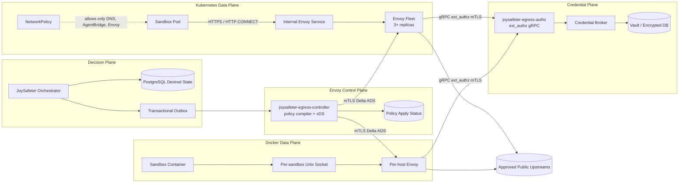

# JoySafeter Production Unified Envoy Egress Architecture

Status: **target architecture approved for implementation planning**  
Date: 2026-07-31  
Scope: Docker, Kubernetes/k3s, and future remote sandbox providers  
Primary decision: **retire the self-built Rust HTTP forwarding proxy and standardize on Envoy as the egress data plane**

This specification supersedes the Rust-forwarding portions of:

- `docs/plans/2026-07-30-k8s-sandbox-egress-security-architecture.md`
- `docs/superpowers/specs/2026-07-31-infra-security-egress-three-plane-design.md`
- `docs/superpowers/plans/2026-07-31-sp4-unified-egress-mediation.md`

The provider-neutral policy model, credential broker, fail-closed resolver gate,
NetworkPolicy enforcement, and request-time credential resolution remain valid.

## 1. Executive Decision

JoySafeter will use one egress architecture across providers:

1. **Envoy is the only external network data plane.** It owns HTTP proxying,
   upstream TLS, DNS, connection pooling, streaming, retries, circuit breaking,
   overload protection, and access telemetry.
2. **JoySafeter owns a small product-specific control plane.** It decides which
   sandbox may reach which route and compiles ref-only policies into xDS.
3. **JoySafeter owns the credential plane.** An `ext_authz` service validates the
   sandbox identity, resolves a non-secret `credential_ref`, and returns the
   exact header Envoy may inject.
4. **No real credential enters a sandbox, xDS resource, Kubernetes manifest,
   Envoy bootstrap file, Envoy config dump, or access log.**
5. **Both `limited` and `unrestricted` networking remain mediated.**
   `unrestricted` means unrestricted public destination breadth through Envoy;
   it does not mean a direct socket path around the egress boundary.
6. **The previous Rust HTTP forwarding proxy implementation is removed after
   migration.** JoySafeter does not maintain a parallel HTTP proxy.

The result is not “zero custom code.” Product-specific policy, identity,
credential lookup, and lifecycle reconciliation cannot be delegated to a
generic proxy. The result is **zero custom forwarding stack** and a deliberately
small, auditable control/authorization surface.

## 2. Architecture Invariants

These are release-blocking invariants.

1. A sandbox never receives a real provider, MCP, Git, or external-service
   credential.
2. A secret-backed sandbox cannot start until its egress policy is accepted by
   the target data-plane group.
3. A sandbox cannot bypass Envoy to reach an external destination.
4. `limited` allows only explicit product policy destinations.
5. `unrestricted` allows arbitrary **public Internet** destinations through
   Envoy but still denies private, loopback, link-local, metadata, cluster, and
   control-plane address ranges.
6. Credential injection occurs only on an explicit route that binds:
   `(sandbox identity, route_id, upstream, credential_ref, header mutation)`.
7. Sandbox-supplied authentication headers are removed before the platform
   credential is injected.
8. xDS carries references and routing metadata only; it never carries decrypted
   credential material.
9. An authorization, policy, broker, DNS, TLS, or configuration failure is
   fail-closed for new requests.
10. Envoy continues serving its last accepted configuration during temporary
    control-plane loss.
11. Revocation prevents new requests within the declared propagation SLO.
12. Logs, metrics, traces, crash reports, and admin endpoints never expose
    credentials or request bodies by default.

## 3. Target Topology



## 4. Plane Responsibilities

### 4.1 Decision Plane — Orchestrator

The orchestrator remains the authority for sandbox lifecycle and desired
policy. It does not render Envoy wire resources and does not proxy requests.

Responsibilities:

- Resolve agent/environment/session configuration.
- Extract real credentials into non-secret `CredentialRef` values.
- Replace sandbox credential environment variables with scoped placeholders.
- Rewrite LLM/MCP/Git/external base URLs to the egress boundary.
- Build a provider-neutral `SandboxEgressPolicy`.
- Persist the desired policy and generation transactionally with the sandbox.
- Insert a durable event-log row in the same transaction; PostgreSQL
  `LISTEN/NOTIFY` wakes controllers after commit.
- Wait for policy apply status before marking the sandbox runnable.
- Revoke policy during teardown and credential rotation.
- Retain per-sandbox deny-by-default NetworkPolicy tombstones during teardown;
  delete them only through a separate GC after positively proving no matching
  Pod exists.
- Fail closed when no compatible egress binding exists.

The resolver must not call a proxy-specific HTTP control API. Its interface is
desired-state based:

```rust
trait EgressPolicyAuthority {
    async fn declare(
        &self,
        sandbox_id: Uuid,
        policy: SandboxEgressPolicy,
    ) -> Result<PolicyGeneration>;

    async fn wait_applied(
        &self,
        sandbox_id: Uuid,
        generation: PolicyGeneration,
        deadline: Instant,
    ) -> Result<EgressBoundary>;

    async fn revoke(&self, sandbox_id: Uuid) -> Result<PolicyGeneration>;
}
```

### 4.2 Envoy Control Plane — `joysafeter-egress-controller`

This is a dedicated service, separate from request-serving orchestrator
instances.

Implementation direction:

- Build on Envoy's maintained xDS control-plane library, preferably
  `envoyproxy/go-control-plane`, rather than extending the handwritten Rust Delta
  xDS protocol implementation.
- Use the transactional event log plus `LISTEN/NOTIFY` for low-latency wakeups,
  while periodic full-database reconciliation remains the correctness path.
- Compile provider-neutral policies into LDS/RDS/CDS resources.
- Maintain last-known-good snapshots by data-plane group.
- Track connected Envoy nodes, resource versions, ACKs, NACKs, and stale nodes.
- Publish per-sandbox apply state for the orchestrator gate.
- Never read or resolve secret values.

The controller is horizontally replicated, but only one logical writer may
publish a generation for a data-plane group at a time. Use leader election or a
single-writer partition assignment. Standby replicas continue serving xDS from
the durable/current snapshot cache and can acquire leadership.

### 4.3 Envoy Data Plane

Envoy owns all forwarding behavior:

- HTTP/1.1 and HTTP/2 downstream handling.
- HTTP CONNECT for non-credentialed HTTPS proxy traffic.
- SSE, streamable HTTP, WebSocket upgrades, and gRPC.
- Upstream DNS and TLS origination.
- Host/path rewrite for explicit credential routes.
- Header stripping and authorization-result header injection.
- Connection pooling, connection limits, circuit breakers, and outlier
  detection.
- Access logs, metrics, response flags, and request IDs.
- Overload shedding and memory-pressure protection.

Envoy must not:

- Query the JoySafeter database.
- Decrypt credentials.
- Accept direct policy writes from the orchestrator.
- Carry a generic platform credential store through SDS or static secrets.
- Use `failure_mode_allow` for authorization.

### 4.4 Credential Plane — `joysafeter-egress-authz`

Split the existing `CredentialBroker` and `ext_authz` endpoint into a dedicated
internal service or a dedicated orchestrator role with isolated deployment and
resource limits.

Responsibilities:

- Authenticate the calling Envoy workload by mTLS service identity.
- Validate sandbox identity material presented by the request.
- Verify that the identity is bound to the requested `sandbox_id` and `route_id`.
- Load the current route definition by non-secret coordinates.
- Resolve `credential_ref` through the existing broker.
- Return allow/deny plus the one authorized upstream header mutation.
- Return sanitized denial/error metadata.
- Emit audit events without values.

The service must not accept a caller-provided arbitrary credential reference,
header name, or upstream. It resolves only a route already installed in the
authoritative policy registry.

### 4.5 Network Enforcement Layer

Envoy is an application-layer boundary. A separate network layer makes bypass
impossible.

Kubernetes sandbox Pods may reach only:

- Cluster DNS on TCP/UDP 53.
- The JoySafeter AgentBridge/orchestrator service on its exact port.
- The internal Envoy egress Service on its exact ports.

They may not reach:

- Internet IPs directly.
- Kubernetes API endpoints.
- Cloud metadata endpoints.
- Other namespaces or Pod CIDRs except explicitly required control services.
- Node addresses, host networking, or link-local services.

Docker sandboxes remain in `network=none` and receive only their own Unix socket
directory plus the AgentBridge socket.

## 5. Deployment Models

### 5.1 Kubernetes

Run a shared Envoy fleet in `joysafeter-egress` or the existing control
namespace, isolated from API/application workloads.

Minimum production shape:

- Three Envoy replicas across nodes and zones when the cluster spans zones.
- ClusterIP Service; no public LoadBalancer or NodePort.
- PodDisruptionBudget with `minAvailable: 2`.
- Topology spread across hostname and zone.
- HPA with a minimum of three replicas.
- Dedicated ServiceAccount with no Kubernetes API permissions.
- Read-only root filesystem, dropped Linux capabilities, seccomp RuntimeDefault,
  non-root UID, and no privilege escalation.
- Admin listener bound to loopback or Unix socket only; never exposed by a
  Service.
- Separate metrics listener accessible only to the monitoring namespace.

The Envoy fleet receives the same policy snapshot within a shard. The Service
may route any request to any healthy replica, so policy apply is successful only
after every ready replica in that shard has ACKed the generation.

### 5.2 Docker / Single Host

Keep one Envoy process/container per Docker host, not one Envoy per sandbox.

- Each sandbox gets a private Unix socket directory mounted into only that
  sandbox.
- Listener identity embeds the sandbox ID as immutable xDS metadata.
- The Envoy node ID includes host ID and deployment generation.
- The controller sends only policies assigned to that host.
- Restart recovery rebuilds host assignment from the database and runtime
  inventory before new sandbox scheduling resumes.

### 5.3 Multi-Host Docker

Introduce a stable `host_id` and scheduler binding:

```text
sandbox_id -> provider=docker -> host_id -> envoy node group
```

Policy is considered applied only when the Envoy node on the assigned host ACKs
the generation.

### 5.4 Remote Providers

E2B/Daytona-like providers are supported only when one of these is proven:

1. The remote sandbox can reach a JoySafeter Envoy boundary over authenticated
   TLS and cannot bypass it; or
2. The provider supplies equivalent, attested network and credential mediation.

Otherwise secret-backed sandbox creation remains fail-closed.

## 6. Traffic Classes and Listeners

Use separate logical listeners to avoid mixing credential mediation with a
general forward proxy.

### 6.1 Credential Listener

Purpose: LLM, MCP, Git HTTPS, and configured external services.

- K8s address: internal TLS Service, for example port 8443.
- Docker address: per-sandbox Unix socket.
- Explicit synthetic authority and route IDs.
- `ext_authz` required on every route.
- Static/STRICT_DNS upstream cluster per approved upstream target.
- Host rewrite and SNI fixed by policy, never by sandbox input.
- Request authentication headers stripped before credential injection.
- CONNECT denied.

Example logical path:

```text
https://joysafeter-egress/.../sandbox/{sandbox_id}/route/{route_id}/...
```

The path is a routing coordinate, not an authority claim. The identity token
must independently bind the caller to the same sandbox.

### 6.2 Forward Proxy Listener

Purpose: non-credentialed package downloads, web research, and general public
Internet access allowed by networking mode.

- Explicit HTTP proxy and CONNECT support.
- Proxy authentication required for shared K8s Envoy.
- `limited`: destination host must match the explicit allowlist.
- `unrestricted`: any public Internet host is allowed.
- Private/internal/reserved resolved addresses are denied in both modes.
- No credential injection.
- Request and response body logging disabled.

Sandbox runtimes receive managed `HTTP_PROXY`, `HTTPS_PROXY`, and `NO_PROXY`
values. `NO_PROXY` contains only the AgentBridge/orchestrator and necessary local
addresses. Workloads that ignore proxy variables fail to connect because the
network policy blocks direct egress.

### 6.3 AgentBridge Control Channel

AgentBridge is not external egress. It remains a narrowly scoped direct internal
control path:

- Docker: dedicated Unix socket.
- K8s: exact Service and port allowed by NetworkPolicy.
- It cannot be used as a generic TCP tunnel.

## 7. Supported Protocol Matrix

| Protocol | Production support | Credential injection | Notes |
|---|---:|---:|---|
| HTTP/1.1 | Yes | Yes | Explicit routes or forward proxy |
| HTTP/2 | Yes | Yes | Upstream/downstream configured per route |
| LLM SSE streaming | Yes | Yes | Long-lived timeout profile |
| MCP streamable HTTP/SSE | Yes | Yes | Explicit route and upgrade policy |
| WebSocket | Yes | Yes | Only explicitly enabled routes |
| gRPC | Yes | Metadata/header only | Explicit HTTP/2 cluster |
| Git over HTTPS | Yes | Yes | Strip user auth, inject scoped credential |
| HTTPS CONNECT | Yes | No | Non-credentialed tunnel only |
| Git over SSH | No in v1 | No | Deny or introduce a separate SSH mediation design |
| Arbitrary TCP/UDP | No in v1 | No | Requires a separate protocol-aware boundary |

Credentialed traffic must terminate at Envoy's HTTP layer. A generic CONNECT
tunnel cannot safely perform header injection inside end-to-end TLS.

## 8. Identity Model

### 8.1 Sandbox Identity Token

Kubernetes sandboxes receive a short-lived signed token, used only to
authenticate to the boundary. Recommended claims:

```json
{
  "iss": "joysafeter-orchestrator",
  "aud": "joysafeter-egress",
  "sub": "sandbox:<uuid>",
  "sandbox_id": "<uuid>",
  "project_id": "<uuid>",
  "session_id": "<uuid>",
  "policy_generation": 42,
  "allowed_route_ids": ["llm", "mcp:abc"],
  "jti": "<random>",
  "iat": 0,
  "exp": 0
}
```

Requirements:

- Asymmetric signing with regularly rotated keys.
- Audience and issuer validation.
- Maximum lifetime measured in minutes, renewable by the runtime control path.
- Token bound to policy generation so stale tokens cannot authorize a new
  policy implicitly.
- Dedicated use in `Proxy-Authorization` for forward proxy traffic or the
  route's placeholder API credential field for SDK-driven credential routes.
- Removed before forwarding upstream.

Do not authenticate by searching arbitrary `Authorization`, `x-api-key`, or
provider-specific headers for any non-empty value. Each route declares the exact
placeholder header and token format expected from the sandbox.

### 8.2 Envoy Service Identity

Envoy to xDS and Envoy to `ext_authz` use mTLS with separate identities and
trust domains. A certificate valid for xDS is not automatically valid for
credential resolution.

### 8.3 Docker Identity

The Unix socket listener provides the sandbox binding. The ext_authz context
contains immutable xDS-provided sandbox metadata rather than trusting a
sandbox-supplied sandbox ID.

## 9. Provider-Neutral Policy Model

The desired-state policy remains free of Envoy implementation details:

```rust
struct SandboxEgressPolicy {
    sandbox_id: Uuid,
    project_id: Option<Uuid>,
    mode: EgressMode, // Limited | Unrestricted
    credential_routes: Vec<EgressCredentialRoute>,
    allowed_public_hosts: Vec<HostPattern>,
    denied_cidrs: Vec<IpNet>,
}

struct EgressCredentialRoute {
    route_id: String,
    consumer_route_id: String,
    kind: EgressKind,
    match_authority: String,
    match_path: PathMatch,
    methods: Vec<HttpMethod>,
    upstream: UpstreamTarget,
    credential_ref: CredentialRef,
    inject_header: HeaderName,
    inject_scheme: InjectScheme,
    remove_headers: Vec<HeaderName>,
    timeout_profile: TimeoutProfile,
    websocket: bool,
}
```

Generation and node-group assignment are properties of the immutable enclosing
`joysafeter_egress_group_generations` row, not duplicated inside each sandbox
policy. Policy schema version 1 uses strict snake-case JSON. `credential_ref`
is an explicitly tagged union containing lookup coordinates only; unknown
fields are rejected, so fields such as `token`, `password`, `secret_value`, or
raw authorization headers cannot silently enter the durable contract.

`route_id` is the unique authorization coordinate attached by Envoy and resolved
by the Rust authz service. `consumer_route_id` is the sandbox-visible synthetic
entry coordinate. They are normally identical. External services with multiple
`allowed_paths` use one stable `consumer_route_id` for the service while each
path retains a unique `route_id`; Envoy selects the authorized path and passes
that unique route ID to `ext_authz`. This keeps one usable base URL without
weakening path-level authorization.

Validation rules:

- Route IDs are unique per sandbox and immutable within a generation.
- Consumer route IDs use the same restricted syntax as route IDs but may be
  shared by routes for the same external-service credential and upstream.
- Upstream scheme is HTTP or HTTPS only in v1.
- Credential routes cannot use wildcard upstream hosts.
- Header names come from an allowlist of supported provider patterns.
- Hop-by-hop, proxy, forwarding, host, and internal JoySafeter headers cannot be
  selected as credential injection targets.
- Host patterns are normalized with IDNA handling and trailing-dot removal.
- Wildcard patterns match exactly one declared suffix and never an empty label.
- IP literals are denied unless an administrator-approved private upstream
  policy explicitly permits them.

## 10. xDS Architecture

### 10.1 Resource Layout

Use stable listeners and move frequently changing routes out of LDS:

- LDS: stable credential listener and forward-proxy listener per node group.
- RDS: route configuration per shard/provider group.
- CDS: explicit credential-route upstream clusters and shared internal clusters.
- EDS: optional when endpoints are service-discovered rather than DNS-based.
- SDS: workload TLS certificates only; never platform API credentials.

Avoid embedding every sandbox route directly in every listener. The current
listener-per-sandbox model remains acceptable for per-host Docker Unix sockets,
but K8s should use a shared listener with RDS-sharded route configuration.

### 10.2 Node Groups

Node metadata must include:

```text
deployment_id
environment
region
provider
shard_id
host_id (Docker only)
envoy_version
config_schema_version
```

The controller sends a node only resources assigned to its group.

### 10.3 Generation and ACK Contract

1. Orchestrator commits policy generation `N` and a durable event-log row.
2. Controller compiles `N` into a candidate snapshot.
3. Controller validates the candidate locally before publication.
4. Controller publishes the snapshot with a deterministic version.
5. Envoy ACKs or NACKs each required resource type.
6. Controller marks generation applied only when the group quorum rule passes.
7. Orchestrator releases the sandbox only after applied status.

The Rust implementation uses a transaction-scoped PostgreSQL advisory lock per
node group, performs a read-modify-write of the complete sandbox policy set,
supersedes the previous desired generation, and inserts the immutable generation
plus `egress.group_generation.desired` event-log row in the same transaction.
Concurrent unrelated sandbox updates therefore cannot overwrite one another.
Apply waiters share one PostgreSQL notification listener per orchestrator
process and retain bounded polling as a correctness fallback.

Credential authorization is served on a dedicated Rust gRPC listener. Envoy
passes immutable `group_key` and `policy_generation` context extensions with
each credential route. The authz service resolves route references only from
the active durable applied generation: while a successor is pending or failed,
the previous applied generation remains authorized; once the successor is
applied, the previous generation is rejected. Resolved-secret cache keys include
that policy identity, preventing credential rotation from reusing stale values.
Production enables mutual TLS and limits the listener to the egress namespace.

For K8s shared Services, the quorum rule is **all ready, connected replicas**.
For Docker, it is the one assigned host Envoy.

On NACK:

- Keep the last-known-good snapshot active.
- Record node, nonce, resource type, generation, and sanitized reason.
- Mark the candidate generation failed.
- Fail sandbox creation/update with `EGRESS_POLICY_APPLY_FAILED`.
- Do not repeatedly republish an identical rejected generation.

### 10.4 Reconciliation

Outbox delivery provides low latency; full reconciliation provides correctness.

- Reconcile desired DB state at startup.
- Reconcile periodically, initially every 30 seconds.
- Compare desired generations, compiled snapshot, connected nodes, and ACK state.
- Remove orphaned policies only after confirming sandbox terminal state and a
  retention grace period.
- Rebuild from DB after controller loss without requiring sandboxes to restart.
- Restore the newest durable `applied` generation as last-known-good before
  evaluating a newer desired candidate.
- Never republish a generation already durably marked `failed`; only a new
  immutable generation may retry changed policy content.

## 11. TLS and Upstream Validation

### 11.1 Downstream

- K8s sandbox-to-Envoy uses TLS even on the internal network.
- TLS 1.2 minimum; prefer TLS 1.3.
- Server certificates are issued by the platform trust domain.
- Sandbox images trust only the required platform CA in addition to normal
  public roots.
- Kubernetes sandboxes build an immutable combined bundle in an init container
  from the image's public roots plus the public `joysafeter-egress-downstream-ca`
  ConfigMap. The runner receives only the bundle; no CA private key or workload
  client key enters the sandbox namespace.
- The runtime image contract requires a POSIX shell and one of the standard
  Debian/RHEL/Alpine system CA bundle paths. Images that do not satisfy this
  contract must provide an equivalent prebuilt trust bundle in their image.
- Plain HTTP listener is allowed only for local development.

### 11.2 Upstream

For every HTTPS upstream:

- Set SNI to the policy upstream hostname.
- Validate the certificate SAN against the same normalized hostname.
- Use the configured public or project-specific CA bundle.
- Never rely on CA trust alone without hostname validation.
- Disable insecure skip-verify paths in production.
- Set ALPN according to route support.

### 11.3 Control Plane

- xDS and ext_authz use independent mTLS identities.
- xDS accepts only a client certificate whose exact DNS SAN is
  `joysafeter-egress-envoy.joysafeter-egress.svc.cluster.local`; CA-chain trust
  alone is insufficient.
- ext_authz applies the same exact Envoy client DNS SAN check at the gRPC
  request boundary after the TLS stack validates the independent authz CA.
- The controller never mounts the ext_authz client private key. It compiles the
  Envoy filesystem path into xDS resources, while the key exists only in the
  Envoy namespace.
- Certificates rotate without restarting the fleet.
- Control-plane clusters use strict SAN validation and bounded connect timeouts.

### 11.4 PKI ownership and validation bootstrap

- Production Secrets are owned by cert-manager, SPIRE, or the organization's
  PKI automation. Git contains neither private keys nor long-lived leaf
  certificates.
- Use three independent trust domains: xDS server/client, ext_authz
  server/client, and sandbox-to-Envoy downstream TLS. Compromise of one CA must
  not mint identities accepted by another channel.
- Server leaves require `serverAuth`; Envoy client leaves require `clientAuth`;
  every leaf uses an explicit DNS SAN and short validity.
- Base manifests require the TLS Secrets and therefore fail closed when PKI is
  absent. The plaintext local overlay alone marks those volumes optional.
- `deploy/k8s/pki/bootstrap-egress-pki.sh` is an ephemeral k3s proof utility,
  not a production issuer. It writes keys only under `mktemp`, applies five
  namespace-scoped TLS Secrets plus the public downstream CA ConfigMap, and
  deletes its working directory on exit.

## 12. SSRF and DNS-Rebinding Defense

Destination security is enforced after DNS resolution, not only on the Host
header.

Always deny unless an explicit private-upstream policy permits them:

- Loopback ranges.
- RFC1918 private ranges.
- Link-local IPv4 and IPv6.
- Cloud metadata addresses.
- Carrier-grade NAT ranges.
- Multicast and unspecified ranges.
- Kubernetes Service CIDRs.
- Kubernetes Pod CIDRs.
- Node and control-plane CIDRs.
- JoySafeter database, Redis, object storage, and internal admin endpoints.

Controls:

1. Envoy Dynamic Forward Proxy resolved-address filter.
2. Egress NetworkPolicy/Cilium policy on Envoy Pods.
3. Cloud firewall or routing controls denying internal ranges from the egress
   subnet.
4. DNS cache TTL limits and revalidation on address changes.
5. No trust in sandbox-supplied `X-Forwarded-*`, `Forwarded`, or original-dst
   headers.

Envoy 1.39 marks the `resolved_address_filter` address-matcher API as
work-in-progress. It is an additional application-layer guard, not the sole
production trust boundary; NetworkPolicy/Cilium and cloud routing/firewall
denials remain mandatory.

`unrestricted` bypasses the host allowlist only. It never bypasses the resolved
address deny policy.

## 13. Credential Lifecycle

### 13.1 Resolution

Per request:

1. Envoy sends sandbox identity, immutable route metadata, method, authority,
   and normalized path to `ext_authz`.
2. Authz verifies Envoy identity and sandbox token.
3. Authz looks up the exact installed route.
4. Broker resolves `credential_ref` from Vault/encrypted DB.
5. Broker formats the header value according to the route's fixed scheme.
6. Authz returns allow plus an overwrite mutation for one header.
7. Envoy removes sandbox auth and forwards to the fixed upstream.

### 13.2 Cache

- Short-TTL in-memory cache, initially 30 seconds.
- Cache key includes sandbox, route, credential version, and scope.
- Singleflight concurrent misses for the same key.
- Explicit eviction on sandbox teardown, policy replacement, credential
  rotation, project membership change, and secret deletion.
- Cache values never appear in debug output or metrics labels.
- Cache expires fail-closed when the backing store remains unavailable.

### 13.3 Memory Handling

- Use secret-aware/zeroizing containers where practical.
- Avoid unnecessary `String` clones of resolved values.
- Never serialize resolved credentials.
- Disable core dumps for credential service processes.
- Restrict process debugging and `/proc` access in production.

### 13.4 Native Envoy Credential Injection

Do not use Kubernetes Secret-based Envoy Gateway credential injection for
platform provider credentials in the initial architecture. It would create a
standing credential copy in Kubernetes/Envoy configuration and violate the
single-resolution boundary invariant. It may be considered only for explicitly
non-sensitive, customer-managed use cases with a separate threat model.

## 14. Timeouts, Limits, and Overload Protection

No production route uses unbounded `0s` timeouts without a documented exception.

Initial profiles, subject to load testing:

| Profile | Connect timeout | Request timeout | Stream idle | Max stream duration |
|---|---:|---:|---:|---:|
| Normal API | 5s | 5m | 60s | 10m |
| LLM streaming | 5s | Disabled after headers | 5m | 6h |
| MCP streaming | 5s | Disabled after headers | 10m | 6h |
| Package/download | 10s | 30m | 2m | 30m |
| ext_authz | 500ms total budget | N/A | N/A | N/A |
| xDS control | 5s connect | Streaming | N/A | N/A |

Additional controls:

- Downstream request-header timeout.
- Maximum header count and aggregate header size.
- Route-specific request-body limits where compatible.
- Per-sandbox concurrent request and connection quotas.
- Per-project rate limits enforced by authz or a dedicated rate-limit service.
- Cluster circuit breakers for requests, pending requests, connections, and
  retries.
- No blind retry for non-idempotent methods.
- Retry budgets rather than unlimited retry counts.
- Overload Manager thresholds driven by fixed heap and cgroup memory.
- Early load shedding before kernel or container OOM.

## 15. High Availability and Failure Semantics

| Failure | Required behavior |
|---|---|
| One Envoy Pod fails | Service removes it; existing streams on that Pod fail and may be retried by the runtime |
| xDS unavailable | Envoy serves last accepted config; new policy generations remain pending/fail closed |
| Candidate xDS NACK | Last-known-good remains active; affected sandbox does not start |
| ext_authz unavailable | New requests receive sanitized 503; never fail open |
| Vault/DB unavailable | Cache hits continue until TTL; misses and expired entries fail closed |
| DNS failure | Upstream request fails with structured resolution/connect error |
| Credential revoked | New requests denied within revocation SLO; existing streams bounded by max duration |
| Controller leader fails | Standby takes leadership and republishes durable current snapshot |
| Orchestrator restarts | Desired policies remain in DB; controller/data plane continue operating |
| Region/cluster loss | New scheduling moves only after provider-level recovery policy; active streams may fail |

Production topology:

- Envoy: minimum three replicas per K8s shard.
- Egress controller: minimum three replicas with leader election.
- Egress authz/broker: minimum three replicas.
- PostgreSQL and credential storage follow their existing HA design.
- Pod anti-affinity/topology spread prevents a single-node loss from removing a
  quorum.

## 16. Capacity and Scaling

Capacity is driven by three independent dimensions:

```text
required_replicas = ceil(max(
    peak_rps / tested_safe_rps_per_pod,
    peak_active_streams / tested_safe_streams_per_pod,
    peak_bandwidth / tested_safe_bandwidth_per_pod
) * 1.30)
```

Then enforce N+1 capacity after losing the largest failure domain.

Initial deployment baselines are starting points, not capacity claims:

- Envoy: request 1 vCPU / 1 GiB, limit 4 vCPU / 4 GiB.
- Authz/broker: request 500m CPU / 512 MiB, limit 2 vCPU / 2 GiB.
- Controller: request 500m CPU / 512 MiB, limit 2 vCPU / 2 GiB.
- HPA scale-up is aggressive; scale-down uses a stabilization window long enough
  to avoid terminating streaming-heavy Pods.

HPA signals:

- CPU and memory.
- Active downstream connections.
- Active upstream streams.
- Requests per second.
- ext_authz latency and queue depth.
- Bandwidth where available.

Sharding is introduced before one fleet exceeds tested configuration or
connection limits. Recommended shard key: stable project/organization hash.
Each shard has its own Service, Envoy fleet, RDS snapshot, and capacity budget.

## 17. Observability

### 17.1 Access Events

Emit one structured event per completed request/stream:

- Timestamp and request ID.
- Sandbox, project, session, and route IDs.
- Policy generation and data-plane node ID.
- Networking mode.
- Normalized upstream host and port.
- HTTP method and route template, not raw sensitive query data.
- Response code and Envoy response flags.
- Bytes in/out.
- Total, upstream connect, first-byte, and ext_authz latency.
- Credential cache hit/miss as a boolean, never a key/value.
- Sanitized failure classification.

Never log:

- Authorization/API-key/proxy-auth headers.
- Cookie values.
- Request or response bodies by default.
- Raw query strings unless a route-specific scrubber proves safety.
- Credential refs containing secret names when those names are classified.

### 17.2 Metrics

Required metrics:

- Request rate, status, latency, and bytes by route class.
- Active and rejected connections.
- Circuit breaker and overload actions.
- DNS failures and resolved-address denials.
- TLS handshake and certificate validation failures.
- ext_authz allow/deny/error/timeout and latency.
- Broker cache hit/miss/eviction and resolve latency.
- xDS connected nodes, ACK/NACK, stale generation, and propagation latency.
- Policy declaration/apply/revoke outcomes.
- Sandbox bypass-denial attempts.

Avoid sandbox ID as a high-cardinality Prometheus label. Use it in audit events
and traces, not fleet-wide time-series dimensions.

### 17.3 Tracing

- Propagate a platform request ID.
- Sample success traffic at a low rate and errors at a higher rate.
- Do not attach headers, bodies, or resolved secret material.
- Correlate orchestrator policy generation, ext_authz decision, and Envoy stream.

## 18. Service Level Objectives

Initial production objectives:

| Objective | Target |
|---|---:|
| Egress data-plane availability | 99.95% monthly |
| Authz/broker availability | 99.95% monthly |
| Policy propagation, p99 | < 5s |
| Revocation effective for new requests, p99 | < 5s |
| Added proxy + cached authz latency, p99 | < 20ms |
| Uncached credential resolution latency, p99 | < 100ms |
| xDS NACK rate | 0 in steady state |
| Unauthorized direct-egress success | 0 |
| Credential exposure incidents | 0 |

Error budgets exclude upstream provider latency and provider-originated status
codes but include JoySafeter proxy, authz, DNS, TLS, and configuration failures.

## 19. Security Hardening Checklist

### Envoy

- Pin an exact supported Envoy image digest.
- Production baseline as of 2026-07-31 is Envoy 1.39.x after canary/soak;
  versions with known `ext_authz` issues are prohibited.
- Enable strict downstream and upstream TLS policies.
- Configure SAN validation, not CA trust alone.
- Bind admin to loopback/Unix socket.
- Disable or protect mutation-capable admin endpoints.
- Enable Overload Manager and circuit breakers.
- Normalize and remove untrusted forwarding/internal headers.
- Apply resolved-address filters to Dynamic Forward Proxy.
- Disable CONNECT on credential listeners.
- Redact logs and configuration dumps.

### Kubernetes

- Default-deny ingress and egress NetworkPolicies.
- Separate egress namespace and ServiceAccount.
- No Kubernetes API RBAC for Envoy.
- Pod Security restricted profile.
- Read-only root filesystem and dropped capabilities.
- PDB, topology spread, resource requests/limits, and priority class.
- Secrets delivered only to authz/broker, not Envoy or sandbox Pods.
- Metrics endpoints restricted to monitoring workloads.

### Control and Credential Planes

- mTLS between every service.
- Separate identities and authorization policies for xDS and ext_authz.
- Leader election and durable reconciliation.
- Constant-time token comparison where symmetric tokens remain.
- Signed short-lived sandbox identities.
- Key rotation and credential-cache invalidation.
- Audit every administrative policy override.

## 20. Configuration Contract

Target configuration replaces HTTP-proxy-specific settings:

```text
JOYSAFETER_EGRESS_MODE=envoy
JOYSAFETER_EGRESS_POLICY_APPLY_TIMEOUT=10s
JOYSAFETER_EGRESS_CONTROLLER_ADDR=dns:///joysafeter-egress-controller:18000
JOYSAFETER_EGRESS_AUTHZ_ADDR=dns:///joysafeter-egress-authz:19000
JOYSAFETER_EGRESS_K8S_SERVICE=https://joysafeter-envoy.joysafeter-egress.svc:8443
JOYSAFETER_EGRESS_FORWARD_PROXY=http://joysafeter-envoy.joysafeter-egress.svc:8080
JOYSAFETER_EGRESS_XDS_MTLS=true
JOYSAFETER_EGRESS_XDS_CLIENT_DNS_SAN=joysafeter-egress-envoy.joysafeter-egress.svc.cluster.local
JOYSAFETER_EGRESS_AUTHZ_MTLS=true
JOYSAFETER_EGRESS_AUTHZ_CLIENT_DNS_SAN=joysafeter-egress-envoy.joysafeter-egress.svc.cluster.local
JOYSAFETER_EGRESS_DOWNSTREAM_CA_CONFIG_MAP=joysafeter-egress-downstream-ca
JOYSAFETER_EGRESS_DOWNSTREAM_CA_MOUNT_PATH=/var/run/joysafeter-egress/trust
JOYSAFETER_EGRESS_DENY_PRIVATE_RANGES=true
JOYSAFETER_EGRESS_ADMIN_EXPOSED=false
JOYSAFETER_ENVOY_IMAGE=<pinned repository@sha256:digest>
```

Removed HTTP proxy compatibility settings:

```text
HTTP_PROXY_HOST
HTTP_PROXY_PORT
HTTP_PROXY_URL
HTTP_PROXY_CONTROL_TOKEN
HTTP_PROXY_REQUIRE_SANDBOX_TOKEN
JOYSAFETER_K8S_EGRESS_MANAGEMENT_ENABLED
```

`JOYSAFETER_ENVOY_XDS_MODE=filesystem` remains development-only. Production uses
authenticated streaming xDS.

## 21. Codebase Migration Map

### Keep and Evolve

- `backend/app/joysafeter_orchestrator_rs/src/egress/policy.rs`
  - Make the model fully provider-neutral and versioned.
- `backend/app/joysafeter_orchestrator_rs/src/kernel/credential_broker.rs`
  - Split into the authz/broker deployment role; add singleflight and rotation
    invalidation.
- `backend/app/joysafeter_orchestrator_rs/src/kernel/ext_authz.rs`
  - Add sandbox identity validation, Envoy mTLS identity, structured audit, and
    route-policy lookup.
- `backend/app/joysafeter_orchestrator_rs/src/egress/enforcer.rs`
  - Replace mechanism-specific forwarding clients with desired policy
    declaration/binding.
- K8s NetworkPolicy generation
  - Keep fail-closed DNS + AgentBridge + Envoy-only behavior.
  - Keep teardown non-destructive and move deletion into a pod-absence-verified
    garbage collector.
- Provider conformance tests
  - Expand to the production matrix in this document.

### Replace

- Handwritten Rust Delta xDS server in
  `backend/app/joysafeter_orchestrator_rs/src/sandbox/lds_backend.rs`
  - Replace with a dedicated controller based on a maintained xDS library.
- K8s HTTP-proxy enforcer branch
  - Replace Rust proxy policy installation with Envoy fleet binding and policy
    apply status.
- Listener-embedded K8s routes
  - Replace with shared listeners plus RDS shard resources.

### Delete After Cutover

- Removed standalone Rust HTTP proxy binary
- Forwarding and policy-store portions of
  the old HTTP proxy module
- Removed K8s HTTP proxy manager adapter
- Removed K8s HTTP proxy Service and Deployment
- Removed proxy control-token configuration.
- Removed proxy-specific smoke-test assertions.

Do not delete the old path until the rollback window closes and production
traffic has completed the soak criteria.

## 22. Delivery Plan

### Phase 0 — Freeze and Guardrails

- Freeze new features in the Rust HTTP forwarding proxy.
- Mark it deprecated and prevent new protocol behavior from being added.
- Upgrade the existing Envoy image to a patched supported version.
- Add strict upstream SAN validation.
- Add SSRF/private-range tests before architecture migration.
- Preserve all existing fail-closed resolver gates.

Exit criteria:

- Existing Docker Envoy path remains green.
- Existing K8s shared Envoy path remains the rollback boundary.
- No known critical credential or TLS gap remains in the transition baseline.

### Phase 1 — Production Controller Foundation

- Create `joysafeter-egress-controller`.
- Define versioned policy and apply-status persistence.
- Add transactional event-log notifications and periodic reconciliation.
- Implement LDS/RDS/CDS snapshots using a maintained xDS library.
- Add mTLS, ACK/NACK tracking, last-known-good, and controller HA.
- Deploy controller readers that accept any additive strict-schema field before
  orchestrator writers begin emitting that field; `consumer_route_id` follows
  this controller-first ordering.
- Connect the existing Docker Envoy in a non-authoritative shadow mode.

Exit criteria:

- Deterministic snapshots from the same desired policy.
- Controller restart and leader failover preserve current data-plane behavior.
- Invalid candidate configuration produces NACK and safe rollback.

### Phase 2 — Authz/Broker Productionization

- Deploy `joysafeter-egress-authz` independently.
- Validate signed sandbox identities and Envoy workload identity.
- Add cache singleflight, invalidation, audit, metrics, and redaction tests.
- Configure Envoy ext_authz fail-closed behavior and bounded timeout.
- Prove no secret enters xDS, Envoy config, sandbox env, logs, or traces.

Exit criteria:

- Credential rotation and revocation meet SLO.
- Authz outage produces structured fail-closed behavior.
- Load test sustains the target request and streaming profile with N+1 capacity.

### Phase 3 — K8s Envoy Fleet

- Deploy the hardened shared Envoy fleet and internal Services.
- Apply Envoy-only sandbox NetworkPolicies.
- Inject downstream trust and short-lived sandbox identity.
- Configure credential and forward-proxy listeners.
- Run validation with production requests through Envoy and release-based rollback
  available during the observation window.
- Canary by project/organization shard.

Exit criteria:

- All protocol, security, recovery, and performance acceptance tests pass.
- At least seven days of canary traffic without policy divergence, NACK, secret
  exposure, or unexplained proxy error budget burn.

### Phase 4 — Docker Migration to the Same Controller

- Move Docker from filesystem/default handwritten xDS to the production
  controller.
- Preserve per-sandbox Unix sockets and host-scoped node groups.
- Validate host restart, Envoy restart, controller failover, and sandbox recovery.

Exit criteria:

- Docker and K8s pass the same provider conformance suite.
- Policy semantics and audit fields are identical across providers.

### Phase 5 — Rust HTTP Proxy Removal

- Remove the Rust forwarding binary, policy store, K8s manager, manifests, and
  environment variables.
- Update installation, operations, and troubleshooting documentation.
- Remove rollback deployment only after the agreed production soak window.

Exit criteria:

- No runtime reference to the removed HTTP proxy resources remains.
- Disaster-recovery and fresh-install tests provision only Envoy architecture.

## 23. Validation Matrix

### Functional

- Claude/Anthropic non-streaming and streaming task.
- OpenAI/Codex non-streaming and streaming task.
- Google/Azure/JD model-provider variants.
- MCP streamable HTTP, SSE, and WebSocket where supported.
- Git clone/fetch/push over HTTPS with scoped credential.
- Public package/download traffic through forward proxy.
- Limited and unrestricted policy behavior.
- Credential rotation without sandbox recreation.

### Security

- Real credential absent from Pod/container env, command, files, xDS, config
  dump, logs, traces, and crash output.
- Direct external IP connection from sandbox denied.
- DNS rebinding to private/metadata/cluster addresses denied.
- Host header and absolute-URI confusion denied.
- Sandbox A cannot use Sandbox B token, route, socket, or credential.
- Expired, wrong-audience, wrong-generation, and revoked tokens denied.
- Sandbox-supplied upstream auth is stripped.
- CONNECT denied on credential listener.
- TLS hostname mismatch and untrusted CA denied.
- xDS and ext_authz callers without valid workload identity denied.

### Resilience

- Kill one Envoy replica during active streams.
- Restart all controller replicas one at a time.
- Force xDS NACK and verify last-known-good retention.
- Disconnect xDS and verify existing policies continue.
- Stop ext_authz and verify new requests fail closed.
- Stop Vault/DB and validate cache-expiry semantics.
- Restart orchestrator and rebuild desired-state status.
- Rotate certificates and signing keys without full outage.
- Simulate DNS failures and upstream connection resets.

### Performance

- Sustained normal API RPS.
- High concurrent SSE/MCP streams.
- Large downloads and backpressure.
- Authz cache-hit and cache-miss load.
- Policy churn and mass sandbox startup.
- Reconciliation after controller cold start.
- N+1 load after terminating the largest failure-domain capacity.

### Operations

- Dashboard and alert coverage.
- Audit search by sandbox/request/route.
- Runbook for NACK, authz outage, DNS failure, certificate expiry, overload, and
  suspected credential exposure.
- Backup/restore of desired policy and controller state.
- Image rollback and configuration rollback.

## 24. Go/No-Go Gates

Production cutover is blocked unless all are true:

1. Envoy image is pinned by digest and passes security scanning.
2. Strict TLS SAN validation is verified against negative tests.
3. Private/metadata/cluster address resolution is denied.
4. NetworkPolicy proves no sandbox direct-egress bypass.
5. All ready Envoy replicas ACK the policy before sandbox release.
6. NACK preserves last-known-good behavior.
7. ext_authz and broker fail closed and meet latency SLO.
8. No credential appears in any prohibited surface.
9. Minimum HA topology and N+1 capacity are demonstrated.
10. Docker and K8s pass the same conformance suite.
11. Seven-day canary and long-running stream soak completes within error budget.
12. Rollback is rehearsed before removing the Rust HTTP proxy path.

## 25. Explicit Architecture Decisions

### AD-1: Raw Envoy Data Plane, Not a Custom Proxy

Accepted. JoySafeter will not maintain proxy forwarding semantics.

### AD-2: Dedicated Product Control Plane

Accepted. Generic Envoy configuration cannot express JoySafeter sandbox
lifecycle, project scope, policy generation, and apply gates without a product
controller.

### AD-3: Maintained xDS Library, Not Handwritten Protocol Semantics

Accepted. The current Rust Delta implementation is useful as a prototype but is
not the production control-plane foundation.

### AD-4: ext_authz Credential Injection, Not Standing SDS/Kubernetes Secrets

Accepted. Request-time resolution preserves the single-decrypt-point invariant
and minimizes standing secret copies.

### AD-5: All Networking Modes Stay Mediated

Accepted. `unrestricted` changes destination breadth, not the network path.
This intentionally supersedes any plan that allows K8s sandboxes direct
arbitrary egress in unrestricted mode.

### AD-6: Envoy Gateway Is Not the Core Controller in v1

Accepted for the initial production architecture because:

- Docker requires the same policy semantics and Unix-socket model.
- JoySafeter requires request-time credential resolution without putting
  platform credentials in Kubernetes Secrets.
- Per-sandbox lifecycle apply/ACK gating is product-specific.
- A direct maintained xDS library provides deterministic cross-provider parity.

Envoy Gateway may be evaluated later for Kubernetes deployment lifecycle or
standard Gateway API integration, but it must not become a second source of
policy truth.

## 26. Initial Engineering Workstreams

1. **Policy and state:** versioned desired policy, event log, apply status, and
   lifecycle gate.
2. **Controller:** maintained xDS library, snapshots, reconciliation, HA,
   ACK/NACK, and RDS sharding.
3. **Authz/broker:** identity, mTLS, route lookup, cache, rotation, audit, and
   redaction.
4. **Envoy hardening:** TLS, SAN, DFP address filters, timeouts, overload,
   circuit breaking, and admin isolation.
5. **K8s platform:** fleet manifests, Services, NetworkPolicies, PDB, HPA,
   topology spread, and certificate delivery.
6. **Docker integration:** host identity, UDS listeners, controller binding, and
   recovery.
7. **Observability:** dashboards, alerts, SLOs, structured events, and runbooks.
8. **Validation:** protocol/security/resilience/performance conformance and
   canary automation.

Each workstream must produce an implementation plan with test-first tasks and a
rollback strategy before code changes begin.
